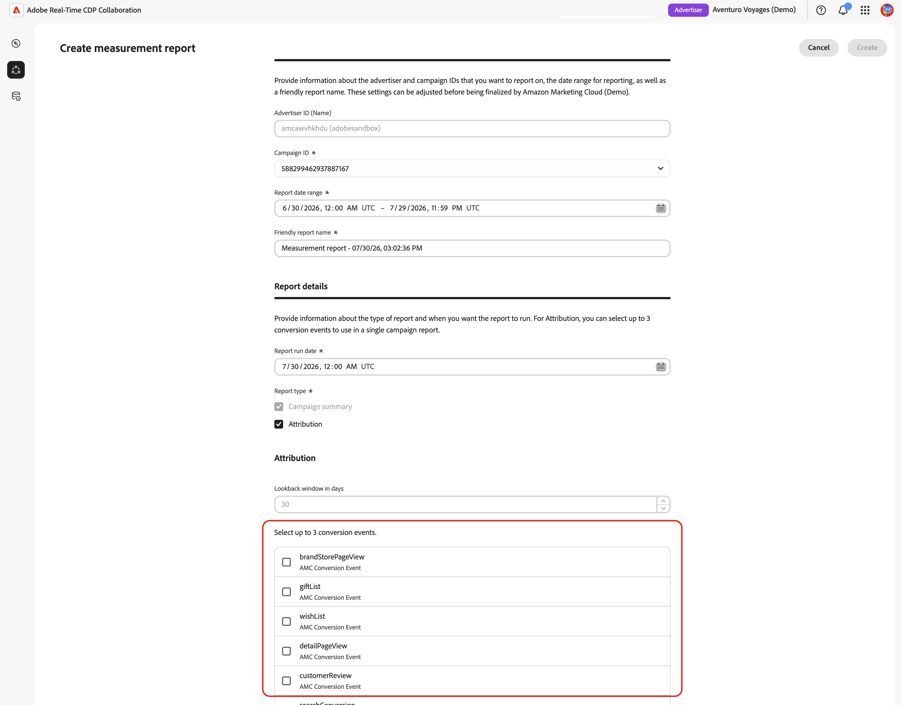
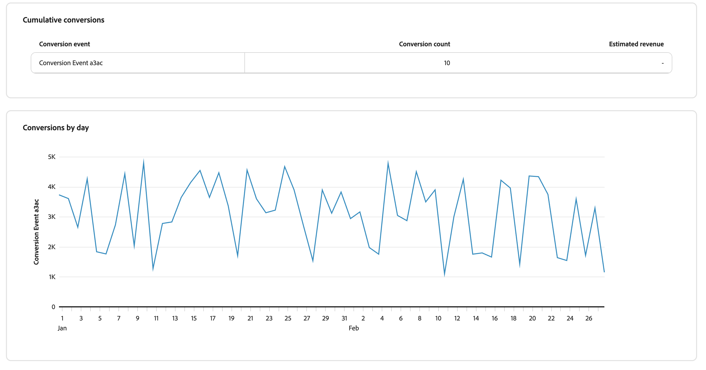

# 建立[!DNL Amazon Marketing Cloud]測量報告 {#amc-measurement-reports}

{{limited-availability-release-note}}

在[!DNL Amazon Marketing Cloud] ([!DNL AMC])專案中使用&#x200B;**[!UICONTROL 量值]**&#x200B;索引標籤來檢閱對象範圍、頻率和轉換結果。 建立AMC專案後，針對已使用[!DNL AMC]執行個體中可用資料執行的行銷活動建立測量報告。

>[!IMPORTANT]
>
>在背景資料設定查詢完成之前，**[!UICONTROL 量值]**&#x200B;索引標籤會顯示「沒有可用的量值資料」。 此程式最多可能需要24小時的時間。 如果訊息在24小時後仍持續存在，請參閱[疑難排解](#troubleshooting)區段。

## 建立報告 {#create-report}

若要建立[!DNL AMC]測量報告，請依照[建立行銷活動摘要報告](../measure.md#create-campaign-summary-report-create-campaign-summary-report)中的步驟操作。

{zoomable="yes"}

### 行銷活動詳細資料 {#campaign}

**[!UICONTROL 廣告商ID]**&#x200B;識別與[!DNL AMC]執行個體相關聯的[!DNL Amazon Advertising]帳戶。 [!DNL AMC]使用此帳戶內容來擷取行銷活動以進行測量。

**[!UICONTROL 促銷活動ID]**&#x200B;清單會自動填入已連線[!DNL AMC]執行個體中可用的促銷活動。 只有當行銷活動在預設探索回顧期間內，並有足夠的不重複使用者滿足[!DNL AMC]的最低彙總臨界值時，才會顯示行銷活動。 選取您要測量其[!DNL Amazon Ads]活動的行銷活動。

如果未列出您需要的行銷活動，請確認它屬於已連線的[!DNL Amazon Ads]帳戶，並檢閱[疑難排解](#troubleshooting)。 如需臨界值的詳細資訊，請參閱[AMC彙總臨界值檔案](https://advertising.amazon.com/API/docs/en-us/guides/amazon-marketing-cloud/aggregation-threshold)。

#### 日期範圍、執行日期和報表名稱 {#dates}

>[!CONTEXTUALHELP]
>id="rtcdp_collaboration_amc_measure_report_date_range"
>title="日期範圍"
>abstract="設定報表要包含之行銷活動資料的開始和結束日期。 日期範圍限製為365天的回溯期，最大跨度為90天。 您只能報告過去的行銷活動。"

>[!CONTEXTUALHELP]
>id="rtcdp_collaboration_amc_measure_report_run_date"
>title="執行日期"
>abstract="報表執行的日期。 報表結束日期之後至少必須有一天，且未來最多可達46天。"

>[!NOTE]
>
>您只能報告已執行的行銷活動。

將&#x200B;**[!UICONTROL 報表日期範圍]**&#x200B;設定為所選[!DNL AMC]行銷活動執行的期間。 [!DNL AMC]支援365天的回顧期間，最大期間為90天。

設定&#x200B;**[!UICONTROL 報表執行日期]**。 這是報表執行的日期。 執行日期必須至少晚於報告結束日期1天，且未來最多可為46天。 如需完整的日期限制集，請參閱[AMC限制參考](#constraints)。

>[!TIP]
>
>若歸因報表的日期範圍是在目前日期的30天內，請將執行日期設定為將來30天，以確保在固定30天回顧期間內的所有轉換都已在報表執行前擷取。

#### 報告類型 {#report-type}

所有[!DNL AMC]報告都包含&#x200B;**[!UICONTROL 行銷活動摘要]**。 您可以選擇性地包含&#x200B;**[!UICONTROL 歸因]**&#x200B;資料，以測量在廣告曝光後的30天內，行銷活動曝光數是否導致客戶動作，例如購買或註冊。 歸因需要在您的[!DNL AMC]執行個體中使用相關的轉換事件。 針對著重於觸及率或認知度的行銷活動，**[!UICONTROL 行銷活動摘要]**&#x200B;可提供您所需的傳遞量度。

| 報告類型 | 說明 |
| --- | --- |
| **[!UICONTROL 行銷活動摘要]** | 提供所選行銷活動的觸及率、頻率和曝光量度。 一律包含。 |
| **[!UICONTROL 歸因]** | 新增轉換資料至報表。 只有在[!DNL AMC]執行個體中存在轉換事件時才可用。 檢視[轉換事件](#conversion-events)。 |

#### 轉換事件 (僅限歸因) {#conversion-events}

>[!CONTEXTUALHELP]
>id="rtcdp_collaboration_amc_attribution_lookback_period"
>title="歸因回顧期間"
>abstract="AMC 強制實施固定的 30 日歸因期間：在最後一次曝光後 30 日內發生的轉換，可歸因於報告日期範圍內的曝光。 此值無法編輯；請將報告執行日期安排在範圍結束日之後至少 30 日，確保擷取到所有符合資格的轉換。"

>[!CONTEXTUALHELP]
>id="rtcdp_collaboration_amc_measure_conversion_events"
>title="轉換事件"
>abstract="選取最多三個要納入歸因報表中的轉換事件。 系統會自動從您的[!DNL AMC]執行個體探索可用的事件。 如果未顯示任何事件，則表示您的[!DNL AMC]執行個體可能沒有任何已記錄的轉換事件，且將無法使用歸因。"

>[!NOTE]
>
>歸因資料需要在[!DNL AMC]執行個體中設定轉換事件。 如果[!UICONTROL 歸因]無法使用或未選取，請略過此區段並選取&#x200B;**[!UICONTROL 建立]**&#x200B;以提交表單。

對於[!UICONTROL 歸因]報表，[!DNL AMC]套用固定的30天歸因回顧期間。 無法調整此設定。

{zoomable="yes"}

轉換事件代表[!DNL Amazon Ads]所追蹤的現場客戶動作，例如購買、加入願望清單、購物車動作或產品詳細資料檢視。 歸因報表支援最多三個事件。 選取與您想要測量的行銷活動結果相符的事件。 如果[!UICONTROL 歸因]選項無法使用，請參閱[疑難排解](#troubleshooting)。

建立報告後，報告會出現在&#x200B;**[!UICONTROL 計量]**&#x200B;索引標籤中，且狀態為排程或擱置。 在設定的執行日期，[!DNL AMC]處理報表查詢並在24小時內傳回結果。

{zoomable="yes"}

## 檢視報告 {#view-report}

報告執行後，結果會顯示在您[!DNL AMC]專案的&#x200B;**[!UICONTROL 量值]**&#x200B;索引標籤中。 找到您的報告並選取&#x200B;**[!UICONTROL 檢視完整報告]**&#x200B;以檢視結果。

![ [!DNL AMC]專案中的「量值」索引標籤會顯示已完成的報表卡及其執行日期、報表型別，以及反白顯示的「檢視完整報表」按鈕。](../../../assets/collaborate/advertising-platforms/view-full-report.png){zoomable="yes"}

報表會顯示所選報表型別的可用結果。 **[!UICONTROL 行銷活動摘要]**&#x200B;報告會顯示所選Amazon行銷活動的傳遞結果。

{zoomable="yes"}

包含&#x200B;**[!UICONTROL 歸因]**&#x200B;的報告也會顯示與所選Amazon Ads轉換事件相關的轉換活動。

{zoomable="yes"}

如需解譯報告結果的詳細資訊，請參閱[測量效能](../measure.md#view-reports-view-reports)。

## [!DNL AMC]個條件約束參考 {#constraints}

下列限制適用於所有[!DNL AMC]測量報告。

| 限制 | 值 |
| --- | --- |
| 最早的報表日期範圍開始 | 目前日期前365天 |
| 最新報表日期範圍結束 | 目前日期後45天。 使用此專案為仍在執行且將在未來45天內結束的行銷活動預先設定報表；報表會在行銷活動結束後的排程執行日期自動執行。 |
| 最大報表日期範圍 | 90 天 |
| 歸因回顧期間 | 30天（固定為[!DNL AMC]） |
| 執行日期下限 | 報表結束日期之後至少1天 |
| 執行日期上限 | 未來46天 |
| 每個報告的最大轉換事件數 | 3 |
| 行銷活動選擇 | 每個報告的單一行銷活動 |
| 報告編輯 | 無法使用。 現有報表會保留。 [需要變更時建立新報告](#create-report) |

## 疑難排解 {#troubleshooting}

**沒有可用的測量資料**

**[!UICONTROL Measure]**&#x200B;索引標籤會顯示「沒有可用的測量資料」，直到專案建立時觸發的背景資料設定查詢完成為止。 這最多可能需要24小時的時間。 如果「沒有可用的測量資料」訊息在24小時後持續存在，請確認您的[!DNL AMC]執行個體具有過去三個月內執行的行銷活動，因為這是行銷活動探索期間使用的預設回顧期間。 如果符合條件的行銷活動存在，且訊息持續存在，請在[Amazon Ads帳戶](https://advertising.amazon.com/sign-in){target="_blank"}中檢查您的行銷活動狀態。

**行銷活動未出現在[!UICONTROL 行銷活動識別碼]下拉式清單中**

即使顯示&#x200B;**[!UICONTROL Measure]**&#x200B;索引標籤，也可能沒有行銷活動。 [!DNL AMC]將最低使用者臨界值套用至行銷活動資料。 若行銷活動不符合最低不重複使用者臨界值，則會予以排除，而報告查詢將不會傳回任何結果。 確認您要報告的行銷活動具有足夠的觸及率。 如需[!DNL AMC]彙總臨界值的詳細資訊，請參閱[AMC彙總臨界值檔案](https://advertising.amazon.com/API/docs/en-us/guides/amazon-marketing-cloud/aggregation-threshold){target="_blank"}。

**在執行日期**&#x200B;之後看不到結果

允許[!DNL AMC]在排定的執行日期後最多24小時處理報告查詢並傳回結果。 如果在此期間後報告仍為擱置，請確認執行日期已過，且報告狀態不再顯示為「擱置」。

**轉換事件無法使用，[!UICONTROL 歸因]為灰色**

發生這種情況有三個原因：

1. **未啟用轉換追蹤。** 您的[!DNL AMC]廣告商帳戶可能未設定轉換追蹤。 導覽至您的[Amazon Ads帳戶](https://advertising.amazon.com/sign-in){target="_blank"}，並確認系統正在追蹤相關行銷活動的轉換事件。
2. **沒有記錄的轉換事件。** 即使已啟用追蹤，您的[!DNL AMC]執行個體可能尚未記錄任何轉換事件。
3. **不符合彙總臨界值。** [!DNL AMC]將最低臨界值套用至轉換資料。 如果轉換事件型別的發生次數不足，則不會傳回該型別，也不會顯示在清單中。

**轉換次數似乎低於預期值**

如果報表執行日期在日期範圍結束後的30天內，[!DNL AMC]可能尚未擷取歸因時段內的所有轉換。 [建立執行日期在日期範圍結束至少30天的新報告](#create-report)。

## 後續步驟 {#next-steps}

使用報告結果來評估行銷活動績效，並為[!DNL Amazon Advertising]中的未來行銷活動規劃提供資訊。 例如，您可以調整目標定位、抑制在頻率分佈中識別的過度曝光對象，或重新分配支出至表現優異的刊登版位。 若要分析不同的促銷活動或報表期間，請使用適當的設定建立另一個測量報表。

如需所有可用[!DNL AMC]共同作業功能的概觀，請參閱[[!DNL Amazon Marketing Cloud]](./amc.md)。
