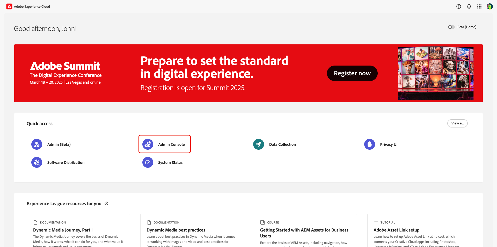
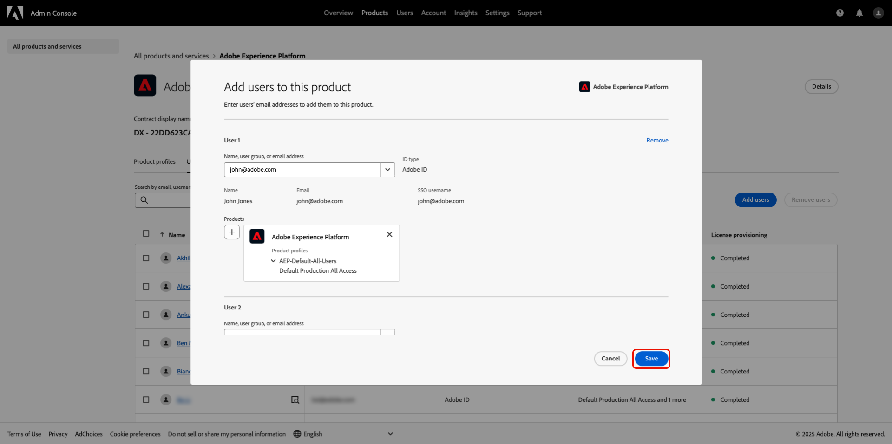
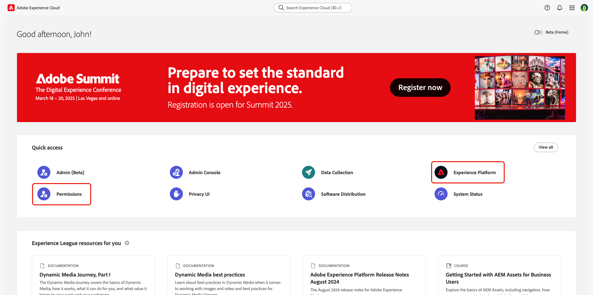
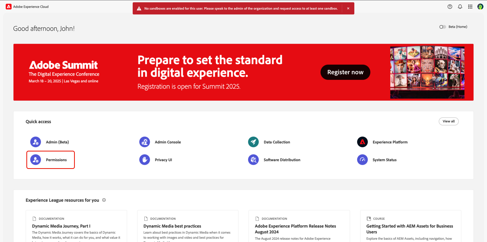

# 透過許可權管理使用者存取 {#manage-user-access}

{{limited-availability-release-note}}

透過Experience Cloud [許可權](https://experienceleague.adobe.com/zh-hant/docs/experience-platform/access-control/abac/permissions-ui/browse){target="_blank"}介面管理Adobe Real-Time CDP Collaboration中個別元件的許可權和使用者存取權。 許可權可讓系統和產品管理員定義[角色](./manage-roles.md)，以管理使用者對特定功能和資源的存取權。

## 設定存取許可權 {#permissions-access}

若要存取許可權，您必須同時擁有產品管理員和使用者對Adobe Experience Platform產品的存取權。 系統管理員需要設定產品管理員許可權，而使用者許可權可由系統或產品管理員設定。 如需有關管理角色的詳細資訊，請閱讀[存取控制階層](./overview.md#hierarchy)指南。

>[!TIP]
>
>在本指南中，**管理員**&#x200B;會同時參照&#x200B;**系統和產品管理員**。

### 系統管理員：設定產品管理員存取權 {#admin-access}

授予使用者產品管理員存取權，以透過下列步驟在Experience Platform產品內授予他們管理權能：

>[!IMPORTANT]
>
>作為系統管理員，您可以直接存取特定的Experience Cloud產品，例如Adobe Admin Console。 不過，若要使用許可權，您必須授予產品管理員和使用者存取Experience Platform產品的許可權。 請依照下列逐步指南，授予您作為系統管理員的存取權。

使用您的認證登入[Adobe Experience Cloud](https://experience.adobe.com/){target="_blank"}。 首頁檢視會顯示您在&#x200B;**[!UICONTROL 快速存取]**&#x200B;區段中的可用產品清單。 選取&#x200B;**[!UICONTROL Admin Console]**。

{zoomable="yes"}

[Adobe Admin Console](https://adminconsole.adobe.com/)總覽儀表板隨即顯示。 從&#x200B;**[!UICONTROL 產品和服務]**&#x200B;下的&#x200B;**[!UICONTROL 產品]**&#x200B;清單中選取&#x200B;**[!UICONTROL Adobe Experience Platform]**。

{zoomable="yes"}

Adobe Experience Platform控制面板隨即顯示。 選取&#x200B;**[!UICONTROL 管理員]**&#x200B;標籤，然後選取&#x200B;**[!UICONTROL 新增管理員]**。

![已選取[管理員]索引標籤並反白顯示[新增管理員]的Adobe Experience Platform產品儀表板。](../../assets/permissions/add-admin.png){zoomable="yes"}

**[!UICONTROL 新增產品管理員]**&#x200B;對話方塊就會顯示。 在&#x200B;**[!UICONTROL 電子郵件或使用者名稱]**&#x200B;文字欄位中輸入使用者電子郵件或使用者名稱，然後從下拉式清單中選取正確的帳戶。 選取&#x200B;**[!UICONTROL 儲存]**&#x200B;以完成將使用者新增為產品管理員。

![[新增產品管理員]對話方塊中填入使用者資訊，並選取[儲存]選項。](../../assets/permissions/add-product-administrators.png){zoomable="yes"}

使用者現在具有產品管理員許可權，並且可以執行管理功能，例如在Admin Console中將使用者或其他管理員新增到產品。 接下來，他們將需要Experience Platform產品的使用者存取權，才能在許可權記憶體取及執行功能。

### 管理員：設定Experience Platform的使用者存取權 {#user-access}

現在您已授予使用者產品管理員存取權，您必須提供他們對Experience Platform產品的使用者存取權。 作為存取設定的一部分，您將指派使用者特定的[產品設定檔](https://helpx.adobe.com/tw/enterprise/using/manage-product-profiles.html)。

>[!TIP]
>
>如果您依照上一節的說明進行，則您已加入Adobe Experience Platform產品，而且可略過第一個步驟。

導覽至[Admin Console](https://adminconsole.adobe.com/){target="_blank"}，並從&#x200B;**[!UICONTROL 產品和服務]**&#x200B;下的&#x200B;**[!UICONTROL 產品]**&#x200B;清單中選取&#x200B;**[!UICONTROL Adobe Experience Platform]**。

{zoomable="yes"}

選取&#x200B;**[!UICONTROL 使用者]**&#x200B;索引標籤，然後選取&#x200B;**[!UICONTROL 新增使用者]**。

![已選取[使用者]索引標籤並反白顯示[新增使用者]的Adobe Experience Platform產品儀表板。](../../assets/permissions/add-users.png){zoomable="yes"}

**[!UICONTROL 新增使用者到此產品]**&#x200B;對話方塊就會顯示。 在&#x200B;**[!UICONTROL 名稱、使用者群組或電子郵件地址]**&#x200B;文字欄位中輸入使用者名稱或電子郵件，然後從下拉式清單中選取正確的帳戶。 接著，選取&#x200B;**[!UICONTROL 產品]**&#x200B;新增選項。

{zoomable="yes"}

**[!UICONTROL 選取產品設定檔]**&#x200B;對話方塊就會顯示。 選取&#x200B;**[!UICONTROL AEP-Default-All-Users]**&#x200B;和&#x200B;**[!UICONTROL 預設的生產所有存取權]**，然後選取&#x200B;**[!UICONTROL 套用]**。

{zoomable="yes"}

確認資訊正確，然後選取[儲存]。**&#x200B;**

{zoomable="yes"}

使用者現在應該具有產品管理員和Experience Platform的產品存取權，進而獲得存取許可權。 接下來，您需要將兩個基本角色指派給使用者，讓他們能存取Experience Platform UI。

### 管理員：設定Experience Platform UI存取權 {#product-access}

在Real-Time CDP Collaboration中，管理員和一般使用者將會處理來自Experience Platform的資料，例如對象和稽核記錄。 此資料會儲存在名為沙箱的Experience Platform例項中。 為了確保使用者可以與此資料互動，您必須將[預設角色](https://experienceleague.adobe.com/zh-hant/docs/experience-platform/access-control/home#default-roles){target="_blank"}指派給使用者。

若要開始，請導覽至[Adobe Experience Cloud](https://experience.adobe.com/)。 您現在應該會在&#x200B;**[!UICONTROL 快速存取]**&#x200B;中看到&#x200B;**[!UICONTROL Experience Platform]**&#x200B;和&#x200B;**[!UICONTROL 許可權]**。

{zoomable="yes"}

>[!NOTE]
>
> 產品可能需要幾分鐘的時間才能存取，而且您會收到電子郵件，提醒您已取得存取權。 如果您在收到電子郵件後沒有在Adobe Experience Cloud中看到Experience Platform或許可權，請先登出，然後再重新登入您的帳戶。

在此階段，您現在可以存取&#x200B;**[!UICONTROL 許可權]**。 如果您嘗試存取&#x200B;**[!UICONTROL Experience Platform]**，將會收到無沙箱啟用的警告，如下所示。 若要解決此問題，您需要將預設角色指派給使用者。 若要開始，請選取&#x200B;**[!UICONTROL 許可權]**。

{zoomable="yes"}

將會顯示&#x200B;**[!UICONTROL 許可權]**&#x200B;儀表板。 從左側面板中選取&#x200B;**使用者**，然後選取使用者的名稱。

![顯示[使用者]工作區並反白顯示使用者的許可權儀表板。](../../assets/permissions/permissions-user.png){zoomable="yes"}

選取&#x200B;**[!UICONTROL 角色]**&#x200B;標籤，然後選取&#x200B;**[!UICONTROL 新增角色]**。

![顯示[角色]索引標籤並反白顯示[新增角色]的使用者工作區。](../../assets/permissions/user-roles.png){zoomable="yes"}

**[!UICONTROL 新增角色]**&#x200B;對話方塊就會顯示。 選取&#x200B;**[!UICONTROL 預設的生產所有存取權]**&#x200B;和&#x200B;**[!UICONTROL 沙箱管理員]**，然後選取&#x200B;**[!UICONTROL 儲存]**。

{zoomable="yes"}

您現在可以存取Experience Platform和許可權。 在最後一個步驟，您將授予Real-Time CDP Collaboration的存取權。

### 管理員：設定 Real-Time CDP Collaboration 存取權 {#RTCDP-collaboration-access}

>[!CONTEXTUALHELP]
>id="rtcdp_collaboration_organization_permissions"
>title="管理使用者存取權指南"
>abstract=""

若要授與使用者存取Collaboration的許可權，您可以使用稱為角色的存取控制概念。 角色定義系統管理員或使用者對貴組織中[資源](https://experienceleague.adobe.com/zh-hant/docs/experience-platform/access-control/home#permissions)的存取層級。

設定個人對Collaboration的存取權時，您將從Collaborations資源指派包含許可權的使用者角色。 您可以使用[管理角色](./manage-roles.md)指南來尋找下列相關資訊：

- [兩個標準角色](./manage-roles.md#standard-roles)及其授與Collaboration的存取權層級
- 使用Collaboration資源建立[自訂角色](./manage-roles.md#specific-access-roles)
- Collaborations資源中包含的許可權清單

>[!NOTE]
>
>此外，必須將使用者指派給&#x200B;**[!UICONTROL 沙箱]**&#x200B;資源中包含&#x200B;**[!UICONTROL Prod]**&#x200B;許可權的角色。 兩個標準角色都包含此許可權。 如果您選擇指派自訂角色而不是標準角色給使用者，您必須確定指派給他們的其中一個角色包含此許可權。

選擇或建立包含使用者需求存取層級的角色後，您需要將使用者指派給該角色。

#### 指派角色

您可以將多個角色指派給單一使用者，或將多個使用者指派給單一角色。 先前在[指派預設角色](#product-access)以授與使用者對Experience Platform的存取權時，已涵蓋第一個案例。 在接下來的步驟中，您將直接將使用者指派給您已選取的角色。

在&#x200B;**[!UICONTROL 許可權]**&#x200B;中，從左側面板選取&#x200B;**[!UICONTROL 角色]**，然後從清單中選取您的角色。

![顯示[角色]工作區並反白顯示角色的[許可權]儀表板。](../../assets/permissions/select-role.png){zoomable="yes"}

角色的詳細資訊頁面隨即顯示。 選取&#x200B;**[!UICONTROL 使用者]**&#x200B;索引標籤，然後選取&#x200B;**[!UICONTROL 新增使用者]**。

![角色詳細資料工作區，其中顯示[使用者]索引標籤，並反白顯示[新增使用者]。](../../assets/permissions/role-users.png){zoomable="yes"}

**[!UICONTROL 新增使用者]**&#x200B;對話方塊出現。 從清單中選取使用者，然後選取&#x200B;**[!UICONTROL 儲存]**。

![新增使用者對話方塊，使用者選取並醒目提示[儲存]選項。](../../assets/permissions/add-users-to-role.png){zoomable="yes"}

使用者現在應該會看到&#x200B;**[!UICONTROL RTCDP Collaboration]**&#x200B;在Experience Cloud中列為「**[!UICONTROL 快速存取]**」下的產品。

## 後續步驟

現在使用者已可存取Real-Time CDP Collaboration，他們可以開始使用產品。 若要進一步瞭解整個產品，請閱讀[概觀指南](../home.md)。
