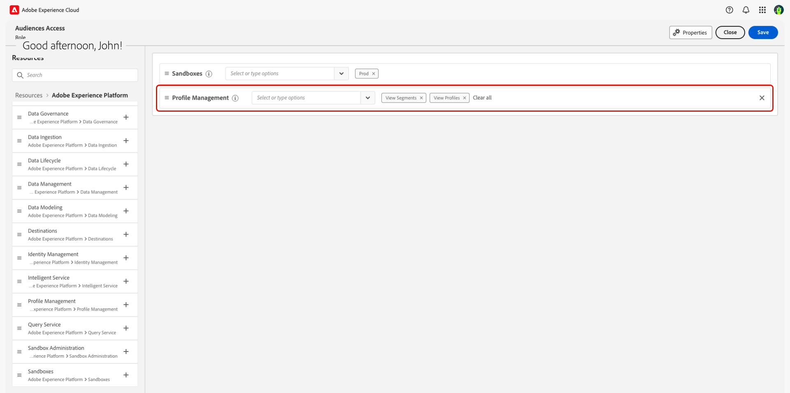

# 存取控制概觀

{{limited-availability-release-note}}

>[!IMPORTANT]
>
> 如果您是想要存取Adobe Real-Time CDP Collaboration的一般使用者，請聯絡您的系統或產品管理員以檢查現有的存取權。 如果您不知道您的系統管理員是誰，請聯絡您的Adobe代表。

Adobe Real-Time CDP Collaboration的存取控制是透過[Adobe Experience Cloud](https://experience.adobe.com/){target="_blank"}中的Admin Console和許可權來提供。 在本指南中，您將瞭解如何根據使用案例授予自己或團隊其他成員的存取權。

## 存取控制階層 {#hierarchy}

若要設定Collaboration的存取控制，您&#x200B;**必須**&#x200B;擁有系統或產品管理員許可權。 系統管理員沒有限制，並在上線流程中布建。 同時，產品管理員可以為他們被指派的所有產品提供管理功能。 產品管理員必須由系統管理員授予產品和管理存取權。

這些指南將說明如何為系統管理員、產品管理員和一般使用者設定存取權。 請參閱下表以瞭解角色之間的主要差異。

| 角色 | 說明 |
| --- | --- | 
| 系統管理員 | 組織的超級使用者。 他們可以在Admin Console中執行所有管理任務，並有權將管理功能委派給其他使用者。 |
| 產品管理員 | 管理指派給它們的產品及所有相關的管理功能，例如將使用者新增至組織、在產品設定檔中新增或移除使用者，以及在產品中新增或移除其他產品管理員。 |
| 一般使用者 | 您組織中使用該產品的使用者。 |

{style="table-layout:auto"}

如需有關管理角色的詳細資訊，請造訪[Adobe說明中心](https://helpx.adobe.com/enterprise/using/admin-roles.html)。

>[!TIP]
>
>在這些指南中使用&#x200B;**系統管理員**&#x200B;將會參考&#x200B;**系統和產品系統管理員**。

## 其他產品 {#products}

在授予Collaboration存取權之前，您需要先存取多項產品，具體取決於您的[使用案例](#use-cases)。 存取控制指南可在您進行時透過多個使用者介面運作，每個介面都可在存取設定過程中提供特定用途。 請參考下表，深入瞭解每項產品的用途。

| 產品 | 使用 |
| --- | --- |
| [Admin Console](https://adminconsole.adobe.com/) | 管理員使用此專案來指派使用者的產品及/或管理員存取權。 |
| [權限](https://experience.adobe.com/) | 管理員使用此項來指派管理員或一般使用者角色。 |
| [Experience Platform](https://platform.adobe.com/) | 管理員和一般使用者需要獲得Experience Platform產品的存取權，才能將其指派給角色。 |

## 從何處開始 {#use-cases}

現在，您已更深入地瞭解使用者和管理角色，以及不同的Experience Cloud產品，您可以開始授與Collaboration的存取權。 有兩個主要因素會影響您需要採取的步驟：

- 如果您正在指派管理員或一般使用者存取權
- 如果使用者已經擁有Experience Platform產品的存取權

請參閱下表以根據您的存取控制使用案例決定需要設定許可權的人員以及開始的位置。 **請務必從您的起始位置開始進行教學課程，直到指南的結尾。**

>[!TIP]
>
> 超級使用者是指系統管理員可取得的最高層級存取權。 超級使用者可以執行所有管理工作和使用者功能。 系統管理員沒有現成可用的產品功能，因此需要授予自己適當的存取權，如下圖所示。

| 使用案例 | 必要的角色 | 從何處開始 |
| --- | --- | --- | 
| 沒有現有Experience Platform產品存取權的超級使用者。 | 系統管理員。 | [設定產品管理員存取權](./manage-user-access.md#admin-access) |
| 擁有&#x200B;**Experience Platform UI存取權的現有Experience Platform系統管理員**&#x200B;的超級使用者。 | 系統管理員。 | [設定Collaboration存取權](./manage-user-access.md#RTCDP-collab-access) |
| 現有Experience Platform系統管理員&#x200B;**的超級使用者，無** Experience Platform UI存取權。 | 系統管理員。 | [設定產品管理員存取權](./manage-user-access.md#admin-access) |
| 產品管理員許可權和新產品管理員的Collaboration存取權。 | 系統管理員。 | [設定產品管理員存取權](./manage-user-access.md#admin-access) |
| 現有Experience Platform產品管理員&#x200B;**的Collaboration存取權，具有** Experience Platform UI存取權。 | 系統或產品管理員。 | [設定Collaboration存取權](./manage-user-access.md#RTCDP-collab-access) |
| 現有Experience Platform產品管理員&#x200B;**的Collaboration存取權(無** Experience Platform UI存取權)。 | 系統或產品管理員。 | [設定使用者存取權](./manage-user-access.md#user-access) |
| 新一般使用者的Collaboration存取權。 | 系統或產品管理員。 | [設定使用者存取權](./manage-user-access.md#user-access) |
| 具有Collaboration存取權的現有使用者的Experience Platform存取權。 | 系統或產品管理員。 | [設定Collaboration存取權](./manage-user-access.md#RTCDP-collab-access) |

{style="table-layout:auto"}

## 其他許可權

取得Collaboration的存取權後，您的特定功能可能需要一些額外的Experience Platform許可權。

### 對象來源 {#audience-sourcing}

開始將對象傳送給共同作業人員之前，您需要先將對象來源至Collaboration。 目前，Experience Platform是目前唯一支援匯入受眾的自助資料連線。 若要開始，管理對象上線的使用者必須獲派包含下列&#x200B;**[!UICONTROL 設定檔管理]**&#x200B;資源許可權的角色：

| 權限 | 說明 |
| ---- | ---- |
| [!UICONTROL 檢視區段] | 允許使用者檢視沙箱中可用的受眾清單。 |
| [!UICONTROL 檢視設定檔] | 允許使用者檢視可用於對應至共同作業欄位的欄位。 |

底下是新增上述許可權的範例角色。 有關建立或指派角色的詳細資訊，請參閱[管理角色](./manage-roles.md)指南。

>[!NOTE]
>
>在沒有上述任何許可權的情況下，使用者在取得受眾來源後，即可與Collaboration中的受眾合作。

## 後續步驟

決定好從何處開始之後，請依照使用案例的連結，開始設定存取權。 如果您想瞭解如何在這些使用案例之外以管理員身分設定存取Collaboration的許可權，請參閱[管理使用者存取權](manage-user-access.md)指南。 若要瞭解角色及其在設定Collaboration各種元件存取權時所扮演的角色，請參閱[管理角色](manage-roles.md)指南。
