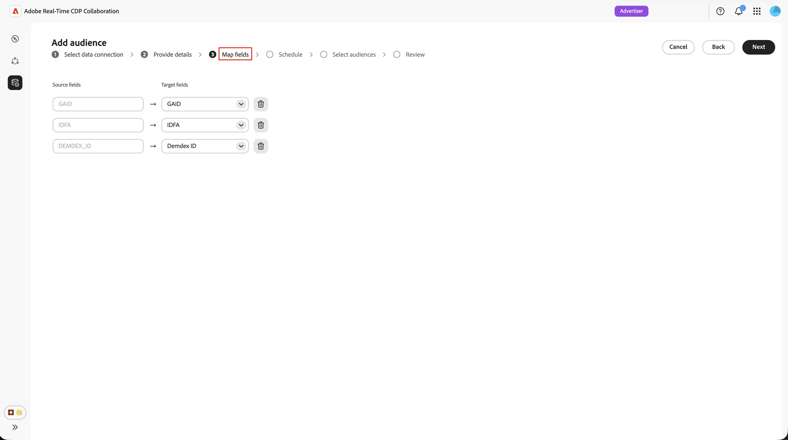

# 設定Adobe Audience Manager以取得對象

瞭解如何將您的Adobe Audience Manager (AAM)執行個體連結至Adobe Real-Time CDP Collaboration，以便您將合格的第一方區段來源至平台。 建立連線後，Collaboration會定期從Adobe Audience Manager擷取對象成員資格，並讓這些對象可在您的共同作業專案中用於重疊分析和啟用。

>[!NOTE]
>
> 來源為Audience Manager的受眾會遵循與來源為Adobe Experience Platform的受眾相同的治理和資料處理規則。 只有從第一方資料來源建立的區段才符合資格。 不支援包含第三方資料或Audience Marketplace來源的區段。

## 先決條件 {#prerequisites}

請先完成本節中的所有專案，再開始設定工作流程。 不完整的先決條件是最常見的原因，包括設定失敗或對象在來源後未出現。 在遵循本指南之前，您必須已完成[帳戶上線和設定](./onboard-account.md)。

### Adobe Audience Manager存取與許可權 {#aam-access-and-permissions}

繼續之前，請確認您擁有：

* 有效的Adobe Audience Manager合約和布建的Audience Manager執行個體。
* 存取Audience Manager使用者介面，並取得檢視您要來源區段的許可權。
* 您在相同Adobe IMS組織下布建的Audience Manager執行個體和Collaboration帳戶。 不支援跨組織來源。

### 區段資格要求 {#aam-segments-requirements}

當您設定連線時，Collaboration會根據下列規則自動篩選區段清單。

**僅限第一方資料**

只有根據您自己的第一方資料的區段才可用於來源。 排除包含來自第三方資料提供者或AAM Audience Marketplace之特徵的區段。

**造訪間隔篩選器**

只有過去13個月&#x200B;**內建立或更新**&#x200B;的區段才可供來源。 較舊的區段會在連線設定期間和後續每次重新整理時排除。

### 同意要求 {#consent-requirements}

所有來源至Collaboration的AAM區段都必須在同意後進行篩選。 如果在匯出時，設定檔有選擇退出標籤，則會在該設定檔到達Collaboration之前將其排除。

>[!IMPORTANT]
>
>您有責任在連線至Collaboration之前，先在Audience Manager執行個體中確保正確設定並強制執行同意。 Adobe不會在資料離開Audience Manager後重新套用同意規則。

## 設定您的Audience Manager連線 {#configure-aam-connection}

設定工作流程是&#x200B;**[!UICONTROL 設定]**&#x200B;工作區內的多步驟精靈。 依序完成每個步驟。 在建立連線之前，您可以使用最終稽核畫面上的鉛筆圖示返回任何步驟。

### 新增資料連線 {#add-data-connection}

從&#x200B;**[!UICONTROL 設定]**&#x200B;工作區中的&#x200B;**[!UICONTROL 我的對象]**&#x200B;索引標籤中，選取新增圖示（） 然後選取&#x200B;**[!UICONTROL 對象]**。

如果這是您的第一個對象，您也可以選取&#x200B;**[!UICONTROL 新增對象]**&#x200B;選項。

「新增對象」工作流程隨即顯示。 選取&#x200B;**[!UICONTROL 新增資料連線]**，然後選取&#x200B;**[!UICONTROL 下一步]**。

![反白顯示[新增資料連線]選項的[新增對象]工作區。](../../assets/setup/add-manage-audiences/add-data-connection.png){zoomable="yes"}

### 選取Adobe Audience Manager作為資料連線 {#select-aam}

資料來源選取畫面會列出所有可用的連線型別。 選取&#x200B;**[!UICONTROL Adobe Audience Manager]**&#x200B;作為資料連線，然後選取&#x200B;**[!UICONTROL 下一步]**。

### 確認同意及資料使用 {#confirm-consent-data-use}

繼續進行之前，請確認您已針對傳送至Collaboration的對象資料，套用法律規定的任何選擇退出。 如果您不確定您的資料是否符合此要求，請先檢閱[治理原則與執行動作](./onboard-audiences.md#governance-policy-and-enforcement-actions)指南，再繼續進行。 選取確認核取方塊，然後選取&#x200B;**[!UICONTROL 確定]**&#x200B;以繼續。

### 提供連線詳細資料 {#provide-connection-details}

接著，輸入此資料連線的名稱和說明（選擇性）。 建立連線後，您提供的名稱會顯示在&#x200B;**[!UICONTROL 我的資料連線]**&#x200B;索引標籤中，並幫助您日後識別此來源。

* **[!UICONTROL 資料連線名稱]** （必要）
* **[!UICONTROL 資料連線描述]** （選擇性）

完成後，選取&#x200B;**[!UICONTROL 下一步]**。

### 檢閱身分對應 {#review-identity-mapping}

**[!UICONTROL 對應]**&#x200B;畫面是唯讀的。 Collaboration會自動將支援的身分輸出從AAM區段對應至Collaboration身分欄位。 如需詳細資訊，請參閱下表。

| AAM身分輸出 | Collaboration身分欄位 | 附註 |
| ------------------- | ---------------------------- | ----- |
| `Demdex ID` | `DEMDEX_ID` | 支援此整合的身分輸出。 在來源取得期間，Collaboration不會將Demdex ID轉譯為ECID。 |
| `GAID` | `GAID` | 支援此整合的身分輸出。 |
| `IDFA` | `IDFA` | 支援此整合的身分輸出。 |

{style="table-layout:auto"}

您可以檢閱對應，但無法在此階段修改它。 選取&#x200B;**[!UICONTROL 「下一步」]**&#x200B;以繼續。

的來源欄位

### 排程資料重新整理 {#schedule-data-refresh}

在&#x200B;**[!UICONTROL 排程]**&#x200B;檢視中，設定Collaboration從AAM區段中擷取更新對象會籍資料的重新整理頻率，並定義來源的有效日期範圍。

使用&#x200B;**[!UICONTROL 頻率]**&#x200B;下拉式功能表，選取一到六天的重新整理間隔。 然後使用行事曆來設定對象來源的開始和結束日期。 到達結束日期時，來源會停止，且先前來源的對象會過期。

>[!IMPORTANT]
>
>Audience Manager區段通常會根據特徵造訪間隔和頻率規則，每24到48小時重新整理一次。 設定Collaboration重新整理間隔小於此值時，可能會耗用Collaboration點數而不會更新結果。 若要監視您的信用使用情況，請參閱[追蹤您的信用消耗活動](./my-activity.md)。

完成後，選取&#x200B;**[!UICONTROL 下一步]**。

### 選取客群 {#select-audiences}

您可以檢視使用第一方資料來源特徵且在過去13個月內建立或更新之合格區段的清單。

選取您要來源至Collaboration的區段。 您可以依名稱搜尋或捲動以尋找特定區段。 完成時選取&#x200B;**[!UICONTROL 下一步]**。

>[!TIP]
>
>如果您預期看到的區段並未列出，請確認該區段在過去13個月內已更新，且僅使用第一方資料來源特徵。 會排除具有第三方或Audience Marketplace特徵的區段。

### 檢閱並完成連線 {#review-and-complete}

在建立連線之前，請先檢閱完整的設定摘要。 摘要畫面會顯示下列區段：

* **[!UICONTROL 詳細資料]**：此資料連線的名稱和選擇性描述。
* **[!UICONTROL 對象選擇]**：您選取的AAM區段。
* **[!UICONTROL 對應]**：識別欄位從AAM來源欄位對應到Collaboration識別欄位。
* **[!UICONTROL 排程]**：重新整理頻率和作用中的日期範圍。

如需進行變更，請選取任何區段旁的鉛筆圖示（）。 選取&#x200B;**[!UICONTROL 完成]**&#x200B;以確認所有區段。

確認對話方塊隨即顯示，指出已建立資料連線，且對象來源正在進行中。

## 檢閱來源對象 {#review-sourced-audiences}

在您完成精靈後，Collaboration會開始以非同步方式從您選取的AAM區段中擷取對象會籍資料。 瀏覽至&#x200B;**[!UICONTROL 設定] > [!UICONTROL 我的對象]**&#x200B;以監視進度。

### 監控對象來源進度 {#monitor-progress}

當Collaboration擷取您的AAM區段資料時，**[!UICONTROL 我的對象]**&#x200B;工作區頂端的橫幅會指出正在尋找來源。 當每個區段的sourcing完成時，個別對象會出現在清單中。

### 檢視來源對象詳細資料 {#view-sourced-audience-details}

來源補充完成後，您的AAM區段會顯示在&#x200B;**[!UICONTROL 我的對象]**&#x200B;標籤中。 **[!UICONTROL Source]**&#x200B;資料行將它們識別為&#x200B;**[!UICONTROL Adobe Audience Manager]**。

選取一列或&#x200B;**[!UICONTROL 檢視對象]**&#x200B;選項，以開啟特定對象的詳細資料檢視。

詳細資料檢視會顯示：

* **[!UICONTROL 身分]**：身分計數總計和任何可用的劃分資訊。
* **[!UICONTROL 類別]**：您已套用來組織或篩選對象的任何標籤。
* **[!UICONTROL 連線存取]**：對象是私人、公開或與特定共同作業人員共用。
* **[!UICONTROL 中繼資料可見性]**：共同作業人員可以看到哪些對象資訊。

在共同作業專案中使用對象之前，使用此檢視來確認對象組態和可見度設定。 若要更新類別、連線存取權或中繼資料可見度，請參閱[檢視和管理個別對象](./onboard-audiences.md#view-individual-audiences)。

## 已知限制

設定和使用Audience Manager來源聯結器時，請注意下列限制：

* **僅限第一方資料：**&#x200B;無法取得包含來自第三方資料提供者或Adobe Audience Marketplace之特徵的區段。 只有完全從您自己的第一方資料來源建立的區段才符合資格。
* **13個月的區段造訪間隔期間：**&#x200B;只有過去13個月內建立或更新過的區段，才可在設定期間和每次排程重新整理時選取。
* **沒有隨選重新整理：**&#x200B;在您設定的排程中重新整理對象資料。 不支援手動、立即重新整理。
* **每個組織有一個作用中的AAM連線：**&#x200B;每個IMS組織僅支援一個作用中的AAM資料連線。
* **符合索引鍵條件約束：**&#x200B;一旦為資料連線啟用符合索引鍵，就無法移除它。 若要變更使用中的比對索引鍵，請刪除連線並建立新的連線。

## 疑難排解 {#troubleshooting}

請參閱本節，解決建立初始連線後的常見問題。

**對象未出現或來源搜尋所花的時間比預期長**

* 貨源搜尋時間會根據所選區段的數量和每個區段母體的大小進行縮放。
* 如果對象沒有在24小時內出現，請確認您選取的區段在Audience Manager中仍然有效，且人口計數非零。
* 檢查&#x200B;**[!UICONTROL 我的資料連線]**&#x200B;索引標籤，瞭解連線上的任何錯誤指標。
* 如果問題仍然存在，請聯絡Adobe客戶支援，提供您的資料連線名稱和未出現的區段名稱。

**安裝程式期間無法使用我預期選取的區段**

確認區段：

* 在過去13個月內建立或上次更新。 較舊的區段不會顯示。
* 僅使用第一方特徵。 會排除具有第三方或Audience Marketplace特徵的區段。
* 屬於為連線設定的IMS組織。

**資料連線在初始成功後顯示失敗狀態**

* 確認您的AAM執行個體與Collaboration帳戶之間的IMS組織關係未變更。
* 確認選取的區段仍然存在於AAM中，且尚未刪除。
* 如果問題仍然存在，請[刪除連線](./manage-data-connection.md#delete-data-connection)並建立新連線，或聯絡Adobe客戶支援。

## 後續步驟 {#next-steps}

您現在已將Audience Manager設定為Collaboration中的資料來源。 來源完成之後，您的對象可在&#x200B;**[!UICONTROL 我的對象]**&#x200B;工作區中使用，並準備用於共同作業專案。 若您的對象在初始來源程式完成後未出現，請檢閱此頁面上的[疑難排解](#troubleshooting)區段。

從此處，您可以：

* [建立及管理共同作業專案](../collaborate/manage-projects.md)
* [在專案中啟用對象](../collaborate/activate.md)
* [檢閱重疊和測量效能](../collaborate/measure.md)
* [管理對象設定和可見度](./onboard-audiences.md)
* [管理您的資料連線](./manage-data-connection.md)

如需其他對象來源方法，請參閱：

* [設定 [!DNL Amazon S3] 對象來源](./configure-aws-s3-audience-sourcing.md)
* [設定 [!DNL Google Cloud Storage] 對象來源](./configure-gcs-audience-sourcing.md)
* [設定 [!DNL Snowflake] 對象來源](./configure-snowflake-audience-sourcing.md)
* [來自Experience Platform的Source對象](./onboard-audiences.md)
* [上傳CSV檔案以取得對象](./upload-csv-audience-sourcing.md)
