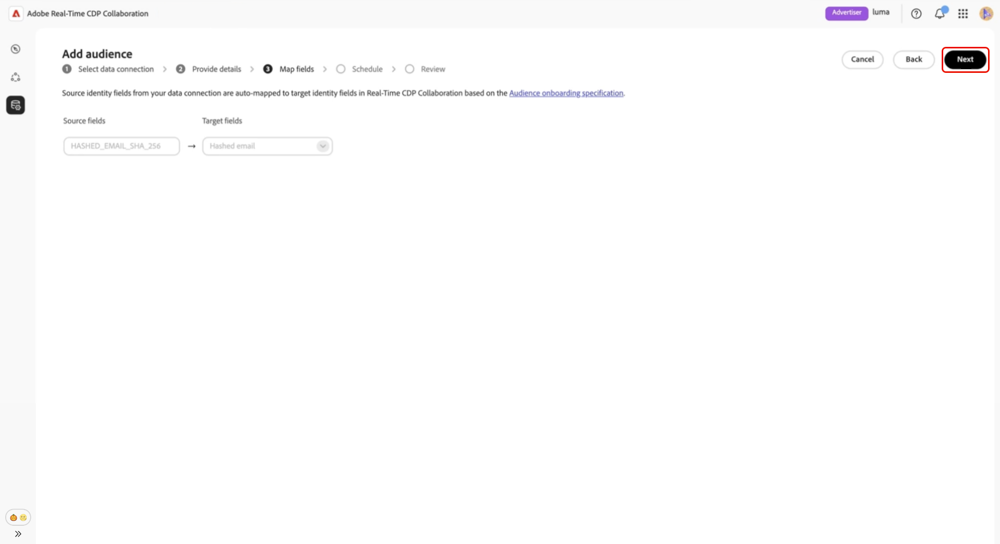
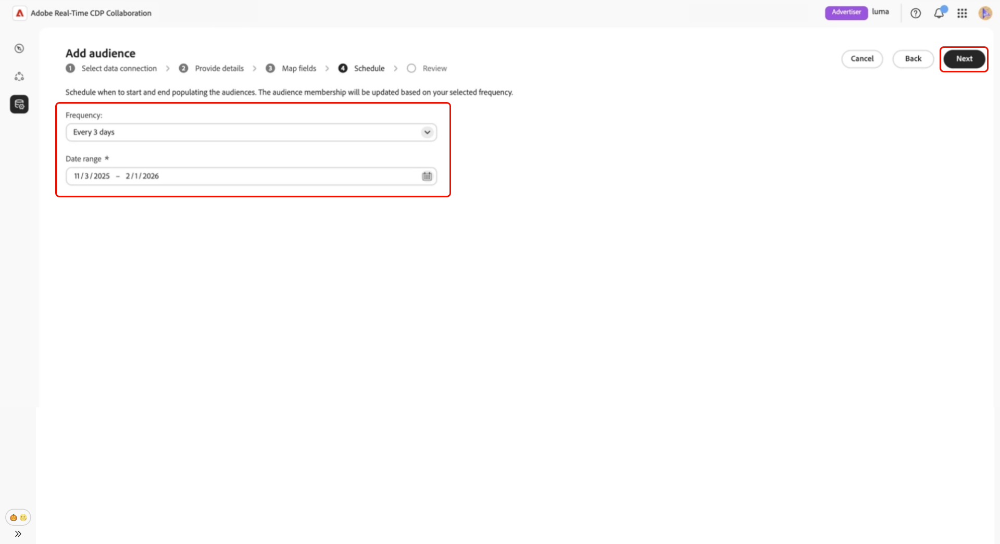
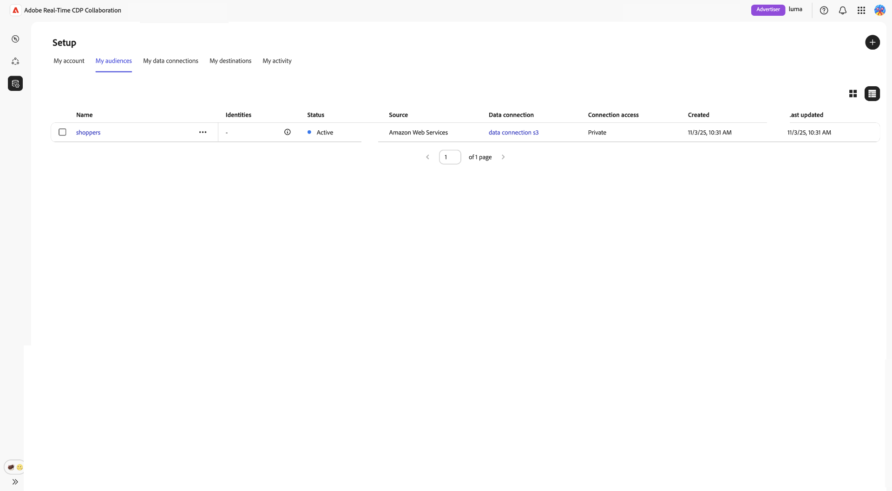

# 設定[!DNL Amazon S3]以取得對象來源

瞭解如何在Adobe Real-Time CDP Collaboration UI中設定並連線您的[!DNL Amazon S3]儲存空間，以取得對象資料以進行啟用和重疊分析。

>[!IMPORTANT]
>
>在遵循本指南之前，您必須先完成在AWS帳戶中授權Adobe IAM角色的步驟。\
>如需逐步設定指示，請參閱&#x200B;**[設定對象來源的AWS許可權](./configure-aws-permissions-audience-sourcing.md)**&#x200B;指南。

## 概觀 {#overview}

使用此工作流程直接從[!DNL Amazon S3]取得及管理第一方對象。 完成設定後，Collaboration會自動從S3貯體取得受眾，並供深入分析和啟用之用。

透過S3取得的對象會遵循與透過Adobe Experience Platform取得的對象相同的治理和資料處理規則。

## 先決條件 {#prerequisites}

在設定S3資料連線之前，請確定下列事項：

* 您可以存取包含符合&#x200B;**[!DNL Amazon S3]對象來源規格(v1.1)**&#x200B;之對象檔案的有效&#x200B;**[貯體](../../assets/quick-start/RTCDP_Collaboration_Audience_Sourcing_Spec_v1.2.pdf)**。
* 您已在AWS中建立&#x200B;**IAM角色**，授予Adobe使用&#x200B;**假設的角色**&#x200B;方法（非存取/密碼金鑰）存取貯體的許可權。 如需詳細指示，請參閱&#x200B;**[設定對象來源的AWS許可權](./configure-aws-permissions-audience-sourcing.md)**。 IAM角色必須包含下列許可權：

   * `ListBucket`
   * `GetBucketLocation`
   * `GetObject`

* 您已準備好下列值：

   * **IAM角色Amazon資源名稱(ARN)**
   * **S3 bucket名稱**
   * **資料夾路徑** （包含對象檔案的目錄前置詞）

>[!NOTE]
>
>對象檔案必須位於授權S3儲存貯體的&#x200B;**根資料夾路徑**&#x200B;中。 不支援子資料夾結構。

## 設定您的[!DNL Amazon S3]連線 {#configure-aws-s3-connection}

從&#x200B;**[!UICONTROL 設定]**&#x200B;工作區中的&#x200B;**[!UICONTROL 我的對象]**&#x200B;索引標籤中，選取新增圖示()，然後選取&#x200B;**[!UICONTROL 對象]**。

如果這是您的第一個對象，您也可以選取&#x200B;**[!UICONTROL 新增]**&#x200B;選項。

「新增對象」工作流程隨即顯示。 選取&#x200B;**[!UICONTROL 新增資料連線]**，然後選取&#x200B;**[!UICONTROL 下一步]**。

![反白顯示[新增資料連線]選項的[新增對象]工作區。](../../assets/setup/add-manage-audiences/add-data-connection.png){zoomable="yes"}

### 選取[!DNL Amazon S3]作為資料連線 {#select-aws-s3}

選取&#x200B;**[!UICONTROL Amazon S3]**&#x200B;作為資料連線，接著選取&#x200B;**[!UICONTROL 下一步]**。

![具有[!DNL Amazon S3]的資料連線選取畫面可作為選取選項使用。](../../assets/setup/aws-audience-sourcing/select-s3-data-connection.png)

### 檢閱對象檔案需求 {#review-audience-requirements}

>[!CONTEXTUALHELP]
>id="rtcdp_collaboration_audience_sourcing_specifications"
>title="準備您的資料以進行上線流程"
>abstract="請參閱Audience Sourcing規格指南，瞭解如何格式化及建構適用於Collaboration的Amazon S3對象資料。"
>additional-url="https://www.adobe.com/go/rtcdp-collaboration-audience-sourcing" text="請參閱指南"

會出現一個對話方塊，說明您的對象檔案必須如何建構。 使用指向&#x200B;**[[!UICONTROL 對象來源規格]](../../assets/quick-start/RTCDP_Collaboration_Audience_Sourcing_Spec_v1.2.pdf)**&#x200B;的連結來瞭解如何格式化和建構來自[!DNL Amazon S3]的對象資料，以便Collaboration正確讀取。

>[!IMPORTANT]
>
>您必須已授權Adobe為[!DNL Amazon S3]使用者，Adobe才能從[!DNL Amazon S3]儲存空間中擷取資料以進行處理。

您的對象檔案必須符合「對象來源規格」。 比對索引鍵會根據所需的格式自動對應。

主要考量事項包括：

* 檔案必須是CSV格式，使用逗號作為分隔符號，並使用直立線符號(`|`)表示多個值。
* 如果上傳多個檔案，請確定所有檔案都包含相同的欄。
* 每個對象記錄都必須包含`AUDIENCE_ID`和至少一個比對索引鍵，例如`HASHED_EMAIL_SHA_256`、`HASHED_PHONE_SHA_256`、`HASHED_IPV4_SHA_256`、`CRM_ID`、`LOYALTY_ID`或`ADFIXUS_ID`。
* 在Collaboration中設定sourcing期間，資料會根據您的選擇每1-6天重新整理一次。

### 驗證您的S3連線 {#authenticate-s3-connection}

>[!CONTEXTUALHELP]
>id="rtcdp_collaboration_sources_s3_folderpath"
>title="資料夾路徑格式"
>abstract="輸入儲存對象檔案的[!DNL Amazon S3]儲存貯體中的資料夾路徑（首碼）。 <ul><li>請勿以正斜線(/)作為路徑的開頭。</li><li>在路徑的結尾處加入尾隨斜線。</li><ul> 有效範例： `base/path/` 無效範例： `/base/path`"

>[!CONTEXTUALHELP]
>id="rtcdp_collaboration_audience_sharing_amazon_s3"
>title="新增Amazon S3對象"
>abstract="若要連線您的Amazon S3儲存空間，請授權Adobe的服務使用者擷取您的對象資料以進行處理。 請依照Experience League中概述的步驟，授予Adobe對Amazon S3儲存空間的存取權。"

接下來，提供您的[!DNL Amazon S3]認證，以將您的S3貯體連線至Collaboration。

請依照&#x200B;**[設定對象來源的AWS許可權](./configure-aws-permissions-audience-sourcing.md)**中概述的步驟，將Adobe存取權授予
[!DNL Amazon S3]儲存空間。 完成後，將您的值輸入到以下UI欄位中：

* IAM 角色
* S3 Bucket名稱
* 資料夾路徑

![具有IAM角色、S3 Bucket名稱和資料夾路徑欄位的[!DNL Amazon S3]連線表單。](../../assets/setup/aws-audience-sourcing/s3-authentication-credentials-form.png)

### 確認同意確認 {#confirm-consent}

在繼續之前，您必須先確認同意選擇退出已移除。 核取確認方塊，然後按一下&#x200B;**[!UICONTROL 確定]**&#x200B;確認。

### 驗證驗證結果 {#validate-authentication}

連線之後，系統會驗證您的憑證並顯示下列其中一則訊息：

| 狀態 | 訊息 | 說明 |
|---| ---|---|
| **成功** | **[!UICONTROL 驗證成功]** | 您與[!DNL Amazon S3]的連線已成功建立。 |
| **已失敗** | **[!UICONTROL 驗證失敗]** | 請檢查您的認證，然後再試一次。 |
| **拒絕存取** | **[!UICONTROL 拒絕存取]** | 您的認證沒有存取此[!DNL Amazon S3]儲存貯體的必要許可權。 請驗證存取設定，或連絡您的管理員。 |
| **無效的檔案格式** | **[!UICONTROL 無效的檔案格式]** | 對象資料不符合預期結構。 請確定您的檔案符合「對象來源規格」。 |
| **找不到對象檔案** | **[!UICONTROL 找不到對象檔案]** | 請確認您的對象檔案存在於指定的資料夾路徑中，以及該路徑可供存取。 |
| **內部錯誤** | **[!UICONTROL 發生內部錯誤]** | 請重試。 如果問題仍然存在，請聯絡客戶支援。 |

### 提供連線詳細資料 {#provide-connection-details}

為您的S3資料連線輸入描述性名稱和選擇性說明。 將您的值輸入到下列UI欄位中：

* **[!UICONTROL 資料連線名稱]** （必要）
* **[!UICONTROL 資料連線描述]** （選擇性）

### 檢閱自動對應的身分欄位 {#auto-mapped-fields}

**[!UICONTROL 對應]**&#x200B;畫面是唯讀的。 您無法新增、刪除或套用轉換。 Collaboration會根據對象來源規格，自動將對象檔案中的來源身分欄位對應到目標欄位。

以視覺化方式確認對應的欄位，並選取&#x200B;**[!UICONTROL 下一步]**&#x200B;以繼續。

### 排程重新整理頻率和日期範圍 {#schedule-refresh}

**[!UICONTROL 排程]**&#x200B;檢視出現。 使用下拉式功能表選取一到六天之間的重新整理頻率，然後設定作用中的日期範圍。 使用日曆圖示指定開始和結束日期。

>[!IMPORTANT]
>
>為了有效管理您的Collaboration積分，請將重新整理頻率設定為符合或超過基礎S3資料的更新頻率。 支援的最低重新整理間隔是每六天一次。

### 檢閱並完成連線 {#review-and-complete}

最後，在摘要畫面中檢閱您的組態設定。 此檢視包含下列區段的摘要：

* **[!UICONTROL 資料連線]**：顯示您設定的IAM角色、S3 Bucket名稱和資料夾路徑。
* **[!UICONTROL 詳細資料]**：顯示資料連線的名稱和選擇性說明，以便稍後識別。
* **[!UICONTROL 對應]**：列出已上傳對象檔案（例如`HASHED_EMAIL`）中的來源欄位如何對應到Collaboration中使用的目標欄位（例如，雜湊電子郵件）。
* **[!UICONTROL 排程]**：摘要連線重新整理對象資料的頻率，以及來源的有效日期範圍。

如需編輯區段，請選取鉛筆圖示。 選取&#x200B;**[!UICONTROL 完成]**&#x200B;以確認所有區段。

系統會顯示對話方塊確認，指出已成功建立資料連線，且正在尋找對象。

## 檢閱來源對象 {#review-sourced-audiences}

完成設定後，Collaboration會開始從S3貯體取得受眾。 透過[!DNL Amazon S3]貯體取得的對象會顯示在「**[!UICONTROL 我的對象]**」標籤中，且具有與來自Experience Platform之對象相同的功能和資訊。

如果對象來源正在進行中，畫面頂端會顯示橫幅。 個別對象只會在來源完成之後顯示。

![「對象」標籤顯示[!DNL Amazon S3]個對象正在進行來源取得。](../../assets/setup/aws-audience-sourcing/s3-audiences-sourcing-in-progress.png)

取得S3對象的來源後，表格或卡片檢視就會提供您的可用對象清單。

>[!TIP]
>
>對象來源時間會因S3資料大小和您設定的重新整理頻率而有所不同。 較大的資料集或不太頻繁的重新整理排程可能需要更長的時間才會出現在&#x200B;**[!UICONTROL 我的對象]**&#x200B;工作區中。

在網格檢視或表格檢視中，選取列專案或&#x200B;**[!UICONTROL 檢視對象]**&#x200B;以檢視特定對象的概觀。 它會顯示對象的狀態、來源和資料連線名稱，以及下列專案的詳細面板：

**[!UICONTROL 身分]**：顯示資料可供使用時的身分計數和劃分總數。
**[!UICONTROL 類別]**：列出用於組織或篩選對象的任何標籤。
**[!UICONTROL 連線存取]**：指出對象是私人、公開或與特定共同作業人員共用。
**[!UICONTROL 中繼資料可見性]**：定義共同作業人員可看到的對象資訊（例如身分計數、重疊百分比和索引）。

在共同作業專案中使用對象之前，使用此檢視來確認對象組態和可見度設定。

請參閱[檢視對象儀表板檔案](https://experienceleague.adobe.com/en/docs/real-time-cdp-collaboration/using/setup/onboard-audiences#view-audiences-dashboard)以瞭解更多資訊。

## 檢視您的S3資料連線 {#view-s3-connection}

您新增的[!DNL Amazon S3]連線立即可在&#x200B;**[!UICONTROL 我的資料連線]**&#x200B;索引標籤中使用。 對象來源顯示為[!UICONTROL Amazon S3]。

您的S3資料連線包含與其他對象資料連線相同的功能和詳細資料，但您無法直接從此檢視新增或編輯對象。

>[!NOTE]
>
>[!DNL Amazon S3]個資料連線無法編輯。 建立連線後，就無法修改設定，例如重新整理頻率。 若要更新組態，您必須刪除現有的連線並建立新的連線。

![我的資料連線標籤顯示[!DNL Amazon S3]資料連線，其中包含sourcing狀態資訊。](../../assets/setup/aws-audience-sourcing/s3-data-connections-tab.png)

## 後續步驟 {#next-steps}

您現在已成功設定並連線您的[!DNL Amazon S3]儲存體作為Collaboration中的資料來源。 透過完成此工作流程，您啟用第一方對象資料的安全來源，以進行啟用和重疊分析。

來源完成之後，您的對象會出現在&#x200B;**[!UICONTROL 我的對象]**&#x200B;工作區中，準備共同作業和啟動。 如需詳細管理選項，請參閱[來源及管理對象檔案](./onboard-audiences.md)。
