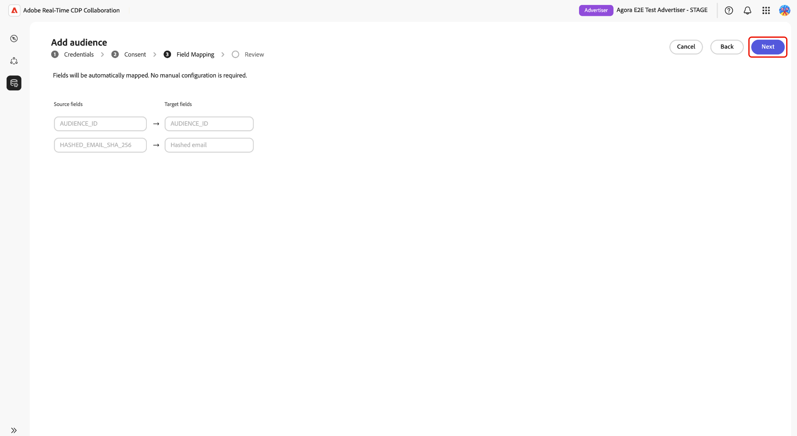
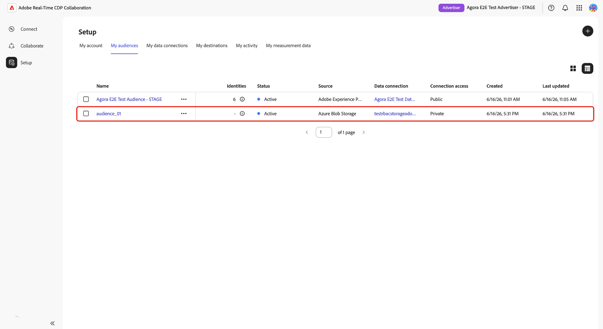

# 來自Azure儲存空間的Source對象

將[!DNL Azure Blob Storage]或[!DNL Azure Data Lake Storage] (ADLS) Gen2連線至Adobe Real-Time CDP Collaboration，以取得第一方對象資料以進行啟用和重疊分析。

使用本指南建立可重複使用的[!DNL Azure]資料連線，並從設定的儲存位置執行一次性匯入。 開始之前，請確認您的對象檔案符合[對象來源規格](../../assets/quick-start/RTCDP_Collaboration_Audience_Sourcing_Spec_v1_3.pdf)。 您將在設定程式進行期間，授予Adobe對Azure儲存區的讀取存取權。

## 選擇您的[!DNL Azure]來源型別 {#choose-source-type}

Collaboration支援兩個[!DNL Azure]擷取選項。 使用下表挑選與您的對象檔案所在位置相符的指南路徑。

| | **[!DNL Azure Blob Storage]** | **[!DNL Azure Data Lake Storage]Gen2** |
|---|---|---|
| **使用時機** | 檔案位於儲存體帳戶上的標準Blob **容器**&#x200B;中（不需要階層式名稱空間）。 | 檔案位於已啟用&#x200B;**階層式名稱空間(ADLS Gen2)**&#x200B;之儲存體帳戶上的&#x200B;**檔案系統**&#x200B;中。 |
| Collaboration中的&#x200B;**Source選項** | **[!DNL Azure Blob Storage]** | **[!DNL Azure Data Lake Storage]Gen2** |
| **Collaboration中的必要欄位** | 儲存體帳戶，**[!UICONTROL 容器]**，**[!UICONTROL 路徑]** | 儲存體帳戶，**[!UICONTROL 容器]** （ADLS Gen2檔案系統），**[!UICONTROL 路徑]** |
| **許可權區段** | [[!DNL Azure Blob] 許可權](#set-up-azure-blob-storage-permissions) | [[!DNL Azure Data Lake Storage] Gen2許可權](#set-up-adls-gen2-permissions) |

您只能為每個資料連線&#x200B;**設定**&#x200B;一個來源型別。 若要同時從[!DNL Blob]和ADLS取得來源，請建立個別的資料連線。

## 先決條件 {#prerequisites}

在遵循本指南之前，請先完成[帳戶上線和設定](./onboard-account.md)。 接著，請先完成本節中的必要條件，再開始設定工作流程。

某些步驟需要由&#x200B;**[!DNL Azure]管理員**&#x200B;執行動作。 如果您不是組織的[!DNL Azure]管理員，請在開始之前識別適當的人員。

### [!DNL Azure]存取與許可權 {#azure-access-and-permissions}

在Collaboration中設定連線之前，您或您的[!DNL Azure]管理員必須授予Adobe對儲存容器或ADLS Gen2檔案系統（包含您的對象檔案）的讀取存取權。 許可權設定完成後，Collaboration設定工作流程會在&#x200B;**[!UICONTROL 同意]**&#x200B;步驟中驗證存取權。

### 準備您的對象資料 {#prepare-audience-data}

您的對象檔案必須符合&#x200B;**[對象來源規格(v1.2)](../../assets/quick-start/RTCDP_Collaboration_Audience_Sourcing_Spec_v1_3.pdf)**，來源才會開始。

主要需求包括：

* **檔案格式：** CSV，使用逗號作為欄位分隔符號，使用直立線符號(`|`)作為單一欄位中多個值的分隔符號。
* **必要欄位：**&#x200B;每個記錄都必須包含`AUDIENCE_ID`欄和至少一個支援的相符索引鍵欄。
* **支援的相符金鑰：** `HASHED_EMAIL_SHA_256`，`HASHED_PHONE_SHA_256`，`HASHED_IPV4_SHA_256`，`CRM_ID`，`LOYALTY_ID`，`ADFIXUS_ID`。
* **雜湊需求：**&#x200B;所有相符索引鍵值在上傳前都必須經過修剪、小寫和SHA256雜湊。 Collaboration不會在內嵌前將資料雜湊或標準化。
* **資料行一致性：**&#x200B;您設定之路徑下的所有檔案都必須使用相同的資料行結構。

對象檔案中存在的所有相符金鑰也必須為您的Collaboration帳戶啟用。 請參閱[設定比對索引鍵](https://experienceleague.adobe.com/zh-hant/docs/real-time-cdp-collaboration/using/setup/onboard-account#set-up-match-keys)以取得指引。

>[!IMPORTANT]
>
> 建立連線後，無法移除為資料連線啟用的相符金鑰。 若要變更使用中的比對金鑰組，您必須刪除連線並建立新的連線。 開始設定工作流程之前，請確認完整的符合金鑰組態。

### 開始前所需的值 {#values-required}

開始設定工作流程之前，請先準備好下列值。

| 值 | 說明 | Azure Blob儲存範例 | ADLS Gen2範例 |
| ------------------- | ------------------------ | -------------------------------------- | -------------------------------------- |
| **儲存體帳戶** | 託管您的對象檔案的[!DNL Azure]儲存體帳戶的名稱。 | `customerdatastore` | `datalake-prod` |
| **容器** | 針對[!DNL Azure Blob Storage]，包含對象檔案的儲存容器。 對於[!DNL Azure Data Lake Storage] Gen2，請在&#x200B;**[!UICONTROL Container]**&#x200B;欄位中輸入ADLS Gen2檔案系統名稱。 | `audience-ingest` | `audiences` |
| **路徑** | 容器或檔案系統內的資料夾路徑，其中包含要擷取的對象檔案。 Collaboration只會直接在設定的路徑下擷取檔案，不會從巢狀子資料夾擷取檔案。 | `sourcing/audiences/path1/` | `sourcing/inbound/` |
| **租使用者識別碼** | 與您的[!DNL Azure]儲存體帳戶相關聯的Microsoft Entra租使用者ID。 | `00000000-0000-0000-0000-000000000000` | `00000000-0000-0000-0000-000000000000` |

## 設定[!DNL Azure]許可權 {#set-up-azure-permissions}

完成本節中的步驟以準備您的[!DNL Azure]環境。 Adobe需要儲存容器的讀取存取權，Collaboration設定工作流程才能建立連線。 這項工作是在[!DNL Azure]入口網站中執行，可能需要由您的[!DNL Azure]管理員完成。

完成此區段後，請繼續[設定您的 [!DNL Azure] 連線](#configure-your-azure-connection)。

### 取得Adobe的[!DNL Azure]服務主要識別碼 {#obtain-principal-identifier}

在您完成以下步驟的角色指派步驟之前，請聯絡您的Adobe客戶團隊，以取得您所在地區（北美、EMEA或澳洲和紐西蘭）的[!DNL Azure]服務主要識別碼。 您將使用此識別碼來授予Adobe對存放區的讀取存取權。

### 設定[!DNL Azure Blob Storage]許可權 {#set-up-azure-blob-storage-permissions}

>[!IMPORTANT]
>
> 您需要許可權才能指派儲存體帳戶或容器的角色（例如，**所有者**&#x200B;或&#x200B;**使用者存取管理員**，或同等專案）。

1. 在[[!DNL Azure] 入口網站](https://portal.azure.com/)中，開啟儲存帳戶，然後移至&#x200B;**[!UICONTROL 容器]**，並選取包含您對象檔案的容器。
2. 選取&#x200B;**[!DNL Access control (IAM)]**，然後選取&#x200B;**[!DNL Add role assignment]**。
3. 將&#x200B;**[!DNL Storage Blob Data Reader]**&#x200B;角色指派給容器範圍中的Adobe主體。
4. 選取「**儲存**」。

### 設定ADLS Gen2許可權 {#set-up-adls-gen2-permissions}

若為ADLS Gen2連線，Collaboration中的&#x200B;**[!UICONTROL Container]**&#x200B;欄位對應至[!DNL Azure]中的ADLS Gen2檔案系統。 使用包含對象檔案的檔案系統。

在指派許可權之前，請確認儲存體帳戶已啟用&#x200B;**階層式名稱空間**，而且防火牆或私用端點規則允許Adobe存取。

1. 在[[!DNL Azure] 入口網站](https://portal.azure.com/)中，開啟包含您ADLS Gen2檔案系統的儲存體帳戶。
2. 開啟包含對象檔案的檔案系統。
3. 選取&#x200B;**[!UICONTROL 存取控制(IAM)]**，然後選取&#x200B;**[!UICONTROL 新增角色指派]**。
4. 將&#x200B;**[!DNL Storage Blob Data Reader]**&#x200B;角色指派給Adobe在檔案系統或目錄範圍的主體。
5. 選取「**[!UICONTROL 儲存]**」。

完成來源型別的許可權設定後，請繼續進行[設定您的 [!DNL Azure] 連線](#configure-your-azure-connection)。

## 設定您的[!DNL Azure]連線 {#configure-your-azure-connection}

使用Collaboration設定工作流程來驗證您的[!DNL Azure]儲存體詳細資料、確認Adobe存取權、檢閱自動對應的身分欄位，以及建立資料連線。

### 新增資料連線 {#add-new-data-connection}

導覽至&#x200B;**[!UICONTROL 設定]** > **[!UICONTROL 我的對象]**，然後選取新增圖示（） 並選擇&#x200B;**[!UICONTROL 對象]**。

{zoomable="yes"}

**[!UICONTROL 新增對象]**&#x200B;工作流程隨即顯示。 選取&#x200B;**[!UICONTROL 新增資料連線]**，然後選取&#x200B;**[!UICONTROL 下一步]**。

![顯示[新增資料連線]選項的[我的對象]檢視已選取，且[下一步]反白顯示。](../../assets/setup/azure-sourcing/add-new-data-connection.png){zoomable="yes"}

### 選取您的[!DNL Azure]資料來源 {#select-azure-data-source}

選取&#x200B;**[!UICONTROL Azure Blob儲存體]**&#x200B;或&#x200B;**[!UICONTROL Azure Data Lake儲存體Gen2]**，然後選取&#x200B;**[!UICONTROL 下一步]**。

![此新增對象工作流程顯示已選取作為資料連線型別的[!DNL Azure Blob Storage]，以及上線步驟認證、同意、欄位對應和檢閱。](../../assets/setup/azure-sourcing/azure-source-selection-step.png){zoomable="yes"}

繼續其餘步驟，以驗證您的Azure連線、確認Adobe存取權、檢閱欄位對應及建立資料連線。

### 輸入連線認證 {#enter-connection-credentials}

在&#x200B;**[!UICONTROL 認證]**&#x200B;步驟中，提供存取您的[!DNL Azure]儲存位置所需的資訊。

| 欄位 | 說明 |
|---|---|
| **[!UICONTROL 儲存體帳戶]** | 包含您的對象檔案的[!DNL Azure]儲存體帳戶。 |
| **[!UICONTROL 容器]** | 包含您的對象檔案的儲存容器或ADLS Gen2檔案系統。 |
| **[!UICONTROL 路徑]** | 容器內儲存對象檔案的資料夾路徑。 |
| **[!UICONTROL 租使用者識別碼]** | 與您的儲存體帳戶相關聯的[!DNL Azure]租使用者識別碼。 |

輸入必要的值後，請選取&#x200B;**[!UICONTROL 連線至Azure]**。

確認訊息會指出連線已成功建立。 選取&#x200B;**[!UICONTROL 「下一步」]**&#x200B;以繼續。

![認證步驟顯示已完成的儲存體帳戶、容器、路徑和租使用者ID欄位，以及已連線至[!DNL Azure]的確認訊息。](../../assets/setup/azure-sourcing/azure-credentials-step.png){zoomable="yes"}

### 將Adobe存取權授與您的[!DNL Azure]儲存空間 {#grant-adobe-access}

在&#x200B;**[!UICONTROL 同意]**&#x200B;步驟中，Collaboration會驗證您先前設定的[!DNL Azure]許可權。

選取&#x200B;**[!UICONTROL 同意URL]**&#x200B;旁的啟動圖示，以在[!DNL Azure]中開啟授權工作流程。 使用有權授予儲存位置同意權的帳戶登入，然後完成授予Adobe存取權至已設定儲存位置的Azure授權提示。 授權完成後，請返回Collaboration並選取&#x200B;**[!UICONTROL 確認同意]**&#x200B;以驗證Adobe的存取權。

>[!NOTE]
>
>[!DNL Azure]角色指派可能需要幾分鐘的時間才能傳播。 如果同意驗證未立即成功，請等候幾分鐘，確認Adobe的服務主體具有所需的角色指派，然後再試一次。

當同意驗證成功時，會出現&#x200B;**[!UICONTROL 已授予同意]**&#x200B;確認訊息。 選取&#x200B;**[!UICONTROL 「下一步」]**&#x200B;以繼續。

![此同意步驟顯示同意URL、\[!DNL Azure\]應用程式識別碼以及同意已授予的確認訊息。](../../assets/setup/azure-sourcing/azure-consent-granted-step.png){zoomable="yes"}

### 檢閱欄位對應 {#review-field-mappings}

在&#x200B;**[!UICONTROL 欄位對應]**&#x200B;步驟中，Collaboration會自動從您的來源檔案對應支援的身分識別欄位。

不需要手動設定。

>[!IMPORTANT]
>
> Collaboration會根據「對象來源規格」自動對應身分欄位。 如果顯示的對應不正確，請在完成入門工作流程之前更新您的來源檔案。

檢閱顯示的對應，並確認來源欄位符合對象檔案中的身分欄。 選取&#x200B;**[!UICONTROL 「下一步」]**&#x200B;以繼續。

{zoomable="yes"}

### 檢閱並完成連線 {#review-and-complete}

在&#x200B;**[!UICONTROL 檢閱]**&#x200B;步驟中，驗證儲存體帳戶、容器、來源路徑、租使用者ID和欄位對應。

檢閱頁面也指出目前的[!DNL Azure]工作流程執行單一來源執行，且未設定週期性排程。

設定正確時，選取&#x200B;**[!UICONTROL 完成]**。

{zoomable="yes"}

## 確認連線並監視來源對象 {#confirm-connection-and-monitor-audiences}

選取&#x200B;**[!UICONTROL 完成]**&#x200B;後，Collaboration會建立資料連線，並將您導覽至&#x200B;**[!UICONTROL 設定]** > **[!UICONTROL 我的資料連線]**。

### 確認連線已建立 {#confirm-connection-created}

**[!UICONTROL 我的資料連線]**&#x200B;中的連線卡會確認連線已成功建立。 卡片會顯示來源型別（**[!UICONTROL Azure Blob儲存體]**&#x200B;或&#x200B;**[!UICONTROL Azure Data Lake儲存體] Gen2**）、建立日期、比對金鑰、受眾規模和目前的連線狀態。

![我的資料連線檢視顯示新建立的[!DNL Azure Blob Storage]連線卡，其中包含連線詳細資料、比對金鑰、受眾規模和狀態資訊。](../../assets/setup/azure-sourcing/azure-data-connection-card.png){zoomable="yes"}

### 檢視來源對象 {#view-sourced-audiences}

建立連線後，Collaboration會自動從設定的[!DNL Azure]位置開始取得對象。 導覽至&#x200B;**[!UICONTROL 設定]** > **[!UICONTROL 我的對象]**，以監視來源補充進度並檢閱來源對象。

來源對象會出現在&#x200B;**[!UICONTROL 我的對象]**&#x200B;表格中。 使用對象狀態、身分計數、來源、資料連線和上次更新日期，確認預期對象是否來自您的[!DNL Azure]連線。

>[!TIP]
>
>來源時間會因資料量而異。 如果對象在24小時後沒有出現，請參閱[疑難排解](#troubleshooting)。

## 已知限制 {#known-limitations}

在建立或管理Azure資料連線之前，請先檢閱下列限制。

* **相符金鑰限制：**&#x200B;無法從現有連線中移除相符金鑰。 若要變更作用中的比對索引鍵，請刪除連線並建立新的連線。
* **每個[!DNL Azure]來源型別有一個使用中的連線：**&#x200B;每個帳戶可以有一個使用中的Blob連線和一個使用中的ADLS Gen2連線。 若要變更儲存位置，請刪除現有的連線並建立新的連線。
* **子資料夾支援：** Collaboration只會擷取已設定路徑下的檔案。 它不會從巢狀子資料夾擷取檔案。
* **個別的來源型別：** Blob和ADLS Gen2是不同的連線 — 請勿在單一精靈執行中混用它們之間的組態。

## 疑難排解 {#troubleshooting}

### 對象未出現或來源緩慢 {#audiences-not-appearing}

如果您在建立連線後未顯示來源對象，請完成下列動作。

* 確認對象檔案直接存在於設定的路徑下方，並符合Audience Sourcing規格。
* 檢查&#x200B;**[!UICONTROL 我的資料連線]**&#x200B;是否有錯誤。
* 如果24小時後問題仍然存在，請聯絡Adobe支援，提供連線名稱、儲存帳戶和容器詳細資訊。

### 對象來源，但顯示零或未預期的身分 {#zero-identities}

如果對象出現在貨源搜尋之後，但身分計數為零或低於預期，請完成下列動作。

* 確認對象檔案中的所有相符索引鍵值在上傳前均已修剪、小寫和SHA256雜湊。 Collaboration不會在內嵌時雜湊或標準化資料。
* 確認已針對您的Collaboration帳戶啟用檔案中存在的相符金鑰。 請參閱[設定相符金鑰](https://experienceleague.adobe.com/zh-hant/docs/real-time-cdp-collaboration/using/setup/onboard-account#set-up-match-keys)。

### 初次成功後連線失敗 {#connection-failed}

當連線成功建立但稍後進入失敗狀態時，請使用這些檢查。

* 確認Adobe主體的[!DNL Azure] RBAC角色指派並未移除或縮小。
* 確認檔案仍然存在於路徑中並符合規格。

### 匯入或格式化錯誤 {#format-errors}

當sourcing因檔案結構、雜湊或欄格式問題而失敗時，請使用這些檢查。

* 請確定所有檔案與初始內嵌檔案都保留相同的欄結構和雜湊規則。

## 後續步驟 {#next-steps}

來源完成之後，即可在&#x200B;**[!UICONTROL 我的對象]**&#x200B;中使用對象來啟動、重疊分析和測量工作流程。 若要透過共同作業人員啟用來源對象，請參閱[啟用對象](../collaborate/activate.md)。

其他可用的來源方法包括Experience Platform、[!DNL Amazon S3]、[!DNL Google Cloud Storage]、[!DNL Snowflake]和CSV檔案上傳。 如需其他對象來源方法，請參閱：

* [設定Google Cloud Storage來取得受眾](./configure-gcs-audience-sourcing.md)
* [設定Snowflake以取得對象](./configure-snowflake-audience-sourcing.md)
* [設定AWS S3以取得對象](./configure-aws-s3-audience-sourcing.md)
* [來自Experience Platform的Source對象](./onboard-audiences.md)
* [上傳CSV檔案以取得對象](./upload-csv-audience-sourcing.md)
