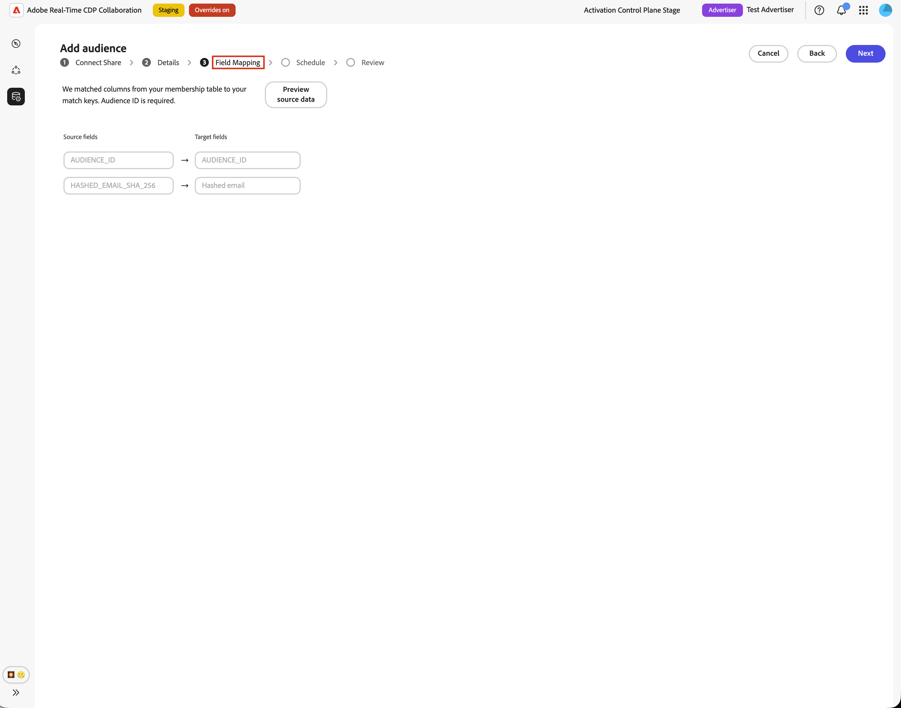
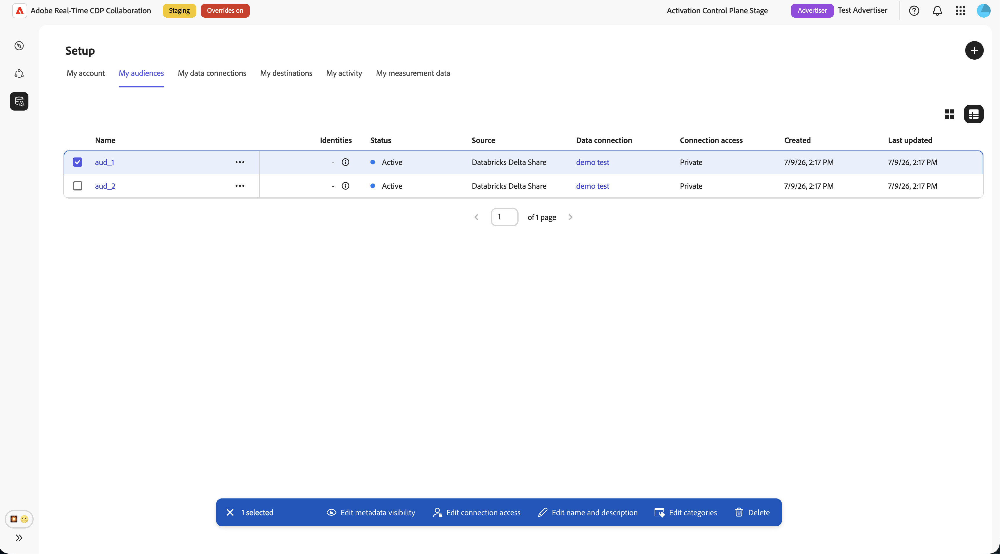

# 設定[!DNL Databricks Delta Share]以取得對象來源

使用本指南透過使用者介面將[!DNL Databricks Delta Share]連線至Adobe Real-Time CDP Collaboration並取得第一方對象。

當您連線[!DNL Databricks Delta Share]時，Collaboration會直接從您的Unity Catalog共用讀取對象資料。 sourcing完成後，您即可在共同作業專案中使用對象進行啟用和重疊分析。

本指南說明如何準備先決條件、連線您的[!DNL Delta Share]、指定來源表格、對應身分欄位，以及驗證對象來源是否成功啟動。

來源為[!DNL Databricks]的對象會遵循與來源為Adobe Experience Platform和其他支援雲端來源的對象相同的治理和資料處理規則。

其他可用的來源方法包括[Experience Platform](./onboard-audiences.md)、[Amazon S3](./configure-aws-s3-audience-sourcing.md)、[Google雲端儲存空間](./configure-gcs-audience-sourcing.md)、[Snowflake](./configure-snowflake-audience-sourcing.md)、[Azure儲存空間](./configure-azure-storage-audience-sourcing.md)和[CSV檔案上傳](./upload-csv-audience-sourcing.md)。 若要進一步瞭解Collaboration中的所有可用來源，請參閱[來源概觀](./source-overview.md)。

## 先決條件 {#prerequisites}

開始設定工作流程之前，請先完成本節中的先決條件。 缺少先決條件是設定失敗或對象在來源後未出現的常見原因。 在遵循本指南之前，請先完成[帳戶上線和設定](./onboard-account.md)。

本指南中的部分工作需要[!DNL Databricks]管理員的協助。 如果您沒有為您的組織管理[!DNL Databricks]，請在開始之前與適當的管理員合作。

### [!DNL Databricks Delta Share]存取權 {#databricks-delta-share-access}

繼續之前，請向您的[!DNL Databricks]管理員確認下列事項：

* 您的組織已使用Native Databricks-to-Databricks共用(Unity Catalog)將[!DNL Delta Share]發佈到Adobe的[!DNL Databricks]帳戶。 Collaboration不支援此工作流程UI中的持有人權杖或OIDC憑證專案。
* 您知道Adobe的Unity Catalog中繼存放區中註冊的提供者名稱、共用名稱，以及包含對象表格的綱要。
* 您的Collaboration帳戶和地區有[!DNL Databricks Delta Share]受眾來源可用。 如果您所在地區尚未提供資料庫來源，請聯絡您的Adobe客戶代表以確認時間表。

如需將共用發佈至Adobe的逐步指示，請參閱本指南中的[將差異共用發佈至Adobe](#publish-delta-share)一節。

### 準備您的對象資料 {#prepare-audience-data}

建構您的對象表格，讓Collaboration可以發現對象並正確對應身分。

* **成員資格資料表（必要）：**&#x200B;共用結構描述中的資料表，包含每個設定檔 — 對象配對的一列。 此資料表必須包含可對應至`AUDIENCE_ID`的資料行，以及至少一個支援的相符索引鍵資料行。 Collaboration使用此表格進行來源資料預覽和欄位對應。
* **中繼資料表格（選用）：**&#x200B;如果您維護個別的對象目錄（每個對象一列，包含對象ID、名稱、計數或類似的中繼資料），您可以提供此表格，讓Collaboration從中讀取對象定義，而非僅從成員資格表格推斷不同的對象ID。
* **支援的相符金鑰：** `HASHED_EMAIL_SHA_256`、`HASHED_PHONE_SHA_256`、`HASHED_IPV4_SHA_256`、`CRM_ID`、`LOYALTY_ID`、`ADFIXUS_ID`，以及其他為您的Collaboration帳戶啟用的相符金鑰。
* **雜湊需求：**&#x200B;所有相符索引鍵值都必須經過修剪、小寫和SHA256雜湊處理，才能儲存在[!DNL Databricks]中。 Collaboration不會在內嵌前將資料雜湊或標準化。
* **資料行一致性：**&#x200B;成員資格資料表必須公開Collaboration可對應到您啟用的相符索引鍵的穩定資料行名稱。

您也必須為Collaboration帳戶啟用成員資格表格中存在的所有相符金鑰。 若要新增或啟用比對金鑰，請參閱[設定比對金鑰](./onboard-account.md#set-up-match-keys)。

### 開始前所需的值 {#required-values}

在啟動設定精靈之前，請先準備好下列值。

| 值 | 說明 |
| ----- | ----------- |
| 提供者名稱 | Adobe在Unity Catalog中用來存取您的[!DNL Delta Share]的提供者識別碼。 您的[!DNL Databricks]管理員或Adobe入門聯絡人可以提供此值。 這個值與您的[!DNL Databricks]工作區URL不同。 |
| 共用名稱 | 發佈至Adobe的[!DNL Delta Share]名稱。 |
| 結構描述 | 共用中包含對象表格的綱要。 |
| 成員資格表格 | 結構描述中的表格名稱，其中包含對象成員資格列（對象中每個設定檔各一列）。 |
| 中繼資料表格（選擇性） | 結構描述中列出對象的表格名稱（每個對象一列），如果您使用中繼資料導向的對象目錄。 |

{style="table-layout:auto"}

## 設定您的[!DNL Databricks]連線 {#configure-databricks-connection}

設定工作流程是&#x200B;**[!UICONTROL 設定]**&#x200B;工作區內的多步驟精靈。 依序完成每個步驟。

### 新增資料連線 {#add-data-connection}

從&#x200B;**[!UICONTROL 設定]**&#x200B;工作區中的&#x200B;**[!UICONTROL 我的對象]**&#x200B;索引標籤中，選取新增圖示（） 然後選取&#x200B;**[!UICONTROL 對象]**。

如果這是您的第一個對象，您也可以選取&#x200B;**[!UICONTROL 新增]**&#x200B;選項。

「新增對象」工作流程隨即顯示。 選取&#x200B;**[!UICONTROL 新增資料連線]**，然後選取&#x200B;**[!UICONTROL 下一步]**。

![反白顯示[新增資料連線]選項的[新增對象]工作區。](../../assets/setup/add-manage-audiences/add-data-connection.png){zoomable="yes"}

### 選取 [!DNL Databricks Delta Share] 作為資料來源。 {#select-databricks-delta-share}

資料來源選取畫面會列出所有可用的連線型別。 選取&#x200B;**[!UICONTROL 資料庫差異共用]**，然後選取&#x200B;**[!UICONTROL 下一步]**。

### 連線您的[!DNL Delta Share] {#connect-delta-share}

>[!CONTEXTUALHELP]
>id="rtcdp_collaboration_audience_sharing_databricks"
>title="Experience League"
>abstract="請參閱[!DNL Databricks Delta Share] sourcing指南，以取得設定您共用對象來源的相關指示"

提供允許Collaboration存取您的[!DNL Delta Share]所需的詳細資料。 輸入您[!DNL Databricks Delta Share]的提供者、共用、結構描述及資料表詳細資料。 共用結構描述中必須有必要的成員資格表格。 如果您使用中繼資料表格，它也必須可在相同的共用結構描述中使用。
輸入必要資訊後，選取&#x200B;**[!UICONTROL 連線]**。

Collaboration會驗證共用並掛載至Adobe的工作區。 此步驟最多可能需要一分鐘。 建立連線時，會出現進度指示器。

| 欄位 | 說明 |
| --- | --- |
| **[!UICONTROL 提供者名稱]** | Adobe用來使用您共用的Unity Catalog提供者名稱。 檢視開始[&#128279;](#required-values)前所需的值。 |
| **[!UICONTROL 共用名稱]** | 發佈至Adobe的[!DNL Delta Share]名稱。 |
| **[!UICONTROL 結構描述]** | 共用中包含對象表格的綱要。 |
| **[!UICONTROL 資料表]** | 結構描述中的表格名稱，其中包含對象成員資格列（對象中每個設定檔各一列）。 |
| **[!UICONTROL 中繼資料表]** | 列出對象的表格（每個對象一列）。 |

![此新增對象工作流程顯示Databricks連線 — 共用表單，其中包含提供者名稱、共用名稱、結構描述、資料表格和中繼資料表格欄位，以及[下一步]按鈕可用。](../../assets/setup/databricks-audience-sourcing/databricks-connect-share-successful.png)

如果找不到共用或結構描述尚未顯示，則會出現錯誤訊息。 請向您的[!DNL Databricks]管理員確認值，然後再試一次。

### 確認同意及資料使用確認 {#confirm-consent}

繼續進行之前，請確認您已針對傳送至Collaboration的對象資料，套用法律規定的任何選擇退出。 如果您不確定您的資料是否符合此要求，請先檢閱[治理原則與執行動作](./onboard-audiences.md#governance-policy-and-enforcement-actions)指南，再繼續進行。 選取確認核取方塊，然後選取&#x200B;**[!UICONTROL 確定]**&#x200B;以繼續。

### 提供連線詳細資料 {#provide-connection-details}

輸入此資料連線的名稱和說明（選擇性）。 您提供的名稱會顯示在&#x200B;**[!UICONTROL 我的資料連線]**&#x200B;標籤中，如果您管理多個資料連線，此名稱有助於區分此來源。

* **[!UICONTROL 資料連線名稱]** （必要）
* **[!UICONTROL 資料連線描述]** （選擇性）

選取&#x200B;**[!UICONTROL 「下一步」]**&#x200B;以繼續。

### 對應身分欄位 {#map-identity-fields}

**[!UICONTROL 對應]**&#x200B;畫面顯示Collaboration如何將來源資料行從您的成員資格資料表對應到目標身分識別欄位。 Collaboration會根據欄名稱和為您的帳戶啟用的相符金鑰自動對應欄位。

>[!TIP]
>
>選取&#x200B;**[!UICONTROL 預覽來源資料]**&#x200B;以表格格式檢閱成員資格表格的範例，然後選取&#x200B;**[!UICONTROL 關閉]**&#x200B;以返回對應畫面。

確認顯示的對應反映成員資格表格中的欄。 選取&#x200B;**[!UICONTROL 「下一步」]**&#x200B;以繼續。

### 排程重新整理頻率和日期範圍 {#schedule-refresh}

**[!UICONTROL 排程]**&#x200B;檢視出現。 使用下拉式功能表選取一到六天之間的重新整理頻率，然後設定作用中的日期範圍。 使用日曆圖示指定開始和結束日期。

>[!IMPORTANT]
>
>為了有效管理您的Collaboration積分，請將重新整理頻率設定為符合或超過基礎資料重新整理的更新頻率。

### 檢閱並完成連線 {#review-and-complete}

在建立連線之前，請先檢閱組態摘要。 摘要畫面會顯示下列區段：

* **[!UICONTROL 資料連線]**：您設定的連線名稱、提供者名稱、共用名稱和結構描述。
* **[!UICONTROL 對應]**：來源與目標識別欄位對應。
* **[!UICONTROL 排程]**：重新整理頻率和作用中的日期範圍。

請確認所有區段正確無誤，然後選取&#x200B;**[!UICONTROL 完成]**。

確認對話方塊隨即顯示，指出Collaboration已建立資料連線，且對象來源正在進行中。

## 檢閱來源對象 {#review-sourced-audiences}

在您完成設定精靈後，Collaboration會以非同步方式開始從您的[!DNL Databricks]表格取得對象。 瀏覽至&#x200B;**[!UICONTROL 設定] > [!UICONTROL 我的對象]**&#x200B;以監視進度。 貨源搜尋不會立即完成；所需時間取決於資料大小。

### 監控對象來源進度 {#monitor-sourcing-progress}

當Collaboration擷取您的對象資料時，**[!UICONTROL 我的對象]**&#x200B;工作區頂端的橫幅會指出來源補充正在進行中。 個別對象只有在每個對象的sourcing完成後才會出現在清單中。

![在[我的對象]索引標籤上設定工作區，顯示「對象來源正在進行」橫幅，指出對象是從Databricks資料連線所來源，對象清單顯示如下。](../../assets/setup/databricks-audience-sourcing/databricks-audience-sourcing-in-progress-banner.png)

>[!TIP]
>
>對象來源時間會因您的成員資格表格大小，以及您是否使用中繼資料表格進行對象探索而有所不同。 較大的資料集可能需要更長的時間才會出現在&#x200B;**[!UICONTROL 我的對象]**&#x200B;工作區中。

### 檢視來源對象詳細資料 {#view-audience-details}

來源補充完成後，您的[!DNL Databricks]對象會與其他連線來源的對象一起出現在&#x200B;**[!UICONTROL 我的對象]**&#x200B;標籤中。 選取列專案或&#x200B;**[!UICONTROL 檢視對象]**&#x200B;以開啟特定對象的詳細資料檢視。

詳細資料檢視會顯示對象的狀態、來源和資料連線名稱，以及下列面板：

* **[!UICONTROL 身分]**：資料可供使用時，對象的身分計數和劃分總數。
* **[!UICONTROL 類別]**：任何套用於組織或篩選對象的標籤。
* **[!UICONTROL 連線存取]**：對象是私人、公開或與特定共同作業人員共用。
* **[!UICONTROL 中繼資料可見性]**：共同作業人員可以看到哪些對象資訊，例如身分計數、重疊百分比和索引。

在共同作業專案中使用對象之前，請先檢閱這些設定。 若要更新類別、連線存取權或中繼資料可見度，請參閱[檢視和管理個別對象](./onboard-audiences.md#view-individual-audiences)。

### 編輯對象設定 {#edit-audience-settings}

您可以直接從&#x200B;**[!UICONTROL 我的對象]**&#x200B;清單檢視編輯對象中繼資料，而不需開啟詳細資料檢視。 選取對象的核取方塊以顯示動作工具列，然後選取動作： **[!UICONTROL 編輯中繼資料可見度]**、**[!UICONTROL 編輯連線存取權]**、**[!UICONTROL 編輯名稱和描述]**、**[!UICONTROL 編輯類別]**&#x200B;或&#x200B;**[!UICONTROL 刪除]**。

### 檢視您的[!DNL Databricks]資料連線 {#view-databricks-connection}

若要檢閱連線本身，包括其相符金鑰，請瀏覽至&#x200B;**[!UICONTROL 設定]** > **[!UICONTROL 我的資料連線]**。 您的新[!DNL Databricks]連線在那裡可用。 對象來源顯示為&#x200B;**[!UICONTROL 資料庫差異共用]**。

![我的資料連線標籤顯示[!DNL Databricks Delta Share]資料連線，其中包含sourcing狀態資訊。](../../assets/setup/databricks-audience-sourcing/databricks-my-data-connections-tab.png)

## 已知限制 {#known-limitations}

設定和使用[!DNL Databricks Delta Share]對象來源時，請注意下列限制：

* **僅原生共用：** UI僅支援原生資料庫對資料庫[!DNL Delta Sharing]。 配置精靈中無法使用持有人權杖和OIDC驗證流程。
* **沒有精靈中的資料表瀏覽器：**&#x200B;您必須手動輸入資料表名稱。 當您預覽表格時，Collaboration會驗證表格名稱；它不會自動列出共用中的所有表格。
* **中繼資料表格列限制：**&#x200B;當您使用中繼資料表格進行對象探索時，Collaboration會從該表格匯入最多100,000個對象列。 如果您的目錄超過此限制，請聯絡Adobe支援。
* **符合索引鍵條件約束：**&#x200B;一旦為資料連線啟用符合索引鍵，就無法移除它。 您可以將相符金鑰新增至現有的連線，但無法停用或刪除它們。 若要變更作用中的比對金鑰，您必須[刪除資料連線](./manage-data-connection.md#delete-data-connection)並建立新的連線。
* **必要的成員資格表格：**&#x200B;即使您使用中繼資料表格進行對象探索，也必須指定成員資格表格。 Collaboration會在擷取期間從成員資格表格中讀取身分列。

## 疑難排解 {#troubleshooting}

使用此區段來解決設定期間或設定之後發生的問題。 若在共用連線期間發生錯誤，請檢閱您的[!DNL Databricks]管理員提供者名稱、共用名稱及結構描述。

**共用連線失敗或逾時**

* 確認您的[!DNL Delta Share]已發佈至Adobe的[!DNL Databricks]帳戶，而且提供者名稱、共用名稱和結構描述正確。
* 確認結構顯示在共用中。 新發佈的共用可能需要一些時間才能傳播。
* 如果連線在幾分鐘後仍失敗，請重新啟動設定並重試，或聯絡Adobe客戶支援並提供提供者名稱、共用名稱、結構描述和任何相關錯誤詳細資料。 請勿包含敏感認證。

**資料表預覽失敗**

* 確認資料表名稱拼字正確，並存在於您指定的結構描述中。
* 確認資料表包含在發佈至Adobe的[!DNL Delta Share]中。
* 對於中繼資料導向的探索，請先預覽成員資格表格和中繼資料表格，然後再繼續。

**欄位對應驗證區塊進度**

* 確認您的成員資格資料表包含可對應至&#x200B;**`AUDIENCE_ID`**&#x200B;的資料行。
* 請確定至少兩個身分欄位已完全對應（來源和目標）。
* 使用&#x200B;**[!UICONTROL 預覽來源資料]**&#x200B;來驗證資料行名稱是否符合您啟用的比對金鑰。

**對象未出現或來源搜尋所花的時間比預期長**

* 來源時間會隨著資料量而調整。 大型成員資格表格預期會延長處理時間。
* 如果對象未在24小時內出現，請檢查&#x200B;**[!UICONTROL 我的資料連線]**&#x200B;索引標籤，以取得連線上的錯誤指標。
* 確認您的成員資格資料表結構和欄位對應符合[準備您的對象資料](#prepare-audience-data)中的要求。
* 如果問題仍然存在，請聯絡Adobe客戶支援，並提供資料連線名稱和表格詳細資訊。

**資料連線在初始成功後顯示失敗狀態**

* 確認自您建立連線後，[!DNL Databricks]中的[!DNL Delta Share]與資料表尚未移除或重新命名。
* 確認Adobe的共用存取權尚未撤銷。
* 如果問題仍然存在，請聯絡Adobe客戶支援。

## 將您的[!DNL Delta Share]發佈到Adobe {#publish-delta-share}

[!DNL Databricks] Unity Catalog [!DNL Delta Sharing]可讓您安全地與其他[!DNL Databricks]帳戶共用表格，而不需複製資料。 若要允許Collaboration讀取您的對象資料，您的[!DNL Databricks]管理員必須將[!DNL Delta Share]發佈至Adobe的[!DNL Databricks]消費者帳戶。

### 發佈之前 {#before-you-publish}

請與您的Adobe客戶代表或入門聯絡人合作，以取得：

* 確認Adobe已準備好接收您在本地區的份額。
* Adobe在其Unity Catalog中繼存放區中使用的提供者名稱，可將您的組織識別為共用提供者。

在您的[!DNL Databricks]工作區中準備下列專案：

* 包含結構描述和資料表的[!DNL Delta Share]將由Collaboration讀取。
* 成員資格表格，每個設定檔 — 對象配對有一列，**`AUDIENCE_ID`**&#x200B;欄和相符索引鍵。
* 選用的中繼資料表格（如果您打算使用中繼資料導向的對象探索）。

### 發佈共用 {#publish}

請依照您組織的[!DNL Databricks Delta Sharing]程式，授予Adobe的消費者帳戶存取共用的許可權。 確切步驟取決於您的[!DNL Databricks]部署和治理模型。 一般而言：

1. 在Unity Catalog中，建立或識別包含對象結構描述和表格的共用。
2. 將方案（或個別表格）新增至共用。
3. 使用原生Databricks-to-Databricks共用將共用授與Adobe的[!DNL Databricks]消費者帳戶。
4. 向您的Adobe連絡人確認可在消費者端看到共用，並注意Collaboration設定精靈的提供者名稱和共用名稱。
5. 有關[!DNL Delta Sharing]上的[!DNL Databricks]產品檔案，請參閱[資料庫差異共用檔案](https://docs.databricks.com/aws/en/delta-sharing)。

### 收集Collaboration的[!DNL Databricks]詳細資料 {#collect-databricks-details}

發佈共用後，請確定您擁有Collaboration設定工作流程可用的提供者名稱、共用名稱、結構描述和表格名稱。

在啟動Collaboration設定精靈之前，請先收集下列詳細資料。

| 欄位 | 說明 | 範例 |
| ------| ----------- | ------- |
| 提供者名稱 | Adobe Unity Catalog中繼存放區中的提供者識別碼（來自Adobe上線） | `your_org_provider` |
| 共用名稱 | 已發佈[!DNL Delta Share]的名稱 | `audience_share_prod` |
| 結構描述 | 結構描述 | `collaboration_audiences` |
| 成員資格表格 | 包含設定檔對象成員資格列的表格 | `audience_members` |
| 中繼資料表格（選擇性） | 列出對象的表格（每個對象一列） | `audience_catalog` |

{style="table-layout:auto"}

## 後續步驟 {#next-steps}

您已將[!DNL Databricks Delta Share]設定為Collaboration中的資料來源。 來源完成之後，您的對象可在&#x200B;**[!UICONTROL 我的對象]**&#x200B;工作區中使用，並準備用於共同作業專案。

從此處，您可以：

* [建立及管理共同作業專案](../collaborate/manage-projects.md)
* [在專案中啟用對象](../collaborate/activate.md)
* [檢閱重疊和測量效能](../collaborate/measure.md)
* [管理對象設定和可見度](./onboard-audiences.md#view-individual-audiences)
* [檢視及管理資料連線](./manage-data-connection.md)

如需其他對象來源方法，請參閱：

* [設定 [!DNL Google Cloud Storage] 對象來源](./configure-gcs-audience-sourcing.md)
* [設定 [!DNL Amazon S3] 對象來源](./configure-aws-s3-audience-sourcing.md)
* [設定 [!DNL Snowflake] 對象來源](./configure-snowflake-audience-sourcing.md)
* [來自Experience Platform的Source對象](./onboard-audiences.md)
* [上傳CSV檔案以取得對象](./upload-csv-audience-sourcing.md)
