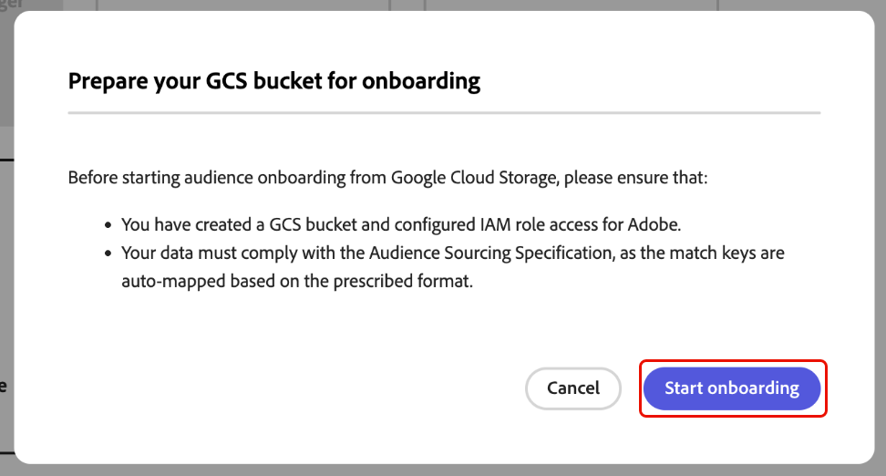
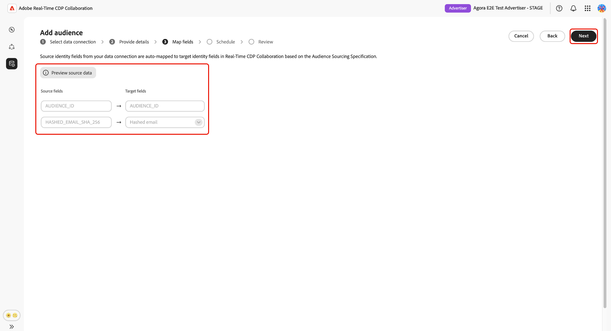
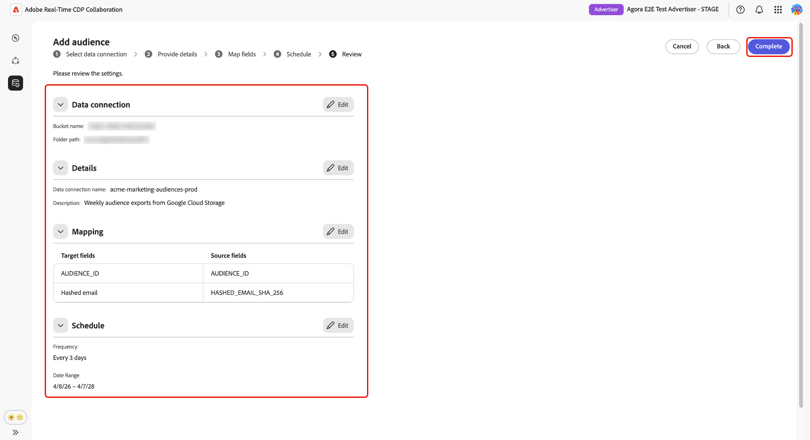
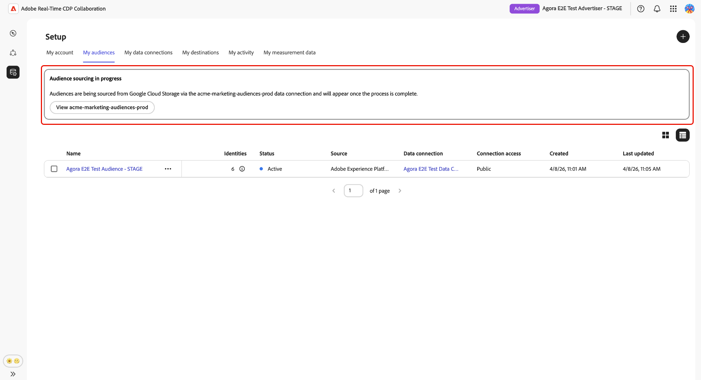
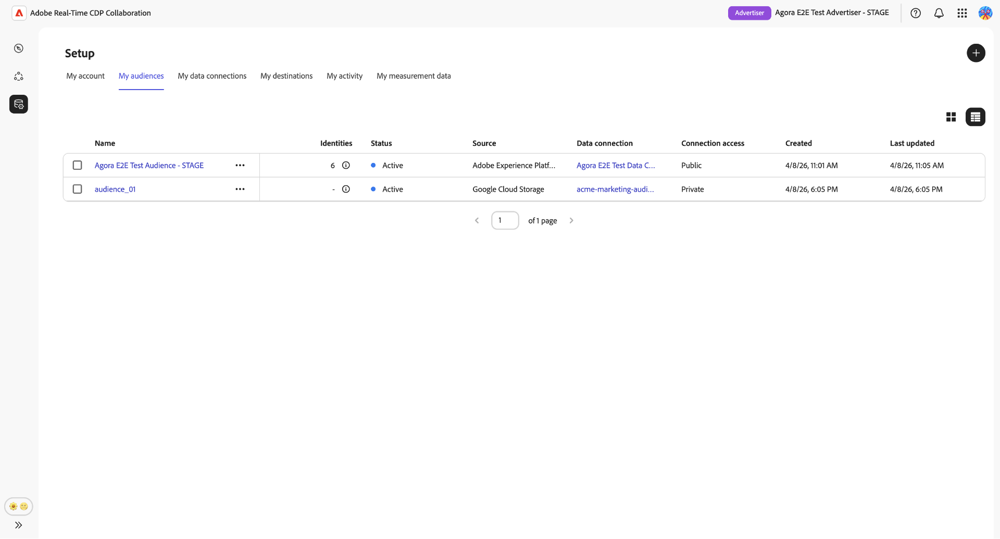
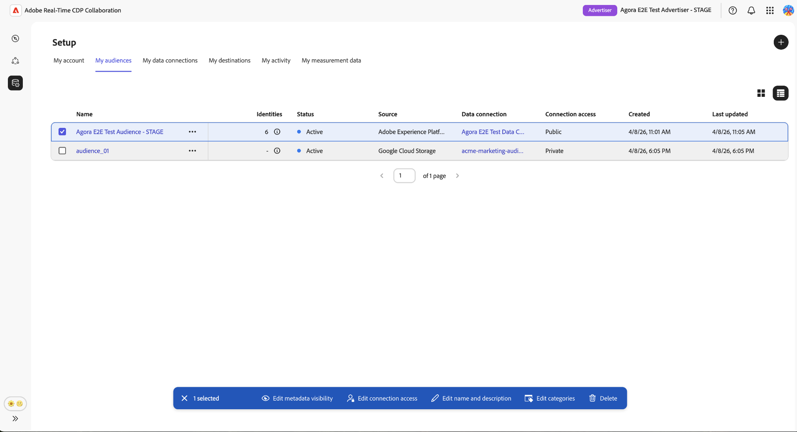

# 設定[!DNL Google Cloud Storage]以取得對象來源

請依照本指南中的步驟，將您的[!DNL Google Cloud Storage] (GCS)貯體連線至Adobe Real-Time CDP Collaboration，並開始透過UI取得第一方對象資料。

將GCS貯體連線到Collaboration以直接擷取第一方受眾資料，無需工程支援。 在連線後，Collaboration會根據週期性排程從您的貯體中取得對象，並讓這些對象可在您的共同作業專案中用於啟用和重疊分析。 您必須先將對象來源化，才能加以啟用，或在與共同作業人員的重疊分析中使用對象。

本指南涵蓋端對端設定工作流程：準備先決條件、驗證您的GCS貯體、檢閱自動對應的身分欄位、排程資料重新整理，以及確認來源已成功完成。

來源為[!DNL Google Cloud Storage]的對象會遵循與來源為Adobe Experience Platform的對象相同的治理和資料處理規則。

其他可用的來源方法包括[Experience Platform](./onboard-audiences.md)、[Amazon S3](./configure-aws-s3-audience-sourcing.md)、[Snowflake](./configure-snowflake-audience-sourcing.md)和[CSV檔案上傳](./upload-csv-audience-sourcing.md)。

## 先決條件 {#prerequisites}

請先完成本節中的所有專案，再開始設定工作流程。 不完整的先決條件是最常見的原因，包括設定失敗或對象在來源後未出現。 在遵循本指南之前，您必須已完成[帳戶上線和設定](./onboard-account.md)。

本節中的某些步驟需要由[!DNL Google Cloud]管理員執行動作。 如果您不是組織的[!DNL Google Cloud]管理員，請在開始之前識別適當的人員。

### GCS存取和許可權 {#gcs-access-permissions}

<!-- [LINK REQUIRED: Once the GCS permissions and roles guide is published, replace this NOTE with a direct link to that guide and remove the placeholder instructions below.] -->

>[!NOTE]
>
>涵蓋此整合所需的特定[!DNL Google Cloud]個IAM角色、服務帳戶設定和貯體層級許可權的專屬指南正在等候發佈。 在該指南可用之前，請與您的[!DNL Google Cloud]管理員合作，確認Adobe具有針對您的貯體進行驗證並讀取受眾檔案所需的許可權。

繼續之前，請向您的[!DNL Google Cloud]管理員確認下列事項：

* Adobe已獲得對您的GCS貯體進行驗證和讀取受眾檔案所需的許可權。
* [!DNL Google Cloud Storage]對象來源可在您的地區使用。 供應情況因地區而異（北美地區、歐洲、中東和非洲地區、澳新地區）。 如果您所在地區尚未提供GCS來源，請聯絡您的Adobe客戶代表以確認時間表。

### 準備您的對象資料 {#prepare-audience-data}

您的對象檔案必須符合&#x200B;**[對象來源規格(v1.2)](../../assets/quick-start/RTCDP_Collaboration_Audience_Sourcing_Spec_v1.2.pdf)**，來源才會開始。 檢閱完整結構描述定義和欄位層級範例的規格。 主要需求包括：

* **檔案格式：** CSV，使用逗號作為欄位分隔符號，使用直立線符號(`|`)作為單一欄位中多個值的分隔符號。
* **必要欄位：**&#x200B;每個記錄都必須包含`AUDIENCE_ID`欄和至少一個支援的相符索引鍵欄。
* **支援的相符金鑰：** `HASHED_EMAIL_SHA_256`，`HASHED_PHONE_SHA_256`，`HASHED_IPV4_SHA_256`，`CRM_ID`，`LOYALTY_ID`，`ADFIXUS_ID`。
* **雜湊需求：**&#x200B;所有相符索引鍵值在上傳前都必須經過修剪、小寫和SHA256雜湊。 Collaboration不會在內嵌前將資料雜湊或標準化。
* **資料行一致性：**&#x200B;如果您的儲存貯體包含多個對象檔案，則所有檔案必須使用相同的資料行結構。

對象檔案中存在的所有相符金鑰也必須為您的Collaboration帳戶啟用。 若要新增或啟用比對金鑰，請參閱[設定比對金鑰](./onboard-account.md#set-up-match-keys)。

### 開始前所需的值 {#required-values}

在啟動設定精靈之前，請先準備好下列值。

| 值 | 說明 |
| --- | --- |
| **[!UICONTROL 貯體]** | 包含您的對象檔案的[!DNL Google Cloud Storage]儲存貯體的名稱。 |
| **[!UICONTROL 路徑]** | 儲存對象檔案之貯體中的路徑前置詞（例如，`sourcing/testdata/path1/`）。 |

## 設定您的[!DNL Google Cloud Storage]連線 {#configure-gcs-connection}

設定工作流程是&#x200B;**[!UICONTROL 設定]**&#x200B;工作區內的多步驟精靈。 依序完成每個步驟。 在建立連線之前，您可以使用最終稽核畫面上的鉛筆圖示返回任何步驟。

### 新增資料連線 {#add-data-connection}

從&#x200B;**[!UICONTROL 設定]**&#x200B;工作區中的&#x200B;**[!UICONTROL 我的對象]**&#x200B;索引標籤中，選取新增圖示（） 然後選取&#x200B;**[!UICONTROL 對象]**。

如果這是您的第一個對象，您也可以選取&#x200B;**[!UICONTROL 新增]**&#x200B;選項。

「新增對象」工作流程隨即顯示。 選取&#x200B;**[!UICONTROL 新增資料連線]**，然後選取&#x200B;**[!UICONTROL 下一步]**。

![反白顯示[新增資料連線]選項的[新增對象]工作區。](../../assets/setup/add-manage-audiences/add-data-connection.png){zoomable="yes"}

### 選取[!DNL Google Cloud Storage]作為資料來源 {#select-gcs}

>[!CONTEXTUALHELP]
>id="rtcdp_collaboration_audience_sourcing_specifications_gcs"
>title="準備您的資料以進行上線流程"
>abstract="請參閱Audience Sourcing規格指南，瞭解如何格式化和建構適用於Collaboration的Google雲端儲存空間的對象資料。"
>additional-url="https://www.adobe.com/go/rtcdp-collaboration-audience-sourcing" text="請參閱指南"

資料來源選取畫面會列出所有可用的連線型別。 選取&#x200B;**[!UICONTROL Google雲端儲存空間]**，然後選取&#x200B;**[!UICONTROL 下一步]**。

先決條件對話方塊會出現，概述必要的設定步驟（例如GCS貯體設定和IAM角色指派），並注意資料必須符合&#x200B;**[[!UICONTROL 對象來源規格]](../../assets/quick-start/RTCDP_Collaboration_Audience_Sourcing_Spec_v1.2.pdf)**。 選取&#x200B;**[!UICONTROL 開始上線]**&#x200B;以確認合規性，然後再繼續。

### 輸入您的[!DNL Google Cloud Storage]連線詳細資料 {#authenticate-gcs-connection}

提供允許Collaboration存取您的[!DNL Google Cloud Storage]儲存貯體所需的詳細資料。 輸入必要資訊後，選取&#x200B;**[!UICONTROL 下一步]**。

| 欄位 | 說明 |
| --- | --- |
| **[!UICONTROL 貯體]** | 您的[!DNL Google Cloud Storage]儲存貯體的名稱。 檢視開始](#required-values)前所需的[值。 |
| **[!UICONTROL 路徑]** | 儲存對象檔案之貯體中的路徑前置詞。 |

![此新增對象工作流程會顯示Google Cloud Storage驗證表單（含貯體名稱和資料夾路徑欄位），以及[下一步]按鈕。](../../assets/setup/gcs-audience-sourcing/gcs-data-connection-authentication.png)

### 確認同意及資料使用確認 {#confirm-consent}

您必須確認已從對象資料中移除同意退出選項，Collaboration才能處理。 如果您不確定您的資料是否符合此要求，請先檢閱[治理原則與執行動作](./onboard-audiences.md#governance-policy-and-enforcement-actions)指南，再繼續進行。 選取確認核取方塊，然後選取&#x200B;**[!UICONTROL 確定]**&#x200B;以繼續。

### 提供連線詳細資料 {#provide-connection-details}

輸入此資料連線的名稱和說明（選擇性）。 您提供的名稱會顯示在&#x200B;**[!UICONTROL 我的資料連線]**&#x200B;標籤中，如果您管理多個資料連線，此名稱有助於區分此來源。

* **[!UICONTROL 資料連線名稱]** （必要）
* **[!UICONTROL 資料連線描述]** （選擇性）。

選取&#x200B;**[!UICONTROL 「下一步」]**&#x200B;以繼續。

### 檢閱自動對應的身分欄位 {#auto-mapped-fields}

**[!UICONTROL 對應]**&#x200B;畫面是唯讀的。 Collaboration會根據「對象來源規格」中定義的欄名稱，自動將來源身分欄位從對象檔案對應至目標欄位。 您無法在此階段新增、移除或套用轉換至對應的欄位。

>[!TIP]
>
>選取&#x200B;**[!UICONTROL 預覽來源資料]**&#x200B;以表格格式檢閱對象資料的範例，然後選取&#x200B;**[!UICONTROL 關閉]**&#x200B;以返回對應畫面。

{zoomable="yes"}

確認顯示的對應反映對象檔案中的欄位。 如果不符合，請先停止並修正您的檔案，使其符合[Audience Sourcing規格](../../assets/quick-start/RTCDP_Collaboration_Audience_Sourcing_Spec_v1.2.pdf)，然後再繼續。 選取&#x200B;**[!UICONTROL 「下一步」]**&#x200B;以繼續。

### 排程資料重新整理 {#schedule-data-refresh}

在&#x200B;**[!UICONTROL 排程]**&#x200B;檢視中，設定Collaboration從您的GCS貯體中擷取更新對象資料的頻率，並定義來源的有效日期範圍。

使用&#x200B;**[!UICONTROL 頻率]**&#x200B;下拉式清單來選取Collaboration從GCS貯體中擷取更新對象資料的頻率。 可用的間隔範圍從&#x200B;**[!UICONTROL 每日]**&#x200B;到&#x200B;**[!UICONTROL 每6天]**。

在輸入欄位中輸入日期範圍，或選取行事曆圖示以設定作用中來源期間的&#x200B;**[!UICONTROL 開始日期]**&#x200B;和&#x200B;**[!UICONTROL 結束日期]**。 到達結束日期時，來源會停止，且先前來源的對象會過期，而無法用於共同作業專案。

>[!IMPORTANT]
>
>將重新整理頻率設定為符合或不超過您的基礎GCS對象資料的更新速率。 支援的最低重新整理間隔是每六天一次。 重新整理的頻率高於資料變更的頻率，會消耗Collaboration積分，而不會產生更新的結果。 若要監視您的信用使用情況，請參閱[追蹤您的信用消耗活動](./my-activity.md)。

選取&#x200B;**[!UICONTROL 「下一步」]**&#x200B;以繼續。

### 檢閱並完成連線 {#review-and-complete}

在建立連線之前，請先檢閱組態摘要。 摘要畫面會顯示下列區段：

* **[!UICONTROL 資料連線]**：您設定的GCS儲存貯體認證和資料夾路徑。
* **[!UICONTROL 詳細資料]**：此資料連線的名稱和選擇性描述。
* **[!UICONTROL 對應]**：自動對應的來源和目標識別欄位。
* **[!UICONTROL 排程]**：重新整理頻率和作用中的日期範圍。

選取鉛筆圖示（） ，即可返回該步驟並進行變更。 當所有區段都正確時，請選取&#x200B;**[!UICONTROL 完成]**。

確認對話方塊隨即顯示，指出Collaboration已建立資料連線，且對象來源正在進行中。

## 檢閱來源對象 {#review-sourced-audiences}

在您完成設定精靈後，Collaboration會開始以非同步方式從GCS貯體取得受眾。 瀏覽至&#x200B;**[!UICONTROL 設定]** > **[!UICONTROL 我的對象]**&#x200B;以監視進度。 來源不會立即完成；所需時間取決於資料大小和設定的重新整理頻率。

### 監控對象來源進度 {#monitor-sourcing-progress}

當Collaboration擷取您的對象資料時，**[!UICONTROL 我的對象]**&#x200B;工作區頂端的橫幅會指出來源補充正在進行中。 個別對象只有在每個對象的sourcing完成後才會出現在清單中。

>[!TIP]
>
>對象來源時間會因GCS資料的大小和您設定的重新整理頻率而有所不同。 較大的資料集或不太頻繁的重新整理排程可能需要更長的時間才會出現在&#x200B;**[!UICONTROL 我的對象]**&#x200B;工作區中。

### 檢視來源對象詳細資料 {#view-audience-details}

來源補充完成後，您的[!DNL Google Cloud Storage]對象會與其他連線來源的對象一起出現在&#x200B;**[!UICONTROL 我的對象]**&#x200B;標籤中。 選取列專案或&#x200B;**[!UICONTROL 檢視對象]**&#x200B;以開啟特定對象的詳細資料檢視。

詳細資料檢視會顯示對象的狀態、來源和資料連線名稱，以及下列面板：

* **[!UICONTROL 身分]**：資料可供使用時，對象的身分計數和劃分總數。
* **[!UICONTROL 類別]**：任何套用於組織或篩選對象的標籤。
* **[!UICONTROL 連線存取]**：對象是私人、公開或與特定共同作業人員共用。
* **[!UICONTROL 中繼資料可見性]**：共同作業人員可看見哪些對象資訊，例如身分計數、重疊百分比和索引。

在共同作業專案中使用對象之前，請先檢閱這些設定。 若要更新類別、連線存取權或中繼資料可見度，請參閱[檢視和管理個別對象](./onboard-audiences.md#view-individual-audiences)。

### 編輯對象設定 {#edit-audience-settings}

您可以直接從&#x200B;**[!UICONTROL 我的對象]**&#x200B;清單檢視編輯對象中繼資料，而不需開啟詳細資料檢視。 選取對象的核取方塊以顯示動作工具列，然後選取動作： **[!UICONTROL 編輯中繼資料可見度]**、**[!UICONTROL 編輯連線存取權]**、**[!UICONTROL 編輯名稱和描述]**、**[!UICONTROL 編輯類別]**&#x200B;或&#x200B;**[!UICONTROL 刪除]**。

### 檢視您的GCS資料連線 {#view-gcs-connection}

若要檢閱或管理連線本身，包括其比對索引鍵和排程，請瀏覽至&#x200B;**[!UICONTROL 設定]** > **[!UICONTROL 我的資料連線]**。 您的新GCS連線立即在那裡可用。 對象來源顯示為&#x200B;**[!UICONTROL Google雲端儲存空間]**。

## 已知限制 {#known-limitations}

設定和使用[!DNL Google Cloud Storage]對象來源時，請注意下列限制：

* **符合索引鍵條件約束：**&#x200B;一旦為資料連線啟用符合索引鍵，就無法移除它。 您可以將相符金鑰新增至現有的連線，但無法停用或刪除它們。 若要變更作用中的比對金鑰，您必須[刪除資料連線](./manage-data-connection.md#delete-data-connection)並建立新的連線。
* **每個來源有一個使用中的資料連線：**&#x200B;一次只支援一個使用中的[!DNL Google Cloud Storage]資料連線。 如果您需要從不同的儲存貯體取得對象，請[刪除現有的連線](./manage-data-connection.md#delete-data-connection)，並建立指向新儲存貯體的新連線。
* **子資料夾支援：**&#x200B;對象檔案必須直接位於指定的資料夾路徑中。 Collaboration不會在該路徑內周遊子資料夾。

## 疑難排解 {#troubleshooting}

您可以使用此段落來解決建立初始連線後發生的問題。 對於驗證期間發生的錯誤，請檢閱您的憑證和貯體許可權，或聯絡您的管理員。

**對象未出現或來源搜尋所花的時間比預期長**

* 來源時間會隨著資料量和設定的重新整理頻率而調整。 大型資料集的處理時間預期會延長。
* 如果對象未在24小時內出現，請確認您的對象檔案位於您在設定期間指定的資料夾路徑中，並符合Audience Sourcing規格。
* 檢查&#x200B;**[!UICONTROL 我的資料連線]**&#x200B;索引標籤，找出連線上的錯誤指標。
* 如果完成這些步驟後問題仍然存在，請聯絡Adobe客戶支援並提供資料連線名稱和貯體詳細資料。

**資料連線在初始成功後顯示失敗狀態**

* 確認自您建立連線以來，GCS貯體許可權和認證沒有變更。 任何移除Adobe貯體存取權的變更都會導致後續來源執行失敗。
* 確認對象檔案仍存在於設定的資料夾路徑中，並符合Audience Sourcing規格。
* 如果在確認許可權和檔案可用性後問題仍然存在，請[刪除連線](./manage-data-connection.md#delete-data-connection)並建立新連線，或聯絡Adobe客戶支援。

**排程重新整理期間發生對象檔案格式錯誤**

* 確認儲存貯體中的更新檔案符合[對象來源規格](../../assets/quick-start/RTCDP_Collaboration_Audience_Sourcing_Spec_v1.2.pdf)中的欄位結構和欄位要求。
* 請確定設定資料夾路徑中的所有檔案都使用相同的欄結構。 相同路徑中的混合格式檔案可能會導致部分sourcing失敗。

## 後續步驟 {#next-steps}

您已將[!DNL Google Cloud Storage]設定為Collaboration中的資料來源。 來源完成之後，您的對象可在&#x200B;**[!UICONTROL 我的對象]**&#x200B;工作區中使用，並準備用於共同作業專案。

從此處，您可以：

* [建立及管理共同作業專案](../collaborate/manage-projects.md)
* [在專案中啟用對象](../collaborate/activate.md)
* [檢閱重疊和測量效能](../collaborate/measure.md)
* [管理對象設定和可見度](./onboard-audiences.md#view-individual-audiences)
* [管理此資料連線的比對索引鍵和排程](./manage-data-connection.md)

如需其他對象來源方法，請參閱：

* [設定 [!DNL Amazon S3] 對象來源](./configure-aws-s3-audience-sourcing.md)
* [設定 [!DNL Snowflake] 對象來源](./configure-snowflake-audience-sourcing.md)
* [來自Experience Platform的Source對象](./onboard-audiences.md)
* [上傳CSV檔案以取得對象](./upload-csv-audience-sourcing.md)
