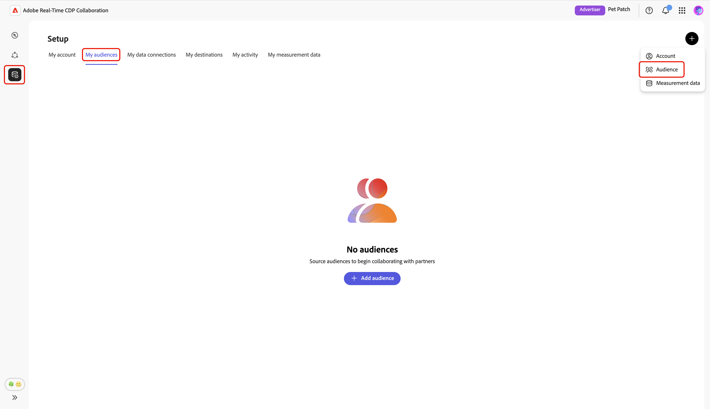
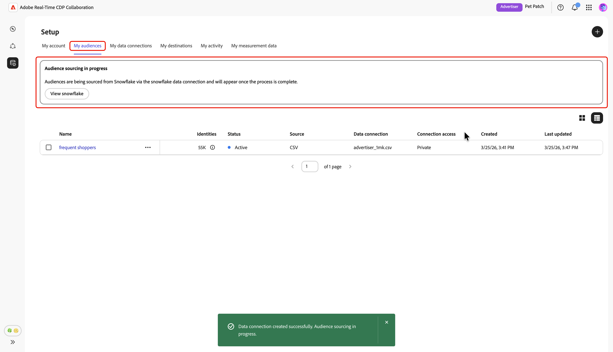
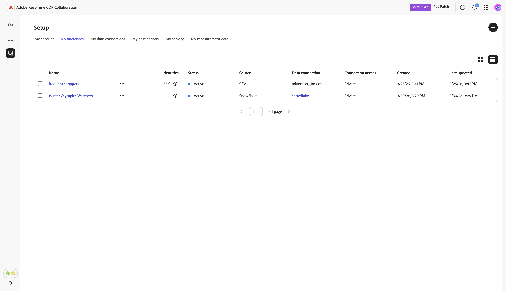

# 設定[!DNL Snowflake]以取得對象來源

瞭解如何在Adobe Real-Time CDP Collaboration UI中設定並連線您的[!DNL Snowflake Secure Data Share]，以取得對象資料以進行啟用和重疊分析。

## 概觀 {#overview}

[!DNL Snowflake]是支援的選項之一，可將第一方對象資料來源至Collaboration。 其他可用方法包括從[Experience Platform](./onboard-audiences.md)取得對象、連線[[!DNL AWS S3] 貯體](./configure-aws-s3-audience-sourcing.md)或上傳[CSV檔案](./upload-csv-audience-sourcing.md)。

請依照下列步驟連線您的[!DNL Snowflake Secure Data Share]，並將您的對象資料來源至Collaboration。 設定完成後，您可以檢閱、啟用和管理共同作業專案的來源對象。

## 先決條件 {#prerequisites}

設定[!DNL Snowflake]連線之前，請確定您符合下列必要條件：

* 您已建立[!DNL Snowflake Share]並在您的[!DNL Snowflake]帳戶中設定必要的許可權，以授予Adobe存取許可權給您的[!DNL Snowflake Secure Data Share]。
* 您備妥下列[!DNL Snowflake Share]個值：

   * **共用名稱**
   * **帳戶識別碼**
   * **結構描述**
   * **檢視**

* 您[!DNL Snowflake Secure Data Share]中的對象資料必須符合[對象來源規格(v1.2)](../../assets/quick-start/RTCDP_Collaboration_Audience_Sourcing_Spec_v1.2.pdf)指南中概述的格式需求。
* [!DNL Snowflake]對象檔案中的所有相符金鑰也必須針對您的Collaboration帳戶啟用。 瞭解如何[啟用相符金鑰](./onboard-account.md#set-up-match-keys)或[新增相符金鑰](./onboard-account.md#edit-match-keys)至您的帳戶。

## 設定您的[!DNL Snowflake]連線 {#configure-snowflake-connection}

從&#x200B;**[!UICONTROL 設定]**&#x200B;工作區中的&#x200B;**[!UICONTROL 我的對象]**&#x200B;索引標籤中，選取新增圖示（） 然後選取&#x200B;**[!UICONTROL 對象]**。

如果這是您的第一個對象，您也可以選取&#x200B;**[!UICONTROL 新增對象]**&#x200B;選項。

「新增對象」工作流程隨即顯示。 選取&#x200B;**[!UICONTROL 新增資料連線]**，然後選取&#x200B;**[!UICONTROL 下一步]**。

![反白顯示[新增資料連線]選項的[新增對象]工作區。](../../assets/setup/snowflake-audience-sourcing/add-data-connection.png){zoomable="yes"}

### 選取[!DNL Snowflake]作為資料連線 {#select-snowflake}

接著，選取&#x200B;**[!UICONTROL Snowflake]**&#x200B;作為資料連線，接著選取&#x200B;**[!UICONTROL 下一步]**。

![具有[!DNL Snowflake]的資料連線選取畫面可作為選取選項使用。](../../assets/setup/snowflake-audience-sourcing/select-snowflake-data-connection.png)

### 檢閱對象檔案 {#review-audience-file}

會出現一個對話方塊，說明[!DNL Snowflake Share]和[!DNL Snowflake]對象檔案的需求，然後才能開始sourcing。 確定您的[!DNL Snowflake Share]是以正確的共用名稱、帳戶識別碼、結構描述和檢視所建立。 若要確認您的對象資料已正確格式化且結構正確，以便在Collaboration中使用，請檢閱&#x200B;**[[!UICONTROL 對象來源規格]](../../assets/quick-start/RTCDP_Collaboration_Audience_Sourcing_Spec_v1.2.pdf)**&#x200B;指南。

完成後，請選取&#x200B;**[!UICONTROL 開始上線]**。

![準備您的[!DNL Snowflake Share]加入具有對象來源規格連結的對話方塊。](../../assets/setup/snowflake-audience-sourcing/prepare-snowflake-share-onboarding-dialog.png)

### 驗證[!DNL Snowflake Share]連線 {#authenticate-snowflake-share-connection}

在此步驟中，您必須提供必要的[!DNL Snowflake Share]認證，才能將您的[!DNL Snowflake Share]連線至Collaboration：

| 欄位 | 說明 | 範例 |
|--------------------|-------------|------------------------------|
| 共用名稱 | [!DNL Snowflake Share]的名稱。 | `ADOBE_DATA_SHARE` |
| 帳戶識別碼 | 您的Snowflake帳戶的唯一識別碼。 | `CUSTOMER_ORG.CUSTOMER_SNOWFLAKE_ACCOUNT` |
| 結構描述 | [!DNL Snowflake Share]中包含您對象資料的結構描述。 | `CUSTOMER_SCHEMA` |
| 檢視 | Collaboration提取受眾資料的實際資料集。 | `SECURE_VIEW_FOR_ADOBE` |

{style="table-layout:auto"}

輸入所有必要的認證後，選取&#x200B;**[!UICONTROL 下一步]**。

![已填寫共用名稱、帳戶識別碼、結構描述和檢視欄位的[!DNL Snowflake Share]連線表單，且[下一步]按鈕已反白顯示。](../../assets/setup/snowflake-audience-sourcing/snowflake-authentication-credentials-form.png)

下一頁底部會顯示確認對話方塊，確認您的[!DNL Snowflake Share]已成功連線至Collaboration。

![確認對話方塊確認您的[!DNL Snowflake Share]連線已成功建立。](../../assets/setup/snowflake-audience-sourcing/snowflake-share-connection-established.png)

### 提供名稱和說明 {#provide-name-description}

在&#x200B;**[!UICONTROL 提供詳細資料]**&#x200B;檢視中，為您的[!DNL Snowflake]資料連線輸入描述性名稱和選擇性描述。 完成後，選取&#x200B;**[!UICONTROL 下一步]**。

![提供詳細資訊畫面會顯示資料連線的名稱和說明，並反白顯示[下一步]按鈕。](../../assets/setup/snowflake-audience-sourcing/provide-name-description.png)

### 對應欄位 {#map-fields}

**[!UICONTROL 對應]**&#x200B;畫面目前為唯讀。 您無法新增、刪除或套用轉換。 Collaboration會根據&#x200B;**[對象來源規格(v1.2)](../../assets/quick-start/RTCDP_Collaboration_Audience_Sourcing_Spec_v1.2.pdf)**，自動將您[!DNL Snowflake Share]資料中的來源身分識別欄位對應到目標欄位。

以視覺化方式確認對應的欄位，並選取&#x200B;**[!UICONTROL 下一步]**&#x200B;以繼續。 您也可以使用&#x200B;**[!UICONTROL 預覽來源資料]**&#x200B;選項，預覽[!DNL Snowflake Share]中的範例資料。

![對應欄位畫面會顯示自動對應的來源和目標欄位，並反白顯示[預覽來源資料]和[下一步]選項。](../../assets/setup/snowflake-audience-sourcing/map-fields-screen.png)

當您選擇預覽時，**[!UICONTROL [!DNL Snowflake Share]資料預覽]**&#x200B;對話方塊會顯示，範例資料以表格格式顯示。 檢閱此專案，然後選取&#x200B;**[!UICONTROL 關閉]**。

![[!DNL Snowflake Share]資料預覽對話方塊會顯示[!DNL Snowflake Share]中的範例資料，且[關閉]選項會反白顯示。](../../assets/setup/snowflake-audience-sourcing/preview-source-data.png)

<!-- NOTE: Manual mapping will be available in the future. -->
<!-- In the **[!UICONTROL Map fields]** screen, you can use the **[!UICONTROL Source field]** and **[!UICONTROL Target field]** dropdowns to update the auto-mapped fields, or include additional fields with the **[!UICONTROL Add field]** option. Once finished, select **[!UICONTROL Next]**. -->

<!--  -->

### 排程重新整理頻率和日期範圍 {#refresh-frequency-date-range}

接下來，在&#x200B;**[!UICONTROL 排程]**&#x200B;檢視中，使用下拉式功能表選取一到六天之間的重新整理頻率。 然後使用行事曆圖示來指定來源對象的開始和結束日期。

>[!IMPORTANT]
>
>若要有效管理您的Collaboration積分，請將重新整理頻率設定為符合或不超過您基礎[!DNL Snowflake]資料的更新頻率。 支援的最低重新整理間隔是每六天一次。

![排程畫面醒目提示重新整理頻率和日期範圍設定，以及[下一步]選項。](../../assets/setup/snowflake-audience-sourcing/refresh-frequency-date-range.png)

### 檢閱並完成連線 {#review-and-complete}

最後，在摘要畫面中檢閱您的組態設定。 此檢視包含下列區段的摘要：

* **[!UICONTROL 資料連線]**：顯示[!DNL Snowflake Share]的共用名稱、帳戶識別碼、配置與檢視。
* **[!UICONTROL 詳細資料]**：顯示資料連線的名稱和選擇性說明，以便稍後識別。
* **[!UICONTROL 對應]**：顯示對象檔案中的來源欄位如何對應到Collaboration中使用的目標欄位。
* **[!UICONTROL 排程]**：顯示連線重新整理對象資料的頻率，以及來源的有效日期範圍。

如果您需要編輯區段，請選取鉛筆圖示（）。 選取&#x200B;**[!UICONTROL 完成]**&#x200B;以確認所有區段。

![檢閱畫面會顯示資料連線、詳細資料、對應和排程設定的摘要，並反白顯示[完成]選項。](../../assets/setup/snowflake-audience-sourcing/review-settings.png)

確認對話方塊會確認資料連線已成功建立，且對象來源正在進行中。

## 檢閱來源對象 {#review-sourced-audiences}

設定完成後，Collaboration會開始從您的[!DNL Snowflake Share]獲取對象。 如果對象來源正在進行中，則橫幅會顯示在檢視上方。

>[!TIP]
>
>對象來源時間會因[!DNL Snowflake]資料的大小和您設定的重新整理頻率而有所不同。 較大的資料集或不太頻繁的重新整理排程可能需要更長的時間才會出現在&#x200B;**[!UICONTROL 我的對象]**&#x200B;工作區中。

來源補充完成後，您的對象會顯示在&#x200B;**[!UICONTROL 我的對象]**&#x200B;標籤中，其功能和資訊與來源為Experience Platform的對象相同。

在網格檢視或表格檢視中，選取列專案或&#x200B;**[!UICONTROL 檢視對象]**&#x200B;以檢視特定對象的概觀。 它會顯示對象的狀態、來源和資料連線名稱，以及&#x200B;**[!UICONTROL 身分]**、**[!UICONTROL 類別]**、**[!UICONTROL 連線存取]**&#x200B;和&#x200B;**[!UICONTROL 中繼資料可見性]**&#x200B;的詳細面板。 如需詳細資訊，請參閱[如何檢視個別對象](./onboard-audiences.md#view-individual-audiences)。

在共同作業專案中使用對象之前，使用此檢視來確認對象組態和可見度設定。

## 檢視您的[!DNL Snowflake]資料連線 {#view-snowflake-connection}

您新增的[!DNL Snowflake]連線立即可在&#x200B;**[!UICONTROL 我的資料連線]**&#x200B;索引標籤中使用。 對象來源顯示為[!UICONTROL [!DNL Snowflake]]。

您的[!DNL Snowflake]資料連線包含與其他對象資料連線相同的功能和詳細資料。 深入瞭解[如何檢視及管理資料連線](../setup/manage-data-connection.md)。

![我的資料連線索引標籤會顯示含有sourcing狀態資訊的[!DNL Snowflake]資料連線。](../../assets/setup/snowflake-audience-sourcing/data-connection-tab-snowflake.png)

## 後續步驟 {#next-steps}

您現在已成功設定並連線您的[!DNL Snowflake]，作為Collaboration中的資料來源。 來源完成之後，您可以[建立共同作業專案](../collaborate/manage-projects.md)、[啟用對象](../collaborate/activate.md)、[檢閱重疊和深入分析](../collaborate/measure.md)，以及[管理您的對象設定和可見度](./onboard-audiences.md)。

如需其他對象來源方法的相關資訊，請參閱下列檔案：

* [設定 [!DNL Amazon S3] 對象來源](./configure-aws-s3-audience-sourcing.md)
* [來自Experience Platform的Source對象](./onboard-audiences.md)
* [上傳CSV檔案以取得對象](./upload-csv-audience-sourcing.md)
