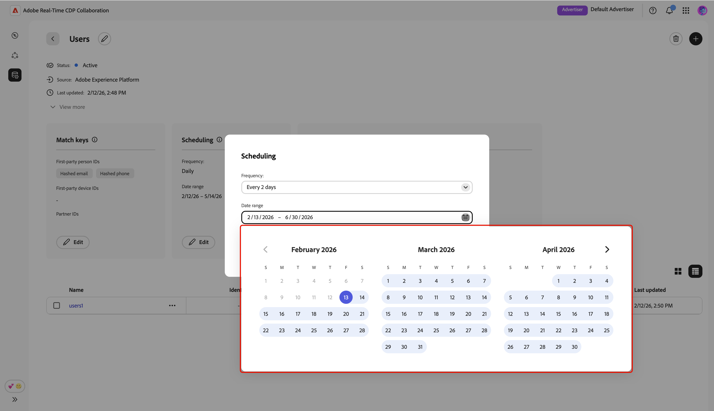

# 管理資料連線

{{limited-availability-release-note}}

## 概觀

在Real-Time CDP Collaboration中使用資料連線，從各種平台取得對象。 瞭解如何管理比對索引鍵，以及排程現有資料連線的資料重新整理作業。 此外，您將可依不同屬性篩選對象，以獲得更精細的深入分析。

>[!NOTE]
>
>若要建立新的資料連線，請參閱[新增和管理對象](./onboard-audiences.md)。

## 檢視資料連線

若要檢視現有的資料連線，請瀏覽至&#x200B;**[!UICONTROL 設定]**，然後選取&#x200B;**[!UICONTROL 我的資料連線]**&#x200B;索引標籤。 系統會顯示您目前的所有資料連線，並顯示每個連線的簡短概觀。 若要完整檢視資料連線的資訊，包括其比對索引鍵、排程詳細資料和對象，請選取對應連線上的&#x200B;**[!UICONTROL 檢視資料連線]**。

![設定工作區，顯示[我的資料連線]索引標籤檢視並反白顯示。](/help/assets/setup/manage-data-connection/my-data-connections.png){zoomable="yes"}

### 比對索引鍵 {#match-keys}

>[!CONTEXTUALHELP]
>id="rtcdp_collaboration_manage_dataconnections_matchkeys"
>title="比對索引鍵"
>abstract="比對索引鍵會決定如何比對來自不同來源的資料。 如下所示的比對索引鍵是您將來源欄位對應到的目標欄位。"

比對索引鍵是您[將來源欄位對應到](./onboard-audiences.md#map-fields)的目標欄位。 若要深入瞭解相符金鑰的運作方式，請參閱[相符金鑰](./onboard-account.md#set-up-match-keys)指南。

{zoomable="yes"}

### 排程 {#scheduling}

>[!CONTEXTUALHELP]
>id="rtcdp_collaboration_manage_dataconnections_scheduling"
>title="排程"
>abstract="檢視資料連線的排程詳細資料，並根據需要編輯設定。"

檢視及管理資料連線的排程設定。 排程決定重新整理對象的頻率。

建立資料連線後，您可以直接從資料連線工作區的&#x200B;**[!UICONTROL 排程]**&#x200B;區段更新其重新整理頻率、開始日期和結束日期。

>[!NOTE]
>
>從Adobe Experience Platform獲取對象時，對象在資料連線建立後24小時內即可使用。 初始來源設定後，對象資料會根據定義的頻率重新整理。

如需排程的詳細資訊，請參閱設定對象指南中的[排程區段](/help/guide/setup/onboard-audiences.md#schedule)。

{zoomable="yes"}

## 編輯資料連線 {#edit-data-connection}

請閱讀以下章節，瞭解如何更新比對索引鍵及現有資料連線的排程設定。

### 編輯比對索引鍵 {#edit-match-keys}

>[!CONTEXTUALHELP]
>id="rtcdp_collaboration_edit_measurement_data_connection_enrichment"
>title="擴充"
>abstract="不支援關閉擴充功能。 您可以改為變更擴充功能的連接鍵。"
>additional-url="https://www.adobe.com/go/rtcdp-collaboration-manage-dataconnections_tw" text="擴充"

>[!IMPORTANT]
>
>編輯資料連線的相符鍵之前，請注意下列事項：
>
>* 只有為您的帳戶設定的相符金鑰才能用於資料連線。
>* 此時，您可以將其他比對金鑰新增至資料連線，但一旦啟用比對金鑰，就無法移除比對金鑰。

從&#x200B;**[!UICONTROL 比對索引鍵]**&#x200B;區段中選取&#x200B;**[!UICONTROL 編輯]**。

![標示[編輯]選項的[比對索引鍵]區段。](/help/assets/setup/manage-data-connection/edit-match-keys.png){zoomable="yes"}

隨即顯示確認對話方塊，說明對資料連線所做的任何變更都會套用至所有關聯的對象。 選取「**[!UICONTROL 確定]**」以確認。 您可以選擇在日後略過此確認。

{zoomable="yes"}

在&#x200B;**[!UICONTROL 比對索引鍵]**&#x200B;對話方塊中，您可以檢視來源欄位與其對應目標欄位（比對索引鍵）之間的現有對應。 您可以更新對應的來源欄位來編輯比對索引鍵，或新增其他對應欄位列以填入新的比對索引鍵。

![[比對索引鍵]對話方塊顯示來源欄位與對應目標欄位之間的現有對應。](/help/assets/setup/manage-data-connection/match-keys-dialog.png){zoomable="yes"}

#### 新增相符金鑰 {#add-match-keys}

選取&#x200B;**[!UICONTROL 新增欄位]**&#x200B;以新增欄位列。

![選取[新增]欄位後，[比對索引鍵]對話方塊會顯示空白的新對應欄位，可供輸入。](/help/assets/setup/manage-data-connection/add-new-field.png){zoomable="yes"}

接著，選取空白的來源欄位。 **[!UICONTROL 選取來源欄位]**&#x200B;對話方塊會顯示&#x200B;**[!UICONTROL 識別名稱空間]**&#x200B;和&#x200B;**[!UICONTROL 設定檔屬性]**&#x200B;選項。 您可以篩選清單，並使用搜尋選項找到所需的來源欄位。

選擇您想要的來源欄位，然後選取&#x200B;**[!UICONTROL 選取]**。

![已選取GAID選項的[選取來源欄位]對話方塊。](/help/assets/setup/manage-data-connection/select-source-field.png){zoomable="yes"}

在&#x200B;**[!UICONTROL 比對索引鍵]**&#x200B;對話方塊中，使用下拉式功能表將新的來源欄位對應到目標欄位。 所有可用的目標欄位都是為您的Collaborator帳戶設定的相符金鑰。 如果您沒有看到所需的目標欄位，請[編輯您帳戶的相符金鑰](./onboard-account.md#edit-match-keys)以將其新增。

如果您想要將非雜湊欄位來源至雜湊目標欄位，例如，將純文字電子郵件來源欄位對應至&#x200B;**[!UICONTROL 雜湊電子郵件]**&#x200B;目標欄位時，請使用&#x200B;**[!UICONTROL 套用轉換]**&#x200B;選項。

{zoomable="yes"}

##### 新增[!DNL Demdex ID (ECID)] {#add-demdex-id-ecid}

如果您想要將[!DNL Demdex ID (ECID)]新增為相符金鑰，請先確定已在您的帳戶設定[&#128279;](../setup/onboard-account.md#set-up-match-keys)中啟用。 如需有關[!DNL Demdex ID (ECID)]的詳細資訊，請閱讀[支援的相符金鑰](../setup/onboard-account.md#supported-match-keys)。

在&#x200B;**[!UICONTROL 比對索引鍵]**&#x200B;對話方塊中，新增對應欄位列。 然後，選取&#x200B;**[!UICONTROL ECID]**&#x200B;作為來源欄位，並從下拉式清單中選取&#x200B;**[!UICONTROL Demdex ID (ECID)]**&#x200B;作為目標欄位。

![具有Demdex ID (ECID)比對索引鍵之對應欄位的[比對索引鍵]對話方塊已反白顯示。](/help/assets/setup/manage-data-connection/demdex-id-ecid-match-key.png){zoomable="yes"}

完成對應欄位後，請檢閱更新並選取&#x200B;**[!UICONTROL 確認]**&#x200B;以套用變更。

![[比對索引鍵]對話方塊顯示[確認]選項反白顯示的更新欄位對應。](/help/assets/setup/manage-data-connection/review-and-confirm.png){zoomable="yes"}

確認對話方塊會確認已成功更新相符金鑰。

### 編輯排程 {#edit-scheduling}

建立資料連線後，您可以直接從資料連線工作區的&#x200B;**[!UICONTROL 排程]**&#x200B;區段更新其重新整理頻率、開始日期和結束日期。

您可以編輯現有資料連線的頻率，以更能控制對象重新整理的頻率。 若要編輯排程，請從排程卡片內的資料連線中選取&#x200B;**[!UICONTROL 編輯]**。

![反白顯示[編輯]選項的[排程]區段。](/help/assets/setup/manage-data-connection/edit-scheduling.png){zoomable="yes"}

隨即顯示確認對話方塊，說明對資料連線所做的任何變更都會套用至所有關聯的對象。 選取「**[!UICONTROL 確定]**」以確認。 您可以選擇在日後略過此確認。

{zoomable="yes"}

在&#x200B;**[!UICONTROL 排程]**&#x200B;對話方塊中，選取下拉式功能表以更新&#x200B;**[!UICONTROL 頻率]**。 將重新整理頻率設定為每日或每兩到六天執行一次。

{zoomable="yes"}

接下來，如果您要更新填入和重新整理對象的期間，請選取&#x200B;**[!UICONTROL 日期範圍]**。

{zoomable="yes"}

完成後，檢閱更新並選取&#x200B;**[!UICONTROL 儲存]**&#x200B;以套用您的變更。

![[排程]對話方塊會醒目提示更新並儲存選項。](../../assets/setup/manage-data-connection/scheduling-dialog.png){zoomable="yes"}

## 刪除資料連線

刪除資料連線將會移除Collaboration中的所有基礎對象、相關設定和使用狀況。 此動作無法還原。

若要刪除現有的資料連線，請選取個別資料連線工作區中的刪除圖示（）。

{zoomable="yes"}

確認對話方塊隨即顯示。 選取&#x200B;**[!UICONTROL 刪除]**&#x200B;以完成刪除資料連線。

![反白顯示[刪除]選項的[刪除資料連線]對話方塊。](/help/assets/setup/manage-data-connection/delete-data-connection-confirm.png){zoomable="yes"}

## 管理對象 {#manage-audiences}

附加至資料連線的對象清單會顯示在工作區底部。 清單會顯示每個對象的簡短概觀，包括其狀態、來源和連線存取。 若要編輯對象的類別、連線存取或中繼資料可見性，請選取對象名稱。 如需管理對象的完整指南，請參閱[檢視個別對象](./onboard-audiences.md#view-individual-audiences)指南。

{zoomable="yes"}

## 後續步驟

管理您的資料連線後，您可以[探索您的對象與共同作業人員已發現的對象之間的重疊](/help/guide/collaborate/discover.md)。
