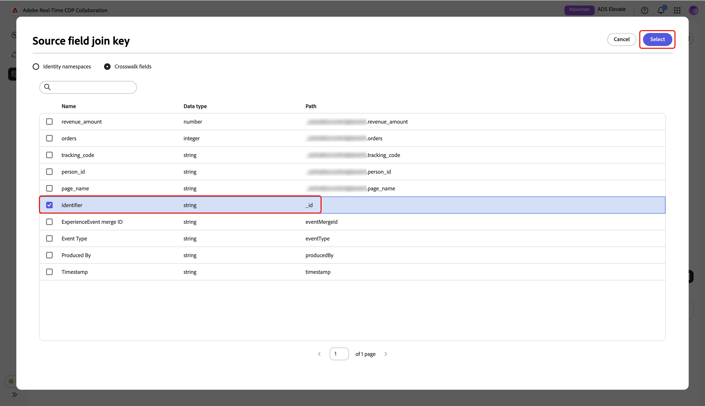

# 管理測量資料連線

{{limited-availability-release-note}}

## 概觀

在Real-Time CDP Collaboration中使用測量資料連線，從各種平台取得轉換資料。 瞭解如何管理現有資料連線的詳細資訊和相符金鑰。

## 檢視測量資料連線 {#view-measurement-data-connections}

您可以檢視任何現有測量資料連線的詳細資料，包括轉換資料的來源方式、使用中的相符索引鍵，以及連結至連線的所有轉換事件。

從&#x200B;**[!UICONTROL 設定]**&#x200B;工作區，瀏覽至&#x200B;**[!UICONTROL 我的資料連線]**&#x200B;索引標籤。 您目前所有的測量資料連線都會顯示在表格或格線檢視的&#x200B;**[!UICONTROL 測量]**&#x200B;區段下。 在相關的連線卡上選取&#x200B;**[!UICONTROL 檢視資料連線]**，或在資料表檢視中選取資料連線名稱，以開啟其工作區並檢視所有詳細資料。

{zoomable="yes"}

### 測量資料連線詳細資料 {#measurement-data-connection-details}

您可以在此段落中檢視下列資料連線的詳細資料：

| 欄位 | 說明 |
|-------------------|-------------|
| 狀態 | 測量資料連線的目前狀態，例如，**[!UICONTROL 作用中]**。 |
| 來源 | 為此連線提供測量資料的平台或系統。 |
| 沙箱 | 設定測量資料連線的沙箱名稱。 |
| 資料集 | 用於獲取連線中測量資料的資料集名稱。 |
| 上次更新時間 | 測量資料連線最近更新的時間戳記。 |
| 上次更新者 | 上次修改測量資料連線的使用者。 |
| 建立時間 | 建立測量資料連線時的時間戳記。 |
| 建立者 | 最初建立測量資料連線的使用者。 |

{style="table-layout:auto"}

### 比對索引鍵 {#match-keys}

相符索引鍵是您[來源您的測量資料](./onboard-measurement-data.md)時，將來源欄位對應到的目標欄位。 若要深入瞭解相符金鑰的運作方式，請參閱[相符金鑰](./onboard-account.md#set-up-match-keys)指南。

{zoomable="yes"}

### 轉換事件 {#conversion-events}

附加至資料連線的轉換事件清單會顯示在工作區底部。 清單會顯示每個事件的簡短概觀，包括其狀態、轉換型別和來源。 您可以選取事件名稱，以檢視並編輯其設定，或使用刪除選項（）移除轉換事件。 如需管理轉換事件的完整指南，請參閱[新增及管理測量資料](./onboard-measurement-data.md)指南。

{zoomable="yes"}

## 編輯測量資料連線 {#edit-measurement-data-connection}

您可以隨時更新現有測量資料連線的詳細資訊和相符金鑰，以確保報告和分析保持準確。 若要開始，請瀏覽至&#x200B;**[!UICONTROL 我的資料連線]**&#x200B;索引標籤，並選取您要編輯的測量資料連線。 如此將可開啟資料連線工作區，您可以在此依照下列步驟進行必要的變更。

### 編輯名稱和說明 {#edit-name-and-description}

若要更新資料連線的名稱和說明，請選取目前連線名稱旁的編輯圖示（）。

{zoomable="yes"}

在&#x200B;**[!UICONTROL 編輯資料連線]**&#x200B;對話方塊中，使用所需的值更新欄位，然後選取&#x200B;**[!UICONTROL 儲存]**&#x200B;以套用您的變更。

![反白顯示[儲存]選項的[編輯資料連線]對話方塊。](/help/assets/setup/manage-measurement-data-connection/edit-name-description-dialog.png){zoomable="yes"}

會顯示確認對話方塊，以確認詳細資料已成功更新。

### 編輯比對索引鍵 {#edit-match-keys}

>[!IMPORTANT]
>
>編輯資料連線的相符鍵之前，請注意下列事項：
>
>* 只有為您的帳戶設定的相符金鑰才能用於資料連線。
>* 此時，您可以將其他比對金鑰新增至資料連線，但一旦啟用比對金鑰，就無法移除比對金鑰。

在資料連線工作區中，選取&#x200B;**[!UICONTROL 比對索引鍵]**&#x200B;面板中的&#x200B;**[!UICONTROL 編輯]**。

![標示[編輯]選項的[比對索引鍵]區段。](/help/assets/setup/manage-measurement-data-connection/edit-match-keys.png){zoomable="yes"}

隨即顯示確認對話方塊，說明對資料連線所做的任何變更都將套用至所有關聯的轉換。 選取「**[!UICONTROL 確定]**」以確認。 您可以選擇在日後略過此確認。

{zoomable="yes"}

在&#x200B;**[!UICONTROL 比對索引鍵]**&#x200B;對話方塊中，您可以檢閱擴充設定，並檢視來源欄位與目標欄位（比對索引鍵）之間的目前對應。

![[比對索引鍵]對話方塊顯示來源欄位與對應目標欄位之間的擴充設定與現有對應。](/help/assets/setup/manage-measurement-data-connection/edit-match-keys-dialog.png){zoomable="yes"}

#### 擴充 {#enrichment}

如果在您[提供測量資料](./onboard-measurement-data.md)時未啟用擴充，您可以選擇使用即時客戶設定檔的屬性擴充您的事件資料集。 請注意，一旦為測量資料開啟擴充功能，就無法停用擴充功能。 您仍可依需要更新擴充結合金鑰。

當您在&#x200B;**[!UICONTROL 比對索引鍵]**&#x200B;對話方塊中啟用擴充時，UI會展開並在&#x200B;**[!UICONTROL 使用設定檔]**&#x200B;區段中的ID擴充您的事件資料下顯示更多設定選項。

選取&#x200B;**[!UICONTROL Source欄位加入索引鍵]**&#x200B;選項。

![反白顯示Source欄位加入索引鍵選項的[比對索引鍵]對話方塊。](../../assets/setup/manage-measurement-data-connection/enrich-event-data.png){zoomable="yes"}

在&#x200B;**[!UICONTROL Source欄位加入索引鍵]**&#x200B;對話方塊中，選擇來源欄位，然後選取&#x200B;**[!UICONTROL 選取]**。

{zoomable="yes"}

接著，選取&#x200B;**[!UICONTROL 設定檔聯結索引鍵]**&#x200B;選項。 在&#x200B;**[!UICONTROL 設定檔聯結索引鍵]**&#x200B;對話方塊中，從清單中選取設定檔欄位。 您可以使用「搜尋」選項來尋找所需欄位。 然後，選擇&#x200B;**[!UICONTROL 選取]**&#x200B;以進行確認。

![設定檔聯結索引鍵對話方塊會醒目提示選取的設定檔欄位和[選取]選項。](../../assets/setup/manage-measurement-data-connection/profile-join-key-dialog.png){zoomable="yes"}

#### 編輯對應 {#edit-mapping}

若要編輯現有的比對索引鍵，請在&#x200B;**[!UICONTROL 比對索引鍵]**&#x200B;對話方塊中更新其關聯的來源欄位和目標欄位。 如果您想要加入新的比對索引鍵，請選取&#x200B;**[!UICONTROL 新增欄位]**。 這會建立一個空白列，您可以在其中定義來源與目標欄位之間的其他對應。

![選取[新增]欄位後，[比對索引鍵]對話方塊會顯示空白的新對應資料列，可供輸入。](/help/assets/setup/manage-measurement-data-connection/add-new-field.png){zoomable="yes"}

接著，選取空白的來源欄位。 **[!UICONTROL 選取來源欄位]**&#x200B;對話方塊會出現，其中包含已分組到選項下的可用來源欄位清單，例如&#x200B;**[!UICONTROL 身分識別名稱空間]**&#x200B;和&#x200B;**[!UICONTROL 設定檔屬性]**。 您可以篩選清單，並使用搜尋選項找到所需的來源欄位。

選擇您想要的來源欄位，然後選取&#x200B;**[!UICONTROL 選取]**。

![[選取來源欄位]對話方塊會醒目提示[搜尋]選項、[電話來源]欄位及[選取]選項。](/help/assets/setup/manage-measurement-data-connection/select-source-field.png){zoomable="yes"}

在&#x200B;**[!UICONTROL 比對索引鍵]**&#x200B;對話方塊中，使用下拉式功能表將新的來源欄位對應到目標欄位。 所有可用的目標欄位都是為您的Collaborator帳戶設定的相符金鑰。 如果您沒有看到所需的目標欄位，請[編輯您帳戶的相符金鑰](./onboard-account.md#edit-match-keys)以將其新增。

如果您想要將非雜湊欄位來源至雜湊目標欄位，例如，將純文字電話來源欄位對應至&#x200B;**[!UICONTROL 雜湊電話]**&#x200B;目標欄位時，請使用&#x200B;**[!UICONTROL 套用轉換]**&#x200B;選項。

{zoomable="yes"}

完成對應欄位後，請檢閱更新並選取&#x200B;**[!UICONTROL 確認]**&#x200B;以套用變更。

![[比對索引鍵]對話方塊顯示[確認]選項反白顯示的更新欄位對應。](/help/assets/setup/manage-measurement-data-connection/confirm-edit-match-keys.png){zoomable="yes"}

確認對話方塊會確認已成功更新相符金鑰。

## 刪除資料連線

刪除資料連線將會移除Collaboration中的所有基礎轉換、相關設定和使用狀況。 此動作無法還原。

若要刪除現有的資料連線，請選取個別資料連線工作區中的刪除圖示（）。

{zoomable="yes"}

確認對話方塊隨即顯示。 選取&#x200B;**[!UICONTROL 刪除]**&#x200B;以完成刪除資料連線。

![反白顯示[刪除]選項的[刪除資料連線]對話方塊。](/help/assets/setup/manage-measurement-data-connection/delete-measurement-data-connection-confirm.png){zoomable="yes"}

確認對話方塊會確認資料連線已成功刪除。

## 後續步驟 {#next-steps}

管理您的測量資料連線後，您可以：

* 視需要新增更多連結至您資料連線的轉換事件。 如需詳細步驟，請閱讀[新增及管理測量資料](./onboard-measurement-data.md)檔案。
* 產生測量報告，以深入瞭解行銷活動的績效和影響。 如需可用報表型別以及如何建立這些型別的詳細資訊，請參閱[測量效能](/help/guide/collaborate/measure.md)指南。
