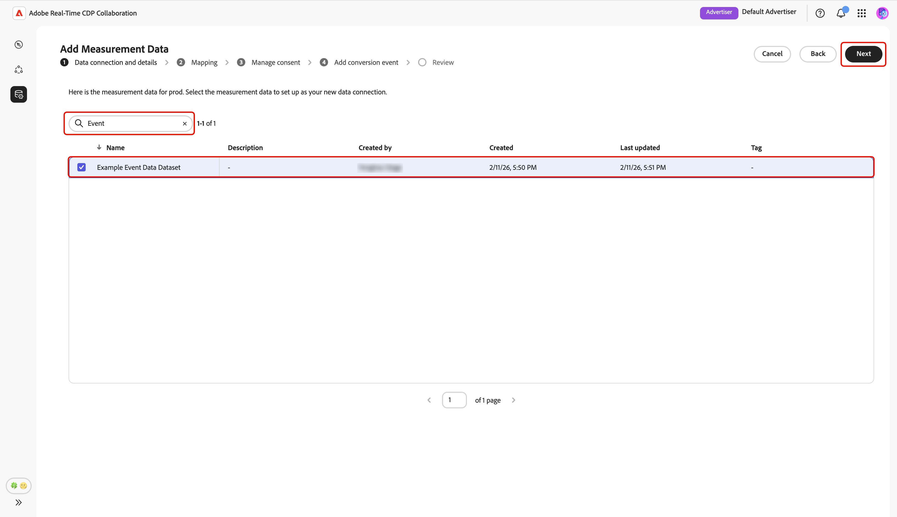
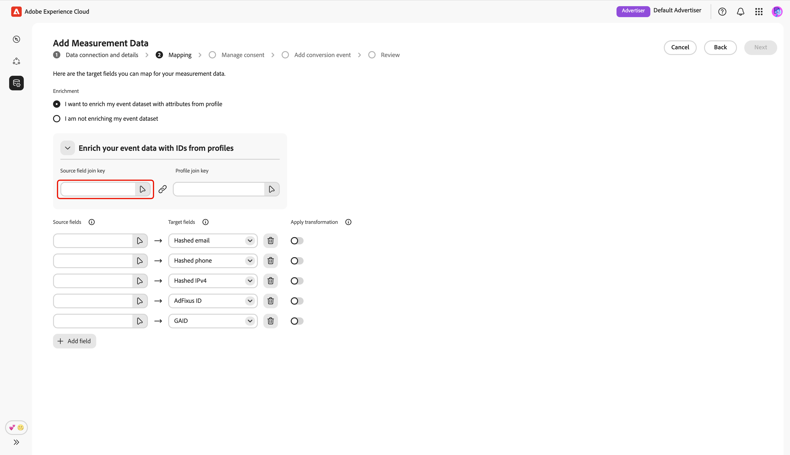
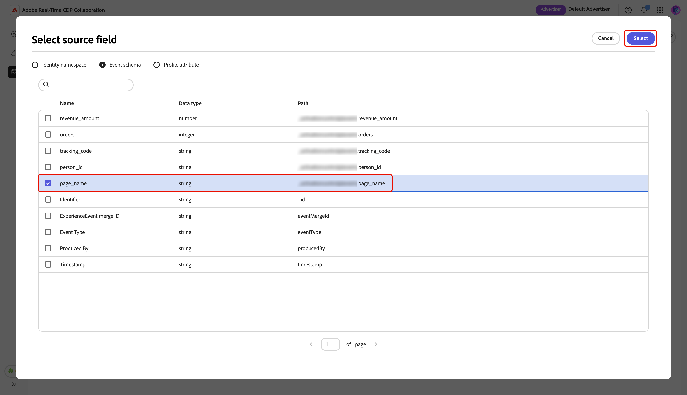

# 新增及管理測量資料 {#add-and-manage-measurement-data}

>[!CONTEXTUALHELP]
>id="rtcdp_collaboration_onboard_measurement_data"
>title="閱讀全文"
>abstract=""

>[!CONTEXTUALHELP]
>id="rtcdp_collaboration_measurement_data_target_fields"
>title="目標欄位"
>abstract="測量目標欄位的預留位置。"

>[!CONTEXTUALHELP]
>id="rtcdp_collaboration_measurement_data_source_fields"
>title="來源欄位"
>abstract="測量來源欄位的預留位置。"

>[!CONTEXTUALHELP]
>id="rtcdp_collaboration_import_measurement_mapping_source_fields"
>title="對應來源欄位"
>abstract="來源欄位測量對應的預留位置。"

>[!CONTEXTUALHELP]
>id="rtcdp_collaboration_import_measurement_mapping_target_fields"
>title="對應目標欄位"
>abstract="目標欄位測量對應的預留位置。"

{{limited-availability-release-note}}

本檔案概述將行銷活動測量資料新增至Adobe Real-Time CDP Collaboration的步驟。 發佈者可與Adobe團隊合作，上傳行銷活動測量資料。 上傳並處理資料之後，發佈者和廣告商都能檢視廣泛的[行銷活動測量報告](/help/guide/collaborate/measure.md)。

## 新增衡量資料 {#add-measurement-data}

作為廣告商，您可以將包含轉換事件的測量資料上傳至Collaboration，以便用於行銷活動測量報表。 轉換資料通常包含使用者識別碼（例如雜湊電子郵件或裝置ID）、轉換事件時間戳記等欄位，以及購買或註冊等特定轉換事件詳細資訊。

若要取得測量資料，請瀏覽至&#x200B;**[!UICONTROL 設定]**&#x200B;工作區中的&#x200B;**[!UICONTROL 我的測量資料]**&#x200B;索引標籤。 選取新增圖示（） 然後選取&#x200B;**[!UICONTROL 測量資料]**。

如果這是您的第一個測量資料，您也可以選取&#x200B;**[!UICONTROL 新增]**&#x200B;選項。

![我的測量資料索引標籤，其中的[新增]選項和[測量資料]選項反白顯示。](../../assets/setup/add-manage-measurement-data/add-measurement-data.png){zoomable="yes"}

**[!UICONTROL 新增測量資料]**&#x200B;畫面隨即顯示，其中顯示取得測量資料的步驟摘要。 選取&#x200B;**[!UICONTROL 開始上線]**。

![新增測量資料畫面會顯示來源測量資料的步驟摘要，以及[開始上線]選項強調顯示。](../../assets/setup/add-manage-measurement-data/add-measurement-data-screen.png){zoomable="yes"}

### 資料連線和詳細資料 {#data-connection-and-details}

在此步驟中，您需要設定資料連線，並指定測量資料的詳細資料。

#### 選取測量資料型別 {#select-measurement-data-type}

測量資料型別會定義您為行銷活動測量引進的事件型別。 目前，轉換資料是受支援的型別。

選取&#x200B;**[!UICONTROL 轉換資料]**&#x200B;作為測量資料型別，接著選取&#x200B;**[!UICONTROL 下一步]**。

![資料連線和詳細資料步驟，強調測量資料型別和[下一步]選項。](../../assets/setup/add-manage-measurement-data/select-measurement-data-type.png){zoomable="yes"}

#### 選取資料連線 {#select-data-connection}

資料連線是您來源將測量資料放入Collaboration的來源。 建立初始資料連線並取得第一組測量資料後，您就可以繼續使用相同的資料連線取得其他測量資料。

若要新增資料連線，請選取&#x200B;**[!UICONTROL 新增資料連線]**，然後選取&#x200B;**[!UICONTROL 下一步]**。

![資料連線與詳細資料步驟，醒目提示[新增資料連線]選項與[下一步]選項。](../../assets/setup/add-manage-measurement-data/select-measurement-data-connection.png){zoomable="yes"}

#### 選取資料來源 {#select-data-source}

接著，選擇資料連線的來源。 目前Adobe Experience Platform是唯一受支援的資料來源。

選取您的資料來源，然後選取&#x200B;**[!UICONTROL 下一步]**。

{zoomable="yes"}

#### 選取沙箱 {#select-sandbox}

選取包含您要用於Collaboration促銷活動測量報告的測量資料的沙箱。 從可用沙箱清單中選擇沙箱，然後選取&#x200B;**[!UICONTROL 下一步]**。

{zoomable="yes"}

#### 選取測量資料集 {#select-measurement-dataset}

選定沙箱中的資料集清單隨即顯示。 選取資料集作為測量資料，然後選取&#x200B;**[!UICONTROL 下一步]**。 您可以使用「搜尋」選項來篩選及尋找偏好的資料集。

{zoomable="yes"}

#### 提供名稱和詳細資訊 {#provide-name-and-details}

接下來，為您的資料連線提供名稱和說明。 此資訊可協助您稍後識別資料連線。

{zoomable="yes"}

### 對應 {#mapping}

下一步是將測量資料中的欄位對應至Collaboration中使用的對應目標欄位。 您也可以選擇對應聯結索引鍵，並使用這些屬性來劃分測量報表，藉此利用即時客戶設定檔的屬性來擴充您的事件資料集。

#### 豐富事件資料 {#enrich-event-data}

若要擴充您的事件資料，請選取&#x200B;**[!UICONTROL Source欄位加入索引鍵]**&#x200B;選項。

{zoomable="yes"}

在&#x200B;**[!UICONTROL Source欄位加入索引鍵]**&#x200B;對話方塊中，選擇來源欄位，然後選取&#x200B;**[!UICONTROL 選取]**。

{zoomable="yes"}

接著，選取&#x200B;**[!UICONTROL 設定檔聯結索引鍵]**&#x200B;選項。 在&#x200B;**[!UICONTROL 設定檔聯結索引鍵]**&#x200B;對話方塊中，從清單中選取設定檔欄位。 您可以使用「搜尋」選項來尋找所需欄位。 然後，選擇&#x200B;**[!UICONTROL 選取]**&#x200B;以進行確認。

![強調搜尋索引鍵、選取的設定檔欄位和[下一步]選項的[設定檔加入索引鍵]對話方塊。](../../assets/setup/add-manage-measurement-data/profile-join-key-dialog.png){zoomable="yes"}

#### 對應欄位 {#mapping-fields}

若要開始將來源欄位從您的測量資料對應至Collaboration中的目標欄位，請在&#x200B;**[!UICONTROL 對應]**&#x200B;畫面中選取空白的來源欄位。

![反白顯示空白來源欄位的[對應]畫面。](../../assets/setup/add-manage-measurement-data/mapping-screen.png){zoomable="yes"}

**[!UICONTROL 選取來源欄位]**&#x200B;對話方塊隨即顯示，其中顯示群組在選項（例如&#x200B;**[!UICONTROL 身分名稱空間]**&#x200B;和&#x200B;**[!UICONTROL 事件結構描述]**）下的可用來源欄位清單。 您可以使用搜尋選項來篩選和尋找清單中的來源欄位。

選擇您想要的來源欄位，然後選取&#x200B;**[!UICONTROL 選取]**。

![[選取來源欄位]對話方塊醒目提示[電子郵件來源]欄位和[選取]選項。](../../assets/setup/add-manage-measurement-data/select-source-field-dialog.png){zoomable="yes"}

接下來，使用下拉式功能表將所選的來源欄位對應到適當的目標欄位。 所有可用的目標欄位都是為您的Collaborator帳戶](./onboard-account.md#set-up-match-keys)設定的[相符金鑰。

{zoomable="yes"}

您可以視需要新增或移除對應列。 如果您需要將非雜湊來源欄位對應到雜湊目標欄位（例如，將純文字電子郵件對應到[!UICONTROL 雜湊電子郵件]），請使用&#x200B;**[!UICONTROL 套用轉換]**&#x200B;選項來套用必要的雜湊。

完成後，若已啟用擴充，請檢閱對應欄位和聯結索引鍵。 然後，選取&#x200B;**[!UICONTROL 下一步]**。

![顯示對應欄位的對應畫面、加入金鑰（啟用擴充時）以及醒目提示的[下一步]選項。](../../assets/setup/add-manage-measurement-data/review-mapping.png){zoomable="yes"}

### 管理同意 {#manage-consent}

在繼續之前，您必須確認您在Collaboration中的資料使用方式符合Real-Time CDP資料控管原則。 所有資料都必須根據同意要求或任何適用的自訂同意原則預先篩選，因此不需要進一步處理。

若要確認您的通知，請選取&#x200B;**[!UICONTROL 下一步]**。

![需要確認且[下一步]選項反白顯示的[管理同意]畫面。](../../assets/setup/add-manage-measurement-data/manage-consent.png){zoomable="yes"}

如果您在對應步驟](#enrich-event-data)期間[啟用設定檔擴充，則可以從預先定義的選項清單中設定同意原則。 其中包括:

* **行銷動作**：使用這些行銷動作來控制要從Experience Platform將哪些對象資料帶入Collaboration。
* **同意規則**：選取同意規則，以套用至來源為Collaboration的資料。
* **對象**：使用對象篩選器來包含或排除同意的對象設定檔。

>[!NOTE]
>
>**[!UICONTROL 資料Collaboration]**&#x200B;支援C4、C5和C9資料使用標籤，而&#x200B;**[!UICONTROL 資料科學]**&#x200B;僅支援C9。 在Experience Platform檔案中進一步瞭解資料使用標籤：
>
>* [資料使用標籤概觀](https://experienceleague.adobe.com/zh-hant/docs/experience-platform/data-governance/labels/overview){target="_blank"}
>* [字彙](https://experienceleague.adobe.com/zh-hant/docs/experience-platform/data-governance/labels/reference){target="_blank"}

選取偏好的設定，然後選取&#x200B;**[!UICONTROL 下一步]**。

{zoomable="yes"}

在繼續之前，您必須確認並接受&#x200B;**[!UICONTROL 治理原則與執行動作]**&#x200B;對話方塊中的條款。 選取核取方塊，然後選取&#x200B;**[!UICONTROL 確定]**。

![顯示核取方塊和[確定]選項的[治理原則與強制執行]對話方塊。](../../assets/setup/add-manage-measurement-data/governance-policy-enforcement-actions-dialog.png){zoomable="yes"}

#### 客群篩選器 {#audience-filter}

若要包含或排除特定對象設定檔以取得同意，請使用&#x200B;**[!UICONTROL 對象篩選器]**&#x200B;下拉式功能表。 選取此篩選器後，UI會更新以顯示&#x200B;**[!UICONTROL 瀏覽對象]**&#x200B;選項。 選取&#x200B;**[!UICONTROL 瀏覽對象]**。

{zoomable="yes"}

**[!UICONTROL 選取對象]**&#x200B;對話方塊就會顯示。 從清單中選擇對象，然後選取&#x200B;**[!UICONTROL 選取]**。

![[選取對象]對話方塊會醒目顯示選取的對象和[選取]選項。](../../assets/setup/add-manage-measurement-data/select-audiences-dialog.png){zoomable="yes"}

現在會顯示您選擇的對象，並附上視需要移除對象的選項。 檢閱您的同意設定，然後選取&#x200B;**[!UICONTROL 下一步]**。

{zoomable="yes"}

### 新增轉換事件 {#add-conversion-event}

接著，定義您要測量行銷活動影響的轉換事件，例如網站造訪、註冊或完成購買。 您最多可以指定&#x200B;**3**&#x200B;個不同的轉換事件來進行測量。

提供轉換事件的名稱，然後使用下拉式功能表選取轉換型別。

{zoomable="yes"}

您可以輸入轉換的值，或如果目前不想指定值，則保留空白。

{zoomable="yes"}

接下來，您需要指定複製索引鍵，以指出事件資料集中的哪些列屬於相同的基本轉換事件（例如，註冊程式期間的相同時間戳記）。 這可防止在測量報告中多次計算相同的轉換。 若要這麼做，請選取&#x200B;**[!UICONTROL 複製索引鍵]**。 在&#x200B;**[!UICONTROL 複製索引鍵]**&#x200B;對話方塊中，尋找並選擇索引鍵，然後選取&#x200B;**[!UICONTROL 選取]**。

![重複索引鍵對話方塊顯示選取的索引鍵和[選取]選項。](../../assets/setup/add-manage-measurement-data/duplication-key-dialog.png){zoomable="yes"}

指定複製索引鍵後，您最多可以新增&#x200B;**5**&#x200B;個條件，以便僅包含轉換事件資料集中的相關列。 選擇以套用所有或其中任何條件。

選取&#x200B;**[!UICONTROL 新增條件]**，然後選取條件選項。

{zoomable="yes"}

在&#x200B;**[!UICONTROL 選取來源欄位]**&#x200B;對話方塊中，尋找並選擇條件規則的來源欄位，然後選取&#x200B;**[!UICONTROL 選取]**。

![[選取來源欄位]對話方塊醒目提示[事件型別]欄位和[選取]選項。](../../assets/setup/add-manage-measurement-data/select-condition-field.png){zoomable="yes"}

使用下拉式功能表選取邏輯運運算元，然後輸入設定規則的值。

{zoomable="yes"}

若要新增另一個轉換事件，請選取&#x200B;**[!UICONTROL 新增轉換]**。 您最多可以包含&#x200B;**3**&#x200B;個轉換事件。 完成後，請檢閱轉換設定並選取&#x200B;**[!UICONTROL 下一步]**。

{zoomable="yes"}

### 檢閱 {#review}

**[!UICONTROL 檢閱]**&#x200B;畫面會出現，其中包含測量資料設定的摘要。 檢閱並確保所有資訊正確無誤。 如果您需要變更任何區段，請使用&#x200B;**[!UICONTROL 編輯]**&#x200B;選項。

最後，選取&#x200B;**[!UICONTROL 完成]**&#x200B;以完成新增測量資料。

{zoomable="yes"}

確認對話方塊會確認您的測量資料已成功建立。 您可以在&#x200B;**[!UICONTROL 我的測量資料]**&#x200B;工作區中，看到從測量資料設定的新轉換事件。

{zoomable="yes"}

在網格檢視或表格檢視中，選取列專案或事件卡片中的&#x200B;**[!UICONTROL 檢視轉換]**&#x200B;選項，以檢視特定轉換事件的概觀。 它會顯示事件的狀態、來源和資料連線名稱，以及下列專案的詳細面板：

* **[!UICONTROL 轉換詳細資料]**：顯示轉換的索引鍵資訊，包括其型別、用來識別唯一事件的複製索引鍵，以及指派的轉換值（如果已指定）。
* **[!UICONTROL 條件]**：顯示套用至此轉換事件的條件規則。

{zoomable="yes"}

## 編輯測量資料 {#edit-measurement-data}

取得您的測量資料後，您可以隨時編輯轉換事件的詳細資訊和條件規則。

從&#x200B;**[!UICONTROL 我的測量資料]**&#x200B;索引標籤中，選取相關轉換事件卡片中的省略符號選項（）。 然後從下拉式選單中選取「**[!UICONTROL 檢視轉換]**」以開啟該轉換事件的詳細頁面。

{zoomable="yes"}

### 編輯名稱和說明 {#edit-name-and-description}

若要更新事件的名稱和說明，請選取頁面右上角的編輯圖示（）。

{zoomable="yes"}

在&#x200B;**[!UICONTROL 編輯名稱和描述]**&#x200B;對話方塊中，使用所需的值更新欄位，然後選取&#x200B;**[!UICONTROL 儲存]**&#x200B;以套用您的變更。

{zoomable="yes"}

會顯示確認對話方塊，以確認詳細資料已成功更新。

### 編輯轉換詳細資料 {#edit-conversion-details}

您可以更新事件的下列轉換詳細資料：

| 欄位 | 說明 |
|-------------------|-------------|
| 轉換類型 | 轉換事件的類別，例如網站造訪、購買或註冊。 |
| 去重複化索引鍵 | 事件資料集中屬於相同轉換事件（例如相同時間戳記）之列的識別碼。 避免重複計數。 |
| 轉換值 | 和每次轉換相關聯的值。 |

{style="table-layout:auto"}

若要開始編輯，請在&#x200B;**[!UICONTROL 轉換詳細資料]**&#x200B;面板中選取&#x200B;**[!UICONTROL 編輯]**。

{zoomable="yes"}

在&#x200B;**[!UICONTROL 編輯轉換詳細資料]**&#x200B;對話方塊中，使用下拉式功能表來更新轉換型別。 您可以輸入轉換的值；如果您不想指定值，請將其保留空白。 若要編輯複製索引鍵，請選取現有索引鍵選項。

![反白顯示[編輯轉換詳細資料]對話方塊的[範例人員ID]選項。](/help/assets/setup/add-manage-measurement-data/edit-conversion-details-dialog.png){zoomable="yes"}

**[!UICONTROL 重複索引鍵]**&#x200B;對話方塊會顯示分組在選項（例如&#x200B;**[!UICONTROL 身分名稱空間]**&#x200B;和&#x200B;**[!UICONTROL 事件結構描述]**）下的可用欄位清單。 尋找並選擇所需的索引鍵，然後選取&#x200B;**[!UICONTROL 選取]**。

![重複索引鍵對話方塊顯示選取的索引鍵和[選取]選項。](../../assets/setup/add-manage-measurement-data/edit-duplication-key-dialog.png){zoomable="yes"}

完成之後，請檢閱更新並選取&#x200B;**[!UICONTROL 儲存]**&#x200B;以套用您的變更。

![反白顯示[儲存]選項的[編輯轉換詳細資料]對話方塊。](/help/assets/setup/add-manage-measurement-data/edit-conversion-details-save.png){zoomable="yes"}

會顯示確認對話方塊，以確認詳細資料已成功更新。

### 編輯條件 {#edit-conditions}

條件規則會指定將事件資料集中的哪些資料列納入轉換。 視需要更新這些規則，以確保您的測量僅反映與分析最相關的資料。

若要編輯條件，請在&#x200B;**[!UICONTROL 條件]**&#x200B;面板中選取&#x200B;**[!UICONTROL 編輯]**。

{zoomable="yes"}

在&#x200B;**[!UICONTROL 編輯轉換規則]**&#x200B;對話方塊中，您可以檢視所有條件的目前詳細資料。 選取現有條件選項以更新其詳細資料，包括來源欄位、邏輯規則和值。

{zoomable="yes"}

若要包含其他轉換規則，請選取&#x200B;**[!UICONTROL 新增條件]**。 然後選取新的空白條件選項。

![在選取[新增條件]選項之後，顯示[編輯轉換規則]對話方塊的新空白條件選項。](/help/assets/setup/add-manage-measurement-data/edit-conversion-rules-add-condition.png){zoomable="yes"}

在&#x200B;**[!UICONTROL 選取來源欄位]**&#x200B;對話方塊中，您可以看到在&#x200B;**[!UICONTROL 身分名稱空間]**&#x200B;和&#x200B;**[!UICONTROL 事件結構描述]**&#x200B;等選項下分組的可用欄位。 選取您要用於條件的適當欄位，然後選擇&#x200B;**[!UICONTROL 選取]**。 您可以使用&#x200B;**[!UICONTROL 搜尋]**&#x200B;選項來快速尋找您偏好的欄位。

{zoomable="yes"}

接下來，使用下拉式功能表，從可用清單中選取邏輯運運算元，並輸入條件的值。

![醒目提示邏輯下拉式功能表的[編輯轉換規則]對話方塊。](../../assets/setup/add-manage-measurement-data/edit-condition-logic-dropdown.png){zoomable="yes"}

若每個轉換都需要所有指定的條件，請使用&#x200B;**[!UICONTROL 包含所有條件]**，或使用&#x200B;**[!UICONTROL 包含任何條件]**&#x200B;以允許至少符合一個條件的轉換。 當您完成更新時，請檢閱並選取&#x200B;**[!UICONTROL 儲存]**&#x200B;以套用變更。

![反白顯示[儲存]選項的[編輯轉換規則]對話方塊。](/help/assets/setup/add-manage-measurement-data/edit-conversion-rules-save.png){zoomable="yes"}

會顯示確認對話方塊，以確認詳細資料已成功更新。

## 刪除測量資料 {#delete-measurement-data}

刪除測量資料會永久從您的專案中移除關聯的轉換事件和所有連結的測量詳細資訊。 任何依賴此事件的測量報告都將失去對應的轉換量度，且無法再更新。 此動作無法還原。

若要刪除現有的轉換事件，請瀏覽至&#x200B;**[!UICONTROL 設定]**&#x200B;工作區中的&#x200B;**[!UICONTROL 我的測量資料]**&#x200B;索引標籤。 在格線檢視中，選取相關事件卡片中的&#x200B;**[!UICONTROL 刪除]**。 在表格檢視中，選取事件名稱旁的刪除圖示（）。

{zoomable="yes"}

**[!UICONTROL 刪除測量]**&#x200B;對話方塊會出現，提示您確認刪除事件。 選取「**[!UICONTROL 刪除]**」。

![反白顯示[刪除]選項的[刪除測量]對話方塊。](/help/assets/setup/add-manage-measurement-data/delete-measurement-dialog.png){zoomable="yes"}

會顯示確認對話方塊，以確認已成功刪除轉換事件。

## 後續步驟 {#next-steps}

您已在Collaboration中完成測量資料的來源取得。 身為廣告商，您現在可以建立歸因報表，以探索行銷活動如何促進轉換並評估整體影響。 如果您是發佈者，請要求共同作業人員為您的行銷活動產生歸因報表。 如需詳細指示，請參閱[建立歸因報表](../collaborate/measure.md#create-attribution-report)指南。
