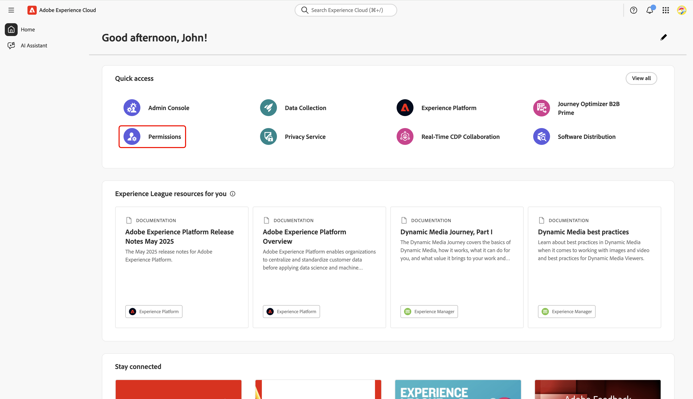

# 設定Collaboration [!DNL Starter]上線的許可權控制項

在設定Adobe Experience Platform產品的管理員和使用者存取權後，您需要為您自己指派具有Real-Time CDP Collaboration適當許可權的角色。 閱讀本指南，瞭解如何透過Experience Cloud許可權介面將正確的角色新增至您的帳戶，以便您可以存取和管理使用者對Collaboration功能的存取權。

如需Collaboration資源中所包含之標準角色與可用許可權的詳細資訊，請參閱[如何管理角色指南](../permissions/manage-roles.md)。

## 先決條件 {#prerequisites}

請確定您同時具有Adobe Experience Platform產品的&#x200B;**系統管理員許可權**&#x200B;和&#x200B;**使用者存取權**。 如果您尚未設定這些存取層級，請參閱[管理員存取指南](./starter-admin-access.md)以取得逐步指示。

## 設定許可權 {#setup-permissions}

請依照下列步驟，設定您需要的Collaboration許可權。 首先，使用您的認證登入[Adobe Experience Cloud](https://experience.adobe.com/)。

### 存取許可權 {#access-permissions}

登入後，瀏覽至&#x200B;**[!UICONTROL 快速存取]**&#x200B;區段並選取&#x200B;**[!UICONTROL 許可權]**。 這樣會開啟「許可權」控制面板，讓您指派必要的角色給自己。

{zoomable="yes"}

### 選取使用者 {#select-user}

在&#x200B;**[!UICONTROL 許可權]**&#x200B;儀表板中，從左側面板選取&#x200B;**[!UICONTROL 使用者]**。 然後從「使用者」表格中選取您的帳戶。

>[!NOTE]
>
> 如果您是貴組織第一個存取Experience Platform的使用者，您可能會是&#x200B;**使用者**&#x200B;表格中列出的唯一使用者。 若要邀請其他團隊成員，請依照[使用者存取設定指南](../permissions/manage-user-access.md#administrators-configure-user-access-to-experience-platform)中的步驟進行。

{zoomable="yes"}

### 指派角色 {#assign-roles}

在對應&#x200B;**[!UICONTROL 使用者]**&#x200B;工作區中，瀏覽至&#x200B;**[!UICONTROL 角色]**&#x200B;索引標籤。 然後選取&#x200B;**[!UICONTROL 新增角色]**。

![對應的使用者工作區會顯示[角色]索引標籤，並反白顯示[新增角色]選項。](../../assets/setup/starter/add-roles.png){zoomable="yes"}

**[!UICONTROL 新增角色]**&#x200B;對話方塊會出現，其中包含可用角色的表格。 表格中的每一列代表一個角色，其資訊如下：

| **資料行** | **說明** |
|---------------|--------------------------------------------------------|
| **名稱** | 角色的名稱。 |
| **說明** | 概述角色功能的簡短摘要。 請注意，無法自訂「唯讀」角色。 |
| **沙箱** | 指定角色提供存取權的沙箱（例如`Prod`）。 |
| **已修改** | 上次更新角色的日期。 |

{style="table-layout:auto"}

如需特定角色及其許可權的深入概觀，請參閱[管理角色的許可權](https://experienceleague.adobe.com/en/docs/experience-platform/access-control/abac/permissions-ui/permissions)指南。

檢閱資訊，並選取要指派給帳號的角色。 完成後，選取&#x200B;**[!UICONTROL 儲存]**。

{zoomable="yes"}

確認對話方塊會確認新角色已成功新增。

若要確定您的許可權設定正確，請返回[Experience Cloud](https://experience.adobe.com/)首頁。 在&#x200B;**[!UICONTROL 快速存取]**&#x200B;中選取&#x200B;**[!UICONTROL Real-Time CDP Collaboration]**。 您應該能夠存取Collaboration工作區，並開始使用您[!DNL Starter]帳戶可用的功能。

## 後續步驟 {#next-steps}

設定好您的許可權後，您就可以存取Collaboration了。 接下來，您可以：

* [建立具有特定許可權的自訂角色，以管理不同的存取層級](../permissions/manage-roles.md#create-specific-access-roles)。
* [在許可權](../permissions/manage-user-access.md#assign-a-role)中指派多個使用者給一個角色。
* [設定Collaboration帳戶並建立與邀請共同作業人員的連線](../overview/starter-overview.md#set-up-connections)。
* [進一步瞭解Collaboration中的信用使用量和消耗量 [!DNL Starter]](./starter-credit-usage.md)。

若要取得Real-Time CDP Collaboration及其主要功能的完整概觀，請閱讀[概觀指南](../home.md)。
