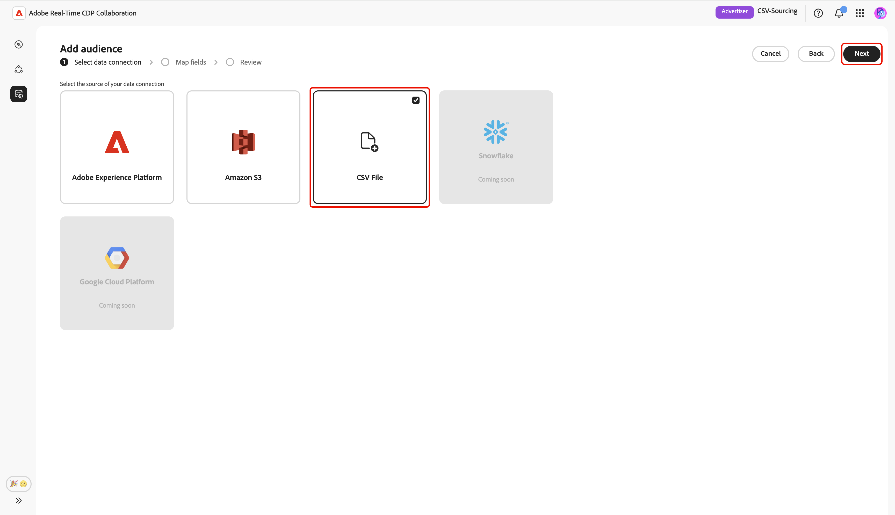
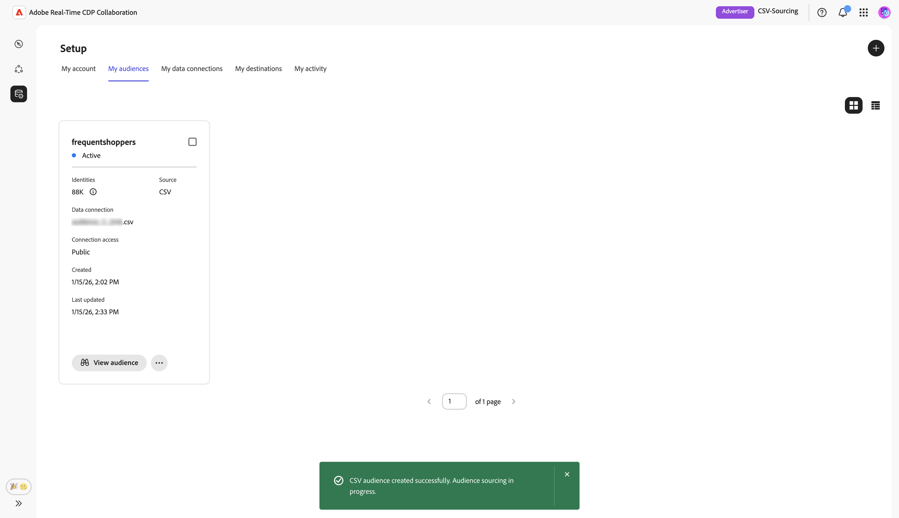

# 上傳CSV檔案以取得對象

This guide provides steps to upload a CSV file in the Adobe Real-Time CDP Collaboration UI to source your audience data for use in collaboration projects.

## 概觀 {#overview}

CSV file upload is one method to source first-party audience data for collaboration projects. This is an alternative to [connecting your AWS S3 bucket](./configure-aws-s3-audience-sourcing.md), [connecting Google Cloud Storage](./configure-gcs-audience-sourcing.md), or [sourcing audiences from Experience Platform](./onboard-audiences.md).

Follow this workflow to upload a CSV file containing your audience data to source and manage first-party audiences within Collaboration. You can map identity fields for activation and overlap analysis. Once your file is uploaded and processed, the sourced audience becomes available in the **[!UICONTROL My audiences]** workspace, where you can review, activate, and manage for your collaboration projects.

>[!IMPORTANT]
>
>* Audiences sourced through CSV upload are available for **7 days**. After this period, the audience expires and must be re-uploaded for use in your collaboration projects.
>
>* You can upload one CSV file per session at this time. To add additional audiences, complete the upload workflow again for each file you wish to source.

## 先決條件 {#prerequisites}

Before you can upload CSV files for audience sourcing, ensure you have:

* Completed account onboarding in Real-Time CDP Collaboration. See [Onboard your account](./onboard-account.md) for step-by-step instructions.
* The necessary permissions to add audiences in your organization.
* A CSV file containing your audience data with identity fields such as email or phone.

## 上傳 CSV 檔案 {#upload-csv-file}

從&#x200B;**[!UICONTROL 設定]**&#x200B;工作區中的&#x200B;**[!UICONTROL 我的對象]**&#x200B;索引標籤中，選取新增圖示（） 然後選取&#x200B;**[!UICONTROL 對象]**。

如果這是您的第一個對象，您也可以選取&#x200B;**[!UICONTROL 新增]**&#x200B;選項。

「新增對象」工作流程隨即顯示。 選取&#x200B;**[!UICONTROL 新增資料連線]**，然後選取&#x200B;**[!UICONTROL 下一步]**。

![反白顯示[新增資料連線]選項的[新增對象]工作區。](../../assets/setup/add-manage-audiences/add-data-connection.png){zoomable="yes"}

### Select CSV File as the data connection {#select-csv-file}

Select **[!UICONTROL CSV File]** as a data connection, followed by **[!UICONTROL Next]**.

### Select file {#select-file}

Choose **[!UICONTROL Select from computer]** to upload a CSV file from your local system. Alternatively, you can drag and drop the CSV file you want to upload into the [!UICONTROL Drag and drop a CSV file] panel.

>[!IMPORTANT]
>
>Only CSV files are supported. 檔案大小上限為&#x200B;**2 GB**。

上傳後，UI會顯示摘要，包括欄數、預估列計數、檔案結構，以及前10列資料的預覽。

檢閱摘要，然後選取&#x200B;**[!UICONTROL 下一步]**。

#### 取代檔案 {#replace-file}

如果您需要上傳其他CSV檔案，請選擇&#x200B;**[!UICONTROL 取代檔案]**&#x200B;並選取您的新檔案。 介面隨後會重新整理，以顯示新資料的更新摘要。

檢閱修訂後的摘要後，選取&#x200B;**[!UICONTROL 下一步]**。

![選取[取代檔案]選項可上傳其他CSV檔案。](../../assets/setup/csv-audience-sourcing/replace-file.png)

### 確認同意確認 {#confirm-consent}

在繼續之前，您必須確認已從對象資料中移除同意退出選項。 Collaboration需要清除受眾資料，使用者則不會選擇退出資料共用。

核取確認方塊，然後按一下&#x200B;**[!UICONTROL 確定]**&#x200B;確認。 對話方塊隨即關閉，然後您繼續前往對應欄位畫面。

### 對應來源身分欄位 {#map-fields}

欄位對應決定Collaboration如何使用您的對象資料進行啟用和重疊分析。 在&#x200B;**[!UICONTROL 對應欄位]**&#x200B;畫面上，使用下拉式功能表，將CSV檔案中的每個來源身分識別欄位對應到Collaboration中適當的目標欄位。

如果您需要有關目標欄位的更多詳細資料，包括資料型別或說明，請選取&#x200B;**[!UICONTROL 目標欄位詳細資料]**&#x200B;以取得更多資訊。

接著，檢閱對應的欄位，然後選取&#x200B;**[!UICONTROL 下一步]**。

### 檢閱並完成上傳 {#review-and-complete}

**[!UICONTROL 檢閱]**&#x200B;畫面會出現，其中包含CSV檔案中的對象設定摘要。 請檢閱下列各節中的資訊：

* **[!UICONTROL 檔案資訊]**：顯示檔案名稱、欄數和預估的列數。
* **[!UICONTROL 對應]**：列出已上傳對象檔案（例如`email`）中的來源欄位如何對應到Collaboration中使用的目標欄位（例如，雜湊電子郵件）。

如需編輯區段，請選取鉛筆圖示。 選取&#x200B;**[!UICONTROL 完成]**&#x200B;以確認所有區段。

摘要區段下方會顯示進度列，以指出上傳進度。 上傳完成後，確認對話方塊會確認您的CSV對象已建立，且對象來源補充正在進行中。

## 檢閱來源對象 {#review-sourced-audiences}

上傳CSV檔案後，Collaboration會開始從檔案中獲取受眾。 此程式可能需要幾分鐘的時間。 來源補充完成後，您的對象會顯示在&#x200B;**[!UICONTROL 我的對象]**&#x200B;標籤中，其功能和資訊與來源為Experience Platform的對象相同。

![在格線檢視中顯示來源對象清單的[對象]索引標籤。](../../assets/setup/csv-audience-sourcing/csv-audiences-list.png)

在網格檢視或表格檢視中，選取列專案或&#x200B;**[!UICONTROL 檢視對象]**&#x200B;以檢視特定對象的概觀。 它會顯示對象的狀態、來源和資料連線名稱，以及下列專案的詳細面板：

**[!UICONTROL 身分]**：在資料可供使用時，顯示身分計數和劃分總數。
**[!UICONTROL 類別]**：顯示用於組織或篩選對象的任何標籤。
**[!UICONTROL 連線存取]**：顯示對象是私人、公開或與特定共同作業人員共用。
**[!UICONTROL 中繼資料可見性]**：顯示共同作業人員可看到的對象資訊（例如身分計數、重疊百分比和索引）。

在共同作業專案中使用對象之前，使用此檢視來確認對象組態和可見度設定。 如需詳細資訊，請參閱[如何檢視個別對象](./onboard-audiences.md#view-individual-audiences)。

## 後續步驟 {#next-steps}

您現在已成功在Collaboration中上傳CSV檔案。 sourcing完成後，您可以：

* 與您的來源對象建立共同作業專案。 請參閱[探索對象](../../guide/collaborate/discover.md)。
* 啟用連線目的地的對象。 請參閱[啟用對象](../../guide/collaborate/activate.md)。
* 檢閱對象重疊和深入分析。 請參閱[測量行銷活動績效](../../guide/collaborate/measure.md)。
* 管理您的對象設定和可見度。 請參閱[Source並管理對象](./onboard-audiences.md)。

如需其他對象來源方法的相關資訊，請參閱[設定AWS S3以取得對象來源](./configure-aws-s3-audience-sourcing.md)或來自Experience Platform[&#128279;](./onboard-audiences.md)的Source對象。
